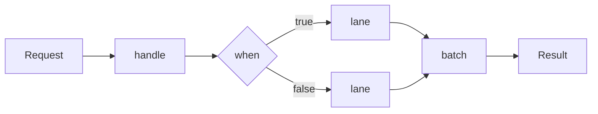

# What is nio-flow

**nio-flow** is a Java library for building business pipelines as fluent, typed flows that run on an event-loop engine — and can be **edited while they run**.

```java
NioFlow<OrderRequest, Receipt> orders = DefaultNioFlow.from(OrderRequest.class)
        .handle("validate", validator::check)
        .adapt(pricing::price)                          // OrderRequest -> Order
        .when(order -> order.total() > 1_000)
        .then(lane -> lane.handle("review", risk::hold))
        .otherwise(lane -> lane.handle("approve", risk::fastPath))
        .background("audit", audit::record)
        .adapt(Receipt::from);

// Per request — thousands of these run concurrently on the same bean:
Receipt receipt = orders.just(request).execute();
```

Every step is a **link** in an immutable chain. A pool of **boss threads** orchestrates each execution; your functions run on **virtual-thread workers**. The result is a pipeline that is:

- **Typed end to end** — `NioFlow<I, T>` is a promise: `just()` takes an `I`, `execute()` returns a `T`. A new flow is always `<I, I>`, only `adapt` moves the output type, and `just()` rejects an input of the wrong type — the generics cannot lie.
- **Editable at runtime** — `splice` single links or swap whole named **regions** atomically; in-flight requests keep their snapshot and never notice. [Runtime editing →](runtime-editing.md)
- **Resilient by composition** — rate limit → per-attempt timeout → retry → `recover()`, all native. [Resilience →](resilience.md)
- **Built for load** — stage fusion, batching, per-key ordering, backpressure, dedicated event loops. [Scaling →](scaling.md)
- **Zero required dependencies** — Resilience4j and OpenTelemetry are optional, compile-only integrations.

## Where it fits

nio-flow sits between "a chain of service calls in a `@Service` method" and a full workflow engine. Reach for it when your logic has **shape** — branches, fan-outs, fallbacks, bulk steps — and that shape needs to **change without a redeploy**: pricing rules swapped by ops, a fraud gate tightened during an incident, a provider replaced behind a named stage.



## At a glance

| You need | nio-flow gives you |
|---|---|
| Branching logic | `when()` / first-match-wins `match()` with nested forks |
| Bulk downstream calls | `batch(size, window, bulk)` — callers still get individual results |
| Per-entity ordering | `just(x).key(orderId)` — Kafka-partition style FIFO per key |
| Hot changes | `splice`, named regions, `replaceRegion` — atomic, validated |
| Protection | native `RateLimit`, `Retry`, timeouts, `recover()`, circuit breaker via Resilience4j |
| Visibility | `onComplete`/`onError` taps, metrics SPI, OpenTelemetry adapter |

Ready? Head to the [Quickstart](quickstart.md).
