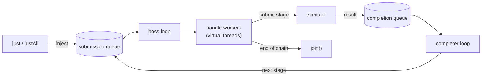

# nio-flow

> An io_uring-style asynchronous flow library for Java — declare a chain of stages once, inject values, and let them flow concurrently without ever blocking each other.

[GitHub](https://github.com/fabiangftech/nioflow) · [Maven Central](https://central.sonatype.com/artifact/dev.nioflow/core)

## What is nio-flow?

nio-flow lets you model a processing flow as a **chain of stages declared once**. Every value you inject walks the chain independently: several values are in flight at the same time, a value blocked on slow IO never delays the values behind it, and an error short-circuits only the value that failed.

The design borrows from Linux's io_uring: a **submission queue** with values ready to run their next stage, and a **completion queue** with reaped async results. A boss event loop hands each value to a virtual-thread handle worker; async stages run on an executor without waiting.

```java
import dev.nioflow.application.facade.NioFlow;

try (NioFlow<Order> flow = new NioFlow<>()) {
    flow.handle("validate", orders::validate)
        .submit("enrich", api::enrich)                 // slow IO — never blocks other values
        .when(order -> order.priority())
        .then(lane -> lane
                .submit(order -> notifier.push(order)))
        .otherwise(lane -> lane
                .handle(order -> queue.offer(order)))
        .onErrorResume(error -> Order.rejected(error))
        .seal();

    flow.justAll(orders);
    flow.join();
}
```

## Installation

**Gradle**

```groovy
implementation 'dev.nioflow:core:1.0.0'
```

**Maven**

```xml
<dependency>
    <groupId>dev.nioflow</groupId>
    <artifactId>core</artifactId>
    <version>1.0.0</version>
</dependency>
```

Requires **Java 25+** (virtual threads and scoped values). The core has **zero runtime dependencies** — Resilience4j and OpenTelemetry integrations are optional and only activate when you add those libraries yourself. See the [quick start](quickstart.md) for details.

## Why nio-flow?

- **Multiple values in flight** — the chain is declared once; every injected value walks it concurrently with its own cursor.
- **Non-blocking by construction** — `submit` stages run on an executor and are reaped asynchronously; a value stuck on JDBC or HTTP never holds up the rest.
- **Virtual threads by default** — blocking anywhere ties up only that value, not a shared worker.
- **Per-value error isolation** — a failure short-circuits one value, is delivered to `onError`, and can be recovered in place with `onErrorResume`.
- **Rich flow shapes** — two-way forks (`when`), switch-style forks (`match`), filtering, fan-out, type adaptation and reusable segments (`via`).
- **Bulk IO built in** — `batch` groups values by size or age and runs one async call for the whole group, with per-value recovery.
- **Backpressure** — bound the number of values in flight and choose to block, drop or fail at capacity.
- **Observability first** — a metrics port (with an OpenTelemetry adapter), an opt-in per-value tracer, and a one-line diagnostics dump of the running flow.
- **Zero required dependencies** — the core is plain JDK; adapters are `compileOnly` and opt-in.

## At a glance



## Where to next?

- [Quick start](quickstart.md) — install, build your first flow, handle errors.
- [Examples](examples.md) — forks, batching, resilience, backpressure, observability.
- [Architecture](architecture.md) — the engine, the threading model and the guarantees.
- [API reference](reference.md) — every operator at a glance.
