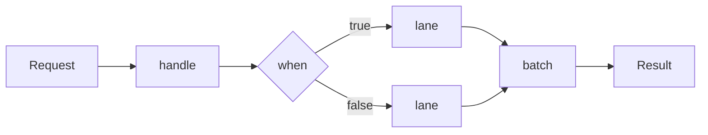

# What is nioflow

[](https://central.sonatype.com/artifact/dev.nioflow/nioflow-core)
[](https://central.sonatype.com/artifact/dev.nioflow/nioflow-reactive)
[](https://www.apache.org/licenses/LICENSE-2.0)
[](https://openjdk.org/)
[](https://nioflow.dev)
[](https://sonarcloud.io/summary/new_code?id=fabiangftech_nioflow)
[](https://sonarcloud.io/summary/new_code?id=fabiangftech_nioflow)
[](https://sonarcloud.io/summary/new_code?id=fabiangftech_nioflow)
[](https://sonarcloud.io/summary/new_code?id=fabiangftech_nioflow)
[](https://sonarcloud.io/summary/new_code?id=fabiangftech_nioflow)
[](https://sonarcloud.io/summary/new_code?id=fabiangftech_nioflow)
[](https://sonarcloud.io/summary/new_code?id=fabiangftech_nioflow)
[](https://sonarcloud.io/summary/new_code?id=fabiangftech_nioflow)
[](https://sonarcloud.io/summary/new_code?id=fabiangftech_nioflow)
[](https://sonarcloud.io/summary/new_code?id=fabiangftech_nioflow)
[](https://sonarcloud.io/summary/new_code?id=fabiangftech_nioflow)
[](https://sonarcloud.io/summary/new_code?id=fabiangftech_nioflow)

**nioflow** is a Java library for building business pipelines as fluent, typed flows that run on an event-loop engine — and can be **edited while they run**.

```java
// The shared definition: what every request goes through first.
NioFlow<OrderRequest, Receipt> orders = DefaultNioFlow.from(OrderRequest.class)
        .handle("validate", validator::check)
        .background("audit", audit::record);

// Per request — thousands of these run concurrently on the same bean.
// The pipeline starts at the INPUT type and adapt is what re-types it:
Receipt receipt = orders.just(request)              // OrderRequest
        .adapt(pricing::price)                      // -> Order
        .when(order -> order.total() > 1_000)
        .then(lane -> lane.handle("review", risk::hold))
        .otherwise(lane -> lane.handle("approve", risk::fastPath))
        .adapt(Receipt::from)                       // -> Receipt
        .execute();
```

Every step is a **link** in an immutable chain. A pool of **boss threads** orchestrates each execution; your functions run on **virtual-thread workers**. The result is a pipeline that is:

- **Typed end to end** — `NioFlow<I, O>` is a promise: `just()` takes an `I` and the pipeline answers an `O`. The per-request builder starts at the input type and `adapt` is the only step that re-types it — so the compiler tells you the moment a pipeline does not deliver what the flow declares.
- **Editable at runtime** — `splice` single links or swap whole named **regions** atomically; in-flight requests keep their snapshot and never notice. [Runtime editing →](runtime-editing.md)
- **Resilient by composition** — rate limit → per-attempt timeout → retry → `recover()`, all native. [Resilience →](resilience.md)
- **Built for load** — stage fusion, batching, per-key ordering, backpressure, dedicated event loops. [Scaling →](scaling.md)
- **Able to detach work** — `fork` runs a whole side pipeline the request never waits for: audit trails, notifications, replication. [Pipeline API →](pipeline-api.md)
- **Cheap under load** — a remote call can hold a future instead of a parked thread (`handleAsync`), consecutive async stages fuse, and an ingestion `pipe` routes them async by default — the heap of thousands in flight, not their stacks. [WebFlux →](webflux.md)
- **At home in WebFlux** — a pipeline ends in a `Mono`, and a `WebClient` call is an ordinary step. WebFlux gives you the non-blocking edge; nioflow gives you the blocking middle. [WebFlux →](webflux.md)
- **Zero required dependencies** — Resilience4j, OpenTelemetry and Reactor are optional, compile-only integrations.

## Where it fits

nioflow sits between "a chain of service calls in a `@Service` method" and a full workflow engine. Reach for it when your logic has **shape** — branches, fan-outs, fallbacks, bulk steps — and that shape needs to **change without a redeploy**: pricing rules swapped by ops, a fraud gate tightened during an incident, a provider replaced behind a named stage.



## When NOT to use it — and what to reach for instead

nioflow is a **pipeline-orchestration engine**, not a concurrency primitive. The
concurrency you get from the virtual-thread workers, plain JDK 21 already gives
you. nioflow earns its keep when you need the machinery layered on top — as a
bundle, not one piece:

| If all you need is… | reach for | not nioflow, because |
|---|---|---|
| "call 3 things concurrently, join" | `StructuredTaskScope` (JDK 21+) | ~15 lines of stdlib, no new model, readable stack traces |
| chain a few blocking calls, return | plain virtual threads / `CompletableFuture` | the boss/worker model buys you nothing here |
| an end-to-end reactive pipeline at very high concurrency, using none of the engine | plain **Reactor** | a worker parked on `Blocking.await` retains ~16× a pure Reactor chain — untenable at 10⁵ in flight ([WebFlux decision tree](webflux.md)) |
| durable, long-running, human-in-the-loop workflows | a real workflow engine (Temporal, Camunda) | nioflow is in-memory and request-scoped; it does not persist state across restarts |

**Reach for nioflow when you need two or more of:** keyed FIFO ordering,
request coalescing (`batch`), hot runtime chain editing (`splice`), positional
`recover`, native retry/rate-limit, or one unified metrics view across a
genuinely multi-step pipeline — and when the shape needs to change without a
redeploy. If you need only one of those, a smaller tool is less risk for equal
capability. When something goes wrong in production, the
[troubleshooting runbook](troubleshooting.md) is the map.

## At a glance

| You need | nioflow gives you |
|---|---|
| Branching logic | `when()` / first-match-wins `match()`, nested and composable |
| Side work nobody waits for | `fork(name, segment)` — a whole detached pipeline, not a lambda |
| Bulk downstream calls | `batch(size, window, bulk)` — callers still get individual results |
| Per-entity ordering | `just(x).key(orderId)` — Kafka-partition style FIFO per key |
| Remote calls without parking a thread | `handleAsync` / `handleMonoAsync` / `fanOutAsync` — a future in flight, not a stack; a run of them fuses |
| The same pipeline every request | `flow.pipeline(segment)` — recorded, validated and compiled once, dispatched off the plan |
| Hot changes | `splice`, named regions, `replaceRegion` — atomic, validated |
| Protection | native `RateLimit`, `Retry`, timeouts, `recover()`, circuit breaker via Resilience4j |
| A `Mono` for WebFlux | `handleMono` / `executeMono` — blocking code stays safe inside |
| Visibility | `onComplete`/`onError` taps, metrics SPI, OpenTelemetry adapter |

## Install

Two artifacts. Take `nioflow-core` alone unless your app is reactive (WebFlux) — then add `nioflow-reactive` on the same version.

```groovy
implementation 'dev.nioflow:nioflow-core:2.1.0'
// optional
implementation 'dev.nioflow:nioflow-reactive:2.1.0'
```

```xml
<dependency>
    <groupId>dev.nioflow</groupId>
    <artifactId>nioflow-core</artifactId>
    <version>2.1.0</version>
</dependency>
<!-- optional -->
<dependency>
    <groupId>dev.nioflow</groupId>
    <artifactId>nioflow-reactive</artifactId>
    <version>2.1.0</version>
</dependency>
```

Java 21+ (virtual threads, sealed types), no other runtime dependencies. Full setup, including why the two coordinates move in lockstep, is in the [Quickstart](quickstart.md).

Ready? Head to the [Quickstart](quickstart.md).
