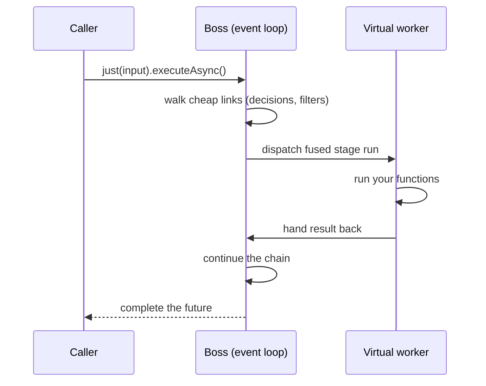
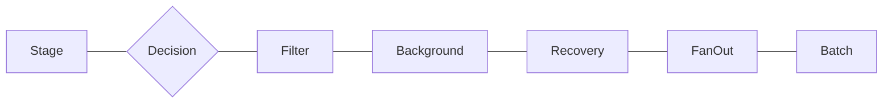

# Architecture

## The event loop

Two rules define the engine:

1. **Each execution is pinned to one boss thread**, and only that boss touches its orchestration state. That is the serialization mechanism — no locks on the request path. Concurrent executions spread across the boss pool, so one boss is never a ceiling.
2. **The boss never runs user code.** Stage functions, recoveries and effects go to virtual-thread workers; results hand back to the boss. The deliberate exceptions — fork predicates and `handleSync` stages — run on the boss and must stay cheap and non-blocking, the same rule as Netty handlers.



A function that throws anywhere — even a predicate on the boss — fails **the value**, never the engine: the failure enters the recovery path and the caller's future always completes.

## The chain model

A flow compiles to an immutable list of **links**:



| Link | Role |
|---|---|
| `Stage` | Transform on a worker; optional timeout, retry, rate limit |
| `Decision` | Records a boolean per value — the routing primitive behind `when`/`match` |
| `Filter` | Short-circuits the execution deliberately |
| `Background` | Fire-and-forget side effect |
| `Recovery` | Positional error handler |
| `FanOut` | Parallel split-join across workers |
| `Batch` | Cross-execution coalescing point |

Forks are **sugar**: `when`/`match` append a `Decision`, and every link declared inside a lane carries *guards* (`decision id` + expected value). The engine only evaluates guards — it knows nothing about forks — which is why nested forks compose for free and routing works identically on shared definitions and per-request executions.

## Stage fusion

Consecutive cheap links (plain stages, filters, recoveries) travel boss → worker → boss as **one composed function**: two thread hops per run instead of per link — about 5x on an 8-stage chain. Runs even extend across routing decisions that this execution's recorded values already ruled out. Stages with a timeout dispatch alone: the budget covers exactly that stage.

## Executions are share-nothing

`just(input)` opens an execution over a **snapshot** of the chain, with its own routing state and result future. Per-request links lazily copy the chain — the shared definition is never mutated. This is the property that makes one flow bean safe under any concurrency, and the property that makes [runtime editing](runtime-editing.md) safe: edits swap the shared list; snapshots in flight are untouched.

## Threads

- **Bosses**: a JVM-wide pool of daemon platform threads (size = CPU cores, floor 2; tune with `-Dnioflow.bosses=N`), shared by every default engine. `DefaultNioEngine.dedicated(n)` gives one engine a private pool.
- **Workers**: one shared virtual-thread-per-task executor. Blocking in a stage is fine — that's what virtual threads are for. Parking is how rate limits and retry backoffs wait without holding anything.
- **Timer**: one lazy daemon runs a hashed timer wheel for stage timeouts and batch windows. It never runs user code.

## Sealing and the compiled plan

`seal()` is optional hardening for stabilized definitions:

- **Validates** the chain (dangling or contradictory guards, duplicate anchors, dead recoveries…) — and re-validates every runtime edit from then on, rejecting broken ones with the running chain intact.
- **Compiles** a dispatch plan: fusion windows and unguarded runs are precomputed per chain version, cutting per-request scanning and allocation. Each edit recompiles once; per-request local chains fall back to interpretation with identical semantics.
- **Freezes appends** (`release()` re-opens them). Splices and region swaps keep working — sealing is what makes them safe, not what prevents them.

## Package layout

```
dev.nioflow
├── core.facade    — public contracts: NioFlow, Lane, NioEngine, Context, FlowResult…
├── core.model     — the chain model: Link types, Guard, Retry, RateLimit, Splice
├── application    — the engine and flow implementations (Default* classes)
└── infrastructure — optional adapters: OpenTelemetryMetrics, Resilience4jStages
```

Dependencies point strictly inward: `application` and `infrastructure` depend on `core`, never the reverse.
