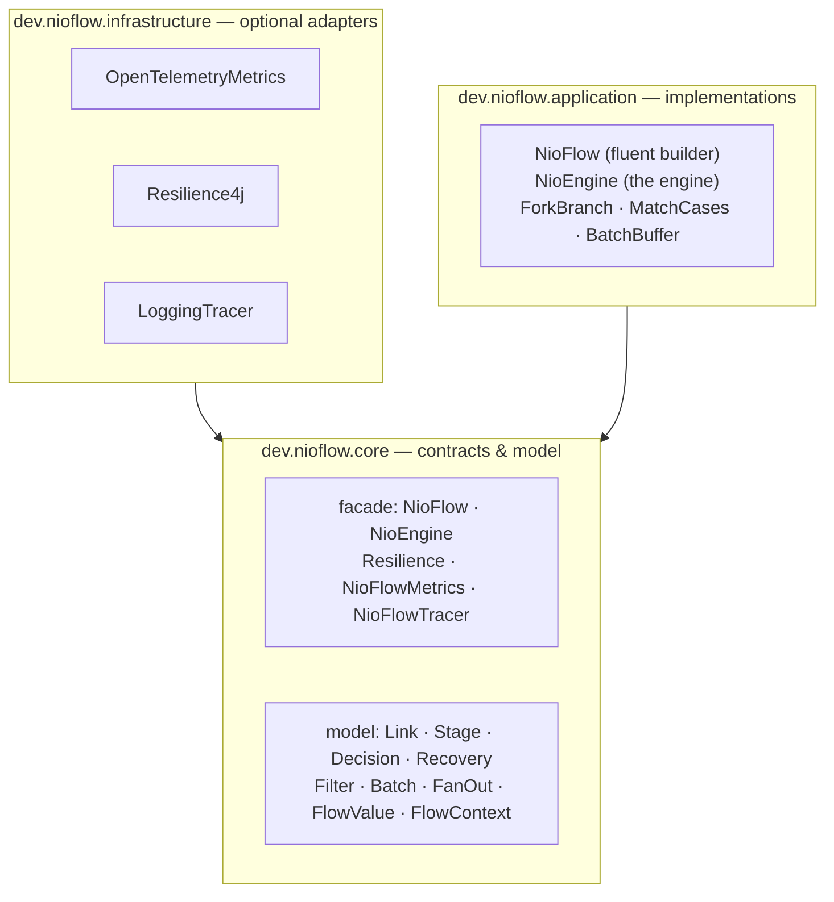
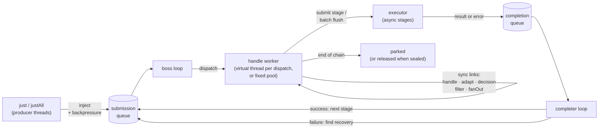
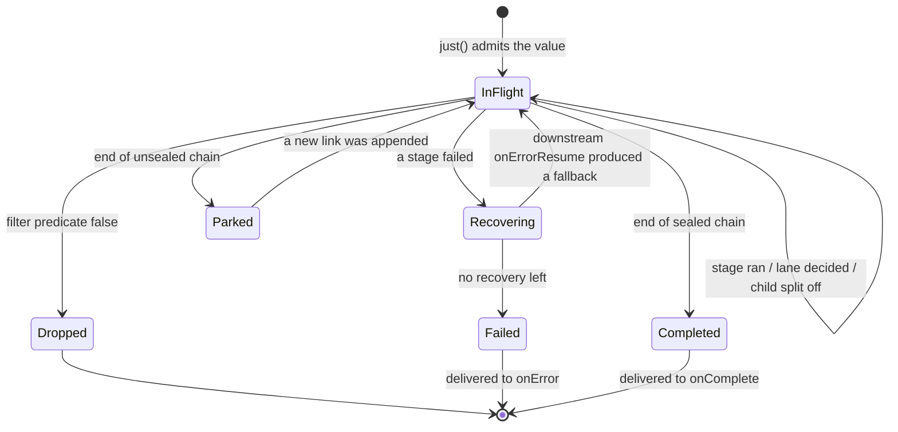
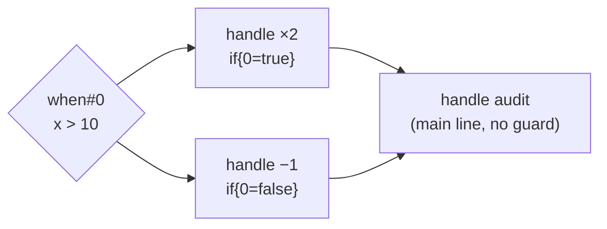

# Architecture

## Design goals

nio-flow is built around one contract:

> **Order is preserved per value, never across values.** A fast value may finish before a slower one injected earlier, a value blocked on slow IO must not delay the values behind it, and an error short-circuits only the value that failed.

Everything below — the queues, the loops, the guards — exists to keep that contract cheap.

## Layers

The library follows a ports-and-adapters layout with the dependency direction strictly inward:

- **`core.facade`** — the public API: the fluent `NioFlow<T>` interface, the untyped `NioEngine` contract behind it, and the pluggable ports (`Resilience`, `NioFlowMetrics`, `NioFlowTracer`).
- **`core.model`** — the chain and value model shared by API and engine. A chain is a list of `Link`s; a `FlowValue` is one in-flight value with its own cursor into that list.
- **`application`** — the queue-driven engine and the fluent builder over it.
- **`infrastructure`** — optional adapters. They are `compileOnly` in the core build: nothing activates unless *you* put Resilience4j or OpenTelemetry on the classpath, and the core stays dependency-free.

## The engine

The engine keeps two queues and two dedicated daemon threads:

- The **boss loop** drains the submission queue and hands each value to a handle worker. It never runs user code itself, so dispatch latency stays flat.
- A **handle worker** walks the value through consecutive *sync* links — stages, decisions, filters, fan-outs — until it hits an async stage, parks, or fails. By default each dispatch gets its own virtual thread, so a blocking `handle` ties up only its own value. An optional fixed pool bounds sync parallelism instead.
- An **async stage** (`submit`) is launched on the executor *without waiting*. The worker moves on immediately; the stage's result lands in the completion queue.
- The **completer loop** reaps completions: on success the value re-enters the submission queue for its next stage; on failure it searches downstream for a recovery.
- The two loops run on their own daemon threads and never borrow executor threads — any executor shape works: fixed, cached, single-threaded or virtual-thread-per-task.

## Value lifecycle

Details worth knowing:

- **Parked values** wait at the end of an *unsealed* chain: appending a new link resumes every parked value. Once **sealed**, finished values are released instead — a sealed, long-running flow does not retain completed values.
- **Dropped values** (filters, or `Backpressure.dropping` at admission) fire no handlers, stop counting toward `join()` and free their backpressure slot.
- **`join()`** waits for quiescence (no active values) and returns the newest injected value's result. A failure recorded since the last call is rethrown once and cleared.

## Forks, lanes and guards

Forks don't copy the chain — they *mark* it. A `when`/`match` appends a `Decision` link that evaluates its predicate once per value and records the outcome **on the value**. Every link declared inside a lane carries a `Guard` (`decision id → expected outcome`); a value simply skips links whose guards don't match its recorded decisions. Nested forks stack one guard per enclosing lane.

This is why lanes are cheap, why a value only runs its own lane, and why stages after the fork run for every value — they carry no guard. The `diagnostics()` dump prints exactly this shape.

## Threading & memory model

- A `FlowValue` lives in **exactly one place at a time** — the submission queue, one worker, the completion queue, a batch buffer or the parked set — so its state needs no synchronization of its own; hand-offs happen through the queues.
- **`FlowContext`** binds the value's metadata around every execution of user code via scoped values, so `get`/`put` work no matter which worker or executor thread runs the stage.
- A flow instance is meant to be **built from a single thread**; injection and the engine's internals are thread-safe.
- User handlers (`onError`, `onComplete`, metrics, tracer) run on engine threads: keep them fast and never let them throw (the engine swallows handler exceptions defensively, but they cost you signal).
- The `onError` replay history and the failure record are **bounded** — a long-running flow does not accumulate throwables.

## Guarantees at a glance

| Guarantee | Mechanism |
|---|---|
| A slow value never delays others | async stages are fire-and-reap; sync stages get their own virtual worker; per-value cursors |
| Errors isolate to one value | failure routes through the completion queue to recovery or `onError` |
| Per-value stage order | one cursor per value, one place at a time |
| Flat memory when long-running | `seal()` releases finished values; bounded failure history |
| No thread leakage | engine owns its loops and workers; external executors stay yours |
| Backpressure never loses in-flight work | only *injection* is bounded; internal re-offers bypass admission |
