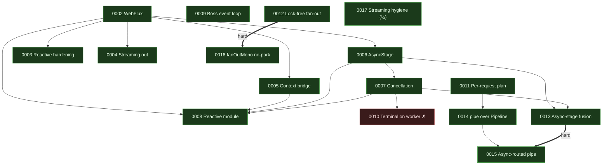

# RFC index

The design record for nio-flow. RFCs 0001–0008 are **implemented** and describe
the engine as it stands; 0009–0017 form the throughput series (split from two
earlier monolithic drafts so each idea stands on its own) — of which **0009 and
0011–0016 are implemented**, **0010 is rejected** (measured regression), and
**0017 is half-shipped** (its streaming deprecation landed; its blocking
fast-path measured neutral and was dropped). **0023–0030 are the
production-hardening cluster — all implemented** — fixes for a multi-agent
audit's findings, all clustered in the shutdown / cancel / metrics /
reactive-bridge corners the steady-state hot path never exercises. **0031–0041
are the second audit cluster — 0031, 0033, 0034, 0035, 0036, 0037, 0038, 0039 and 0041 implemented, 0032 part-shipped (phase A), 0040 proposed** — a fresh
multi-agent review (core, reactive, docs, adopter) covering an admission-control
gap on `call()`, the engine god class, reactive safety defaults, and a batch of
docs/build and long-uptime hardening items; none is on the steady-state hot path.

## Catalogue

| # | Title | Status | Target | Depends on |
| --- | --- | --- | --- | --- |
| [0001](0001-fork.md) | `fork`: detached sub-flows | ✅ Implemented | core | — |
| [0002](0002-webflux.md) | WebFlux: `Mono`/`Flux` without a bridge | ✅ Implemented | reactive | — |
| [0003](0003-reactive-hardening.md) | Reactive hardening: thread leak, knobs, promises | ✅ Implemented | reactive | 0002 |
| [0004](0004-streaming-out.md) | Streaming out: `executeFlux`, bounded `adaptFlux` | ✅ Implemented | reactive | 0002 |
| [0005](0005-reactor-context-bridge.md) | The Reactor context bridge, declared once | ✅ Implemented | reactive | 0002 |
| [0006](0006-async-stage.md) | `AsyncStage`: the stage that does not park | ✅ Implemented | core | 0002 |
| [0007](0007-cancellation.md) | Cooperative cancellation | ✅ Implemented | core | 0006 |
| [0008](0008-reactive-module.md) | `nioflow-reactive` as its own artifact | ✅ Implemented | reactive | 0002, 0005, 0006, 0007 |
| [0009](0009-boss-event-loop.md) | Boss event loop (MPSC + spin-park) + uncontended counters | ✅ Implemented | core | — |
| [0010](0010-terminal-on-the-worker.md) | The last hop: complete on the worker | ❌ Rejected (measured regression) | core | 0007 |
| [0011](0011-per-request-plan.md) | A dispatch plan for per-request pipelines | ✅ Implemented | core | — |
| [0012](0012-lock-free-fanout.md) | Lock-free fan-out + `fanOutAsync` | ✅ Implemented | core | — |
| [0013](0013-async-stage-fusion.md) | Async-stage fusion (the 2.8× 0006 accepted) | ✅ Implemented | core | 0006, 0007 |
| [0014](0014-pipe-prebuilt-pipeline.md) | `pipe` over a prebuilt `Pipeline` | ✅ Implemented | reactive | 0011 |
| [0015](0015-async-routed-pipe.md) | Async-routed `pipe` (the heap win) | ✅ Implemented | reactive | **0013**, 0014 |
| [0016](0016-fanoutmono-no-parked-workers.md) | `fanOutMono` without parked workers | ✅ Implemented | reactive | **0012** |
| [0017](0017-reactive-streaming-hygiene.md) | Reactive streaming & blocking hygiene | ◐ Part 1 shipped (Part 2 neutral) | reactive | — |
| [0018](0018-docs-refresh-2.1.0.md) | Documentation refresh for the 2.1.0 release | ✅ Implemented | docs, versions | 0009, 0011–0017 |
| [0019](0019-docs-google-analytics.md) | Google Analytics for the docs site (per-page tracking on a SPA) | ✅ Implemented | docs | 0018 |
| [0020](0020-unit-test-bug-hunt.md) | Bug-hunting with deterministic unit tests in `core/` and `reactive/` | ✅ Implemented | core, reactive (tests) | 0001–0017 |
| [0021](0021-jmh-regression-gates.md) | Regression-hunting with JMH gates in `tests/` | ✅ Implemented | tests | 0009, 0011–0017, 0020 |
| [0022](0022-benchmarks-evidence-page.md) | A benchmarks page: the performance claims, documented as evidence | ✅ Implemented | docs | 0021, 0009, 0011–0017 |
| [0023](0023-metrics-spi-must-not-hang-a-future.md) | A throwing metrics SPI must not hang a future | ✅ Implemented | core | 0009 |
| [0024](0024-atomic-exactly-once-terminal.md) | An atomic exactly-once terminal (drain never double-counts) | ✅ Implemented | core | 0007, 0009 |
| [0025](0025-cancel-off-the-timer-thread.md) | Subscription cancellation off the TimerWheel thread | ✅ Implemented | core | 0006, 0007 |
| [0026](0026-off-boss-key-lane-release.md) | Off-boss key-lane release must not recurse or race | ✅ Implemented | core | **0024** |
| [0027](0027-empty-mono-semantics.md) | `Mono.empty()` must mean one thing, not two | ✅ Implemented | reactive | 0002, 0004 |
| [0028](0028-preferasync-no-budget-leak.md) | Close the `preferAsync` no-budget leak | ✅ Implemented | reactive | 0003, 0006 |
| [0029](0029-handlers-off-the-boss.md) | Completion/error handlers on the boss: offload, bound, or say so | ✅ Implemented | docs, example | 0009, **0023** |
| [0030](0030-reactive-mirror-behavioral-parity.md) | Guard the reactive mirror's behaviour, not just its existence | ✅ Implemented | reactive | 0008 |
| [0031](0031-admission-control-on-call.md) | Admission control must cover `call()`, not just `inject()` | ✅ Implemented | core | 0009, **0024** |
| [0032](0032-break-up-the-engine-god-class.md) | Break up the `DefaultNioEngine` god class; unify the three drivers | ◐ Phase A shipped (B/C deferred) | core | 0009, 0011, 0013 |
| [0033](0033-reactor-context-bridge-is-string-only.md) | `propagate` bridges strings, not trace context — make it work or say so | ✅ Implemented | reactive | 0005 |
| [0034](0034-reactive-budget-safe-by-default.md) | The reactive budget footgun ships armed — make safety the default | ✅ Implemented | reactive | 0003, 0006, 0028 |
| [0035](0035-mirror-test-covers-every-builder.md) | `ReactiveMirrorTest` must cover every builder pair + one behaviour per family | ✅ Implemented | reactive (tests) | 0008, **0030** |
| [0036](0036-examples-overhaul.md) | Examples overhaul: stop shipping the anti-pattern the docs warn against | ✅ Implemented | examples, docs | — |
| [0037](0037-docs-and-build-hygiene.md) | Docs & build hygiene: one benchmark source, reachable RFCs, a pinned JDK floor | ✅ Implemented | docs, build | 0018, 0022 |
| [0038](0038-per-request-decision-id-compaction.md) | Compact per-request decision ids so branching never falls off the bitset | ✅ Implemented | core | 0011 |
| [0039](0039-bounded-key-lane-and-depth-metric.md) | Bound the per-key lane, and surface its depth | ✅ Implemented | core | 0024, 0026 |
| [0040](0040-lane-held-visibility-in-shutdown-terminal.md) | `laneHeld` visibility on the off-boss shutdown terminal | 📋 Proposed | core | 0007, 0024, 0026 |
| [0041](0041-batch-flush-off-the-timer-thread.md) | Keep the batch group lock off the shared TimerWheel thread | ✅ Implemented | core | 0025 |

**Bold** = hard dependency: the RFC cannot ship until its parent does. A plain
number means the RFC builds on the parent's design but could be sequenced with
care.

## The production-hardening cluster (0023–0030)

A four-agent audit (core concurrency, reactive design, test honesty, API/value)
found no defect in the steady-state hot path — it is genuinely solid — but a set
of reachable holes in the **shutdown / cancel / metrics / reactive-bridge**
corners that benchmarks and happy-path tests never reach. These eight RFCs are
the fixes, ordered by severity for a production push:

| # | Finding | Severity | Ship order |
| --- | --- | --- | --- |
| 0023 | A throwing metrics sink hangs the caller's future forever (unguarded SPI, unlike the handlers right beside it) | **High** | 1 |
| 0028 | `preferAsync` + no budget leaks an `Execution` + a connection forever — on the path sold to *avoid* the parked-worker leak | **High** | 2 |
| 0025 | The async-timeout cancel runs connection teardown on the shared TimerWheel thread, stalling every timeout/batch JVM-wide | **Med-High** | 3 |
| 0024 | The exactly-once terminal is a non-atomic check-then-set; two off-boss shutdown writers double-count the drain, so `shutdown(grace)` can report clean while work runs | **Med** | 4 |
| 0026 | Off-boss `releaseKey` at shutdown recurses on a worker stack and reads a racy deque (depends on 0024) | **Med** | 5 |
| 0027 | `Mono.empty()` injects a silent `null` mid-chain but means "filtered" at the terminal — a latent NPE | **Med** | 6 |
| 0029 | "The boss never runs user code" is false for completion/error handlers; a slow handler stalls every execution on a shared boss (enforce or scope the claim) | **Med** | 7 |
| 0030 | The reactive mirror guards method *existence*, not *behaviour*; the hand-replicated budget/preferAsync logic is a "fixed in two of three copies" hazard (do first if landing 0027/0028) | **Med** | 8 |

Sequencing notes: **0023 and 0028 first** (the two reachable permanent leaks).
**0024 before 0026** (the atomic terminal closes half of 0026). **0030's refactor
before 0027/0028** if taken, so those bridge fixes are written once, not three
times. Every RFC in the cluster ships with an RFC 0020-style deterministic unit
test that *falsifies the bug* (an `orTimeout` on every joined future, so a hang
is a visible failure) and, where a hot path is touched at all, a confirmation
against the RFC 0021 allocation/throughput gates — none of these fixes is on the
per-link hot path, so the gates should be flat.

## The second audit cluster (0031–0041)

A fresh four-lens review (core concurrency, reactive design, docs accuracy,
adopter/DX) run against the 2.1.0 tree. Like the first cluster it found the
steady-state hot path solid, and again the findings sit off it — an
admission-control gap on the request/response path, reactive safety defaults,
long-uptime hazards, and maintainability/docs debt. These are **proposed**, to
be worked through later; ordered by severity for a production push:

| # | Finding | Severity | Ship order |
| --- | --- | --- | --- |
| 0031 | `capacity`/`OverflowPolicy` only bounds `inject`; `call()` — hence the whole reactive facade — has no admission control at all | **High** | 1 |
| 0034 | The reactive budget footgun ships armed: an unbudgeted `handleMono` leaks a worker + `Execution` forever on a hung upstream, and that is the default | **High** | 2 |
| 0033 | `propagate` matches subscriber-context by string name only; wired against Micrometer/Sleuth tracing it silently seeds nothing (the #1 use case) | **Med-High** | 3 |
| 0038 | Per-request `when`/`match` consume a JVM-lifetime counter and fall off the fast bitset past 511 — a hot-path allocation cliff the fork path already knows how to fix | **Med** | 4 |
| 0039 | The per-key FIFO lane is unbounded with no depth metric; a stuck hot-key head grows it without limit and blocks a clean drain | **Med** | 5 |
| 0035 | `ReactiveMirrorTest` checks only 3 of 12 builder pairs; a dropped reactive step in a branch family fails no test | **Med** | 6 |
| 0032 | `DefaultNioEngine` is a 2414-line god class with three hand-synchronized execution drivers — where the next cancellation/fusion bug will hide | **Med** | 7 |
| 0036 | The flagship Spring example ships the wildcard-bean anti-pattern its own Javadoc condemns; no operability/runbook example exists | **Med** | 8 |
| 0037 | Benchmark numbers drift across three files; the RFC record is unreachable from the site; "Java 21+" is unenforced by any toolchain | **Med-Low** | 9 |
| 0041 | A batch-window flush takes the group lock on the single shared TimerWheel thread — contention coupling into every unrelated timeout | **Low-Med** | 10 |
| 0040 | `laneHeld` is read cross-thread on the documented off-boss shutdown terminal with no happens-before edge — a narrow but free-to-fix data race | **Low** | 11 |

Sequencing notes: **0031 and 0034 first** (the two reachable production
hazards — an unbounded request path and an armed leak). **0032 (the god-class
extraction) before or alongside 0038/0039/0040/0041**, since those all edit
`Execution`/engine internals and are far easier once the drivers are one. **0035
before any core change to the branch builders**, so a dropped mirror override is
caught. **0036 on its own** (a credibility fix, no core dependency). Each core/
reactive RFC ships with an RFC 0020-style deterministic test that *falsifies the
bug* and, where any hot path is touched, an RFC 0021 gate confirmation — none of
these is on the per-link hot path, so the gates should stay flat.

## Dependency graph

Legend: green = implemented, red = rejected, thick edge = hard dependency. The
series is complete: every node is on the working tree except **0010** (rejected,
measured regression) and **0017**'s blocking fast-path (measured neutral,
dropped) — its streaming deprecation shipped, so the node is green.

## The throughput series, read as one argument

The series starts from a measured fact: a 1-stage chain and a 32-stage chain
cost **nearly the same — about 1.5× apart over 32× more links** (measured 88.6
vs 58.8 ops/ms; see [benchmarks](../benchmarks.md)), so **fusion already made
the links nearly free** and everything left is plumbing around them — thread
handoffs, the queue that carries them, objects allocated on the way, and the
chain rebuilt per request.

- **The hops** — 0009 (the boss's park/unpark), 0010 (the redundant third hop),
  0013 (async stages that never fused). Two `unpark` syscalls per request
  dominate the per-execution cost; 0009 is the largest single win.
- **The allocations** — 0011 (per-request pipelines that copy the chain twice
  and interpret), 0012 (fan-out's `CompletableFuture` tree).
- **The reactive heap** — 0014 (`pipe` re-assembling per element), 0015 (parking
  a worker per element: 3 173 B → 489 B), 0016 (parking N workers per fan-out).
  These spend the savings 0013 unlocks.
- **The loose ends** — 0017 (deprecate uncapped `adaptFlux`, shipped; the
  proposed "skip the latch on a resolved Mono" was measured neutral — the JIT
  already elides the latch — and dropped).

**The load-bearing edge is `0013 → 0015`, and 0013 landed within the gate**
(`fourAsyncReactiveStages` 74.9 vs `fourReactiveStages` 72.4 ops/ms; see
[benchmarks](../benchmarks.md), the single source for these numbers), so
async-stage fusion closed the gap to blocking: the facade can now get the 489 B
floor at fused throughput and **RFC 0015 is unblocked**. Every RFC carries its
own benchmark gate and ships only if that gate moves.

## Conventions

- **Numbering** is sequential and permanent; a superseded RFC keeps its number
  and gains a `Superseded by` line rather than being deleted.
- **Status** is one of `Proposed`, `Implemented`, `Superseded`. An implemented
  RFC's header names the classes and tests that realize it.
- **Every feature** ships with unit tests (`core/` or `reactive/`) **and** a JMH
  benchmark (`tests/`) with before/after numbers — see `CLAUDE.md`.
