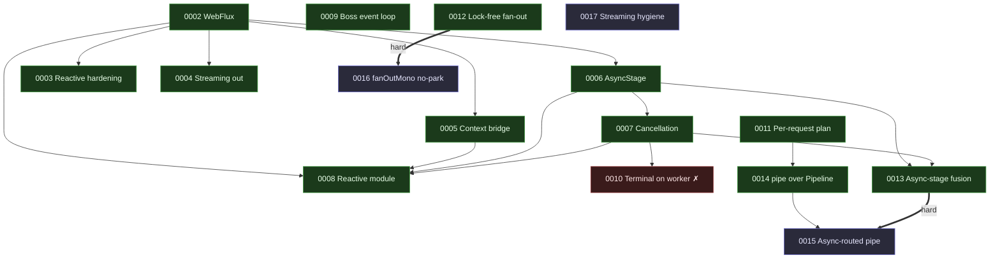

# RFC index

The design record for nio-flow. RFCs 0001–0008 are **implemented** and describe
the engine as it stands; 0009–0017 form the throughput series (split from two
earlier monolithic drafts so each idea stands on its own) — of which **0009,
0011, 0012, 0013 and 0014 are implemented**, **0010 is rejected** (measured
regression), and the rest are proposed.

## Catalogue

| # | Title | Status | Target | Depends on |
| --- | --- | --- | --- | --- |
| [0001](0001-fork.md) | `fork`: detached sub-flows | ✅ Implemented | core | — |
| [0002](0002-webflux.md) | WebFlux: `Mono`/`Flux` without a bridge | ✅ Implemented | reactive | — |
| [0003](0003-reactive-hardening.md) | Reactive hardening: thread leak, knobs, promises | ✅ Implemented | reactive | 0002 |
| [0004](0004-streaming-out.md) | Streaming out: `executeFlux`, bounded `adaptFlux` | ✅ Implemented | reactive | 0002 |
| [0005](0005-reactor-context-bridge.md) | The Reactor context bridge, declared once | ✅ Implemented | reactive | 0002 |
| [0006](0006-async-stage.md) | `AsyncStage`: the stage that does not park | ✅ Implemented | core | 0002 |
| [0007](0007-cancellation.md) | Cooperative cancellation | ✅ Implemented | core | 0006 |
| [0008](0008-reactive-module.md) | `nioflow-reactive` as its own artifact | ✅ Implemented | reactive | 0002, 0005, 0006, 0007 |
| [0009](0009-boss-event-loop.md) | Boss event loop (MPSC + spin-park) + uncontended counters | ✅ Implemented | core | — |
| [0010](0010-terminal-on-the-worker.md) | The last hop: complete on the worker | ❌ Rejected (measured regression) | core | 0007 |
| [0011](0011-per-request-plan.md) | A dispatch plan for per-request pipelines | ✅ Implemented | core | — |
| [0012](0012-lock-free-fanout.md) | Lock-free fan-out + `fanOutAsync` | ✅ Implemented | core | — |
| [0013](0013-async-stage-fusion.md) | Async-stage fusion (the 2.8× 0006 accepted) | ✅ Implemented | core | 0006, 0007 |
| [0014](0014-pipe-prebuilt-pipeline.md) | `pipe` over a prebuilt `Pipeline` | ✅ Implemented | reactive | 0011 |
| [0015](0015-async-routed-pipe.md) | Async-routed `pipe` (the heap win) | 📝 Proposed | reactive | **0013**, 0014 |
| [0016](0016-fanoutmono-no-parked-workers.md) | `fanOutMono` without parked workers | 📝 Proposed | reactive | **0012** |
| [0017](0017-reactive-streaming-hygiene.md) | Reactive streaming & blocking hygiene | 📝 Proposed | reactive | — |

**Bold** = hard dependency: the RFC cannot ship until its parent does. A plain
number means the RFC builds on the parent's design but could be sequenced with
care.

## Dependency graph

Legend: green = implemented, blue = proposed, thick edge = hard dependency.
Nodes with no incoming proposed edge (**0009**, **0011**, **0012**, **0017**)
land on the working tree today — **0009**, **0011** and **0012** already have;
the rest wait on their parent.

## The throughput series, read as one argument

The series starts from a measured fact: an execution of a 1-stage chain and a
32-stage chain cost the same (~17.5 µs), so **fusion already made the links
free** and everything left is plumbing around them — thread handoffs, the queue
that carries them, objects allocated on the way, and the chain rebuilt per
request.

- **The hops** — 0009 (the boss's park/unpark), 0010 (the redundant third hop),
  0013 (async stages that never fused). Two `unpark` syscalls per request are
  most of the 17.5 µs; 0009 is the largest single win.
- **The allocations** — 0011 (per-request pipelines that copy the chain twice
  and interpret), 0012 (fan-out's `CompletableFuture` tree).
- **The reactive heap** — 0014 (`pipe` re-assembling per element), 0015 (parking
  a worker per element: 3 173 B → 489 B), 0016 (parking N workers per fan-out).
  These spend the savings 0013 unlocks.
- **The loose ends** — 0017 (deprecate uncapped `adaptFlux`; skip the latch on a
  resolved Mono).

**The load-bearing edge is `0013 → 0015`, and 0013 landed within the gate**
(`fourAsyncReactiveStages` 74.4 vs `fourReactiveStages` 72.4 ops/ms, +2.9%), so
async-stage fusion closed the gap to blocking: the facade can now get the 489 B
floor at fused throughput and **RFC 0015 is unblocked**. Every RFC carries its
own benchmark gate and ships only if that gate moves.

## Conventions

- **Numbering** is sequential and permanent; a superseded RFC keeps its number
  and gains a `Superseded by` line rather than being deleted.
- **Status** is one of `Proposed`, `Implemented`, `Superseded`. An implemented
  RFC's header names the classes and tests that realize it.
- **Every feature** ships with unit tests (`core/` or `reactive/`) **and** a JMH
  benchmark (`tests/`) with before/after numbers — see `CLAUDE.md`.
