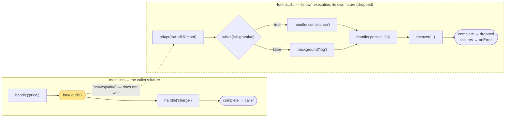
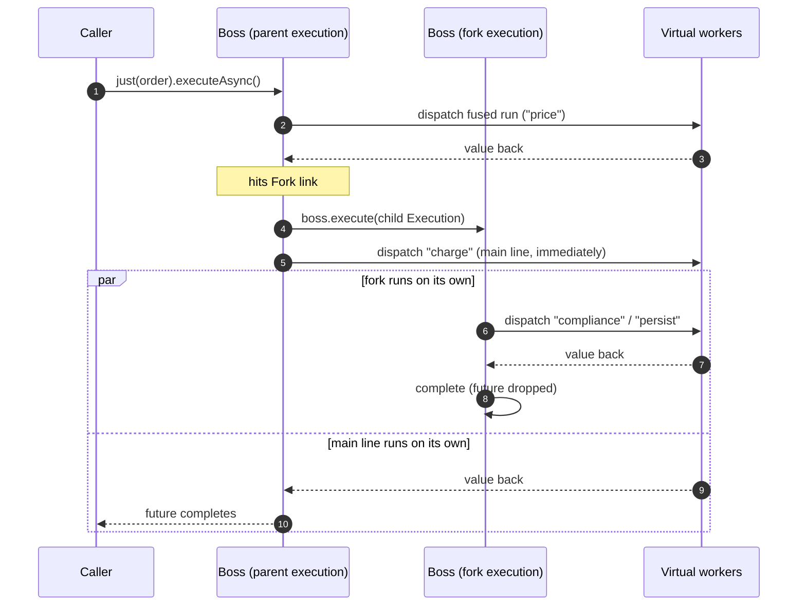

# RFC 0001 — `fork`: detached sub-flows

- **Status**: Implemented (see `Fork`, `AbstractChain.forkSegment`, `DefaultNioEngine.Execution.spawnFork`)
- **Target**: `core/` (`dev.nioflow.core.facade`, `dev.nioflow.core.model`, `dev.nioflow.application.facade`)
- **Author**: Fabián Guamán
- **Depends on**: `Segment` / `Lane` (sub-flow builder), `CompiledChain` (dispatch plan), the drain counter in `DefaultNioEngine`

## Summary

`fork(name, segment)` declares a **sub-flow that runs on its own, detached from the main line**. The value that reaches the fork point is handed to a child execution and the main flow **keeps walking immediately** — it never waits for the fork, its latency does not include it, and a fork failure never fails the request.

The sub-flow is a full pipeline, not a callback: it can `handle`, `handleSync`, `background`, `adapt`, `filter`, `recover`, `fanOut`, `batch`, `use(segment)`, and branch with `when` / `match` — including nested forks.

```java
orders.handle("price", this::price)
      .fork("audit", sub -> sub                    // detached: the request does not wait
              .adapt(Order::toAuditRecord)
              .when(AuditRecord::isHighValue)
                  .then(lane -> lane.handle("compliance", compliance::report))
                  .otherwise(lane -> lane.background("log", audit::debug))
              .handle("persist", auditRepo::save, Duration.ofSeconds(2))
              .recover(error -> AuditRecord.failed(error)))
      .handle("charge", this::charge);              // runs without waiting for "audit"
```

## Motivation

Today the only "do something and don't wait" primitive is `background(Consumer<T>)`: a single lambda, dispatched to a worker, no chain around it. Everything it cannot express has to be built by hand inside that lambda — retries, timeouts, branching, error handling — and none of it is visible to the engine (no per-stage metrics, no splice anchors, no validation, no fusion, no drain participation of its internal steps).

So today, side work that is *itself a pipeline* has three bad options:

| Option | What breaks |
| --- | --- |
| `background(v -> { ...20 lines of orchestration... })` | Opaque to the engine: no stage metrics, no `recover()`, no timeouts, no splice, no validation. |
| A second `NioFlow` bean + `engine.inject(v)` from inside a `background` | Works, but the side flow is a separate definition with its own lifecycle; the coupling is invisible in the pipeline, and shutdown does not order the two. |
| `fanOut(...)` with a join that discards the branch result | The request **waits** for the side work. That is exactly what we don't want. |

`fork` gives the third thing the model is missing. The chain already has the join-style parallelism (`fanOut`) and the fire-and-forget *step* (`background`); what it lacks is the fire-and-forget *pipeline*.

Concrete cases: audit trails, notification pipelines, cache warm-up, analytics/ETL emission, replication to a secondary store, ML feature logging. All of them are multi-step, all of them have their own resilience, and none of them belongs on the request's critical path.

## Goals

- A fork's steps are **ordinary links**: same fusion, same metrics, same validation, same `recover()` positional semantics.
- The main line **never waits** — not for the fork's first stage, not even for its first boss-inlined link.
- A fork failure **never** reaches the caller's future; it reaches `onError` (like a failing `background`).
- `shutdown(grace)` **drains forks**: an in-flight fork is in-flight work.
- Zero cost when unused; near-`background` cost when used (one extra `Execution` per fork).

## Non-goals

- **No join.** A fork produces no value for the main line. If you need the result, that is `fanOut`.
- **No result future** exposed to the caller.
- **No fork-level timeout / cancellation** in v1 — per-stage `Duration` and `Retry` already bound each step. (See *Future work*.)
- **No ordering guarantee** between the fork and the rest of the main line: they run concurrently, by definition.
- **No transactional coupling**: the main line can complete (or fail) while the fork is still running.

## Naming (decide this first)

The codebase already calls `when()` / `match()` "forks" ("fork predicates run on the boss", `Condition`/`Branch`/`Cases`). Two different things cannot both be "the fork".

> **Decided and applied.** `fork` is this feature; `when`/`match` are **branching** everywhere — docs, comments and test names (`DefaultNioFlowBranchingTest`, `BranchRoutingBenchmark`, `ConcurrentBranchRoutingStressTest`). `DefaultNioFlowForkTest` now covers the detached fork.

The proposal is to **give the word to this feature** — it is what "fork" means everywhere else (`fork(2)`, "fork a process"): *detach a child that outlives the caller's attention*. `when`/`match` get the name the code already uses for their type: **branching over lanes** (`Lane<T>` is the builder, `Condition`/`Branch`/`Cases` the contracts). That is a docs + test-name rename, no API change.

The alternative — keep "fork" for `when`/`match` and call this one `detach(name, segment)` or `spawn(name, segment)` — is cheaper (no rename) but leaves the more evocative word on the less surprising feature. `detach` is the recommended fallback if the rename is judged too invasive.

The rest of this RFC uses `fork`.

## The shape of it



The dashed arrow is the whole feature: the value crosses it once, and nothing crosses back.

### On the threads



Two things to read off this diagram:

1. The parent does **not** call `child.advance(...)` inline. It submits the child as a **new boss task** (`boss.execute(child)`), so the parent's `advance` loop continues on the very next instruction. If we ran the child inline, the fork's boss-inlined links (`handleSync`, `when`/`match` predicates) would execute *before* the main line resumed — a latency coupling that violates "the main line never waits".
2. The caller's future can complete while the fork is still running (step 11 before the fork's completion). That is the contract, not a bug.

## API

`Segment<T, R>` is already "a reusable piece of pipeline over a `Lane<T>`", and `Lane<T>` already exposes exactly the operations a fork needs (`handle`, `handleSync`, `handleContextual`, `background`, `adapt`, `filter`, `recover`, `fanOut`, `batch`, `use`, `when`, `match`). **The fork sub-flow builder is `Lane<T>`.** No new builder interface, and a fork body is a `Segment` — so it is reusable and independently testable, for free.

```java
// core/facade/NioFlow.java — type-preserving on the shared definition
<R> NioFlow<I, O> fork(String name, Segment<I, R> sub);
<R> NioFlow<I, O> fork(Segment<I, R> sub);

// core/facade/NioStep.java — the main line keeps its type: the fork gives nothing back
<R> NioStep<T, O> fork(String name, Segment<T, R> sub);
<R> NioStep<T, O> fork(Segment<T, R> sub);

// core/facade/Lane.java — a fork declared inside a branch spawns only for values routed there
<R> Lane<T> fork(String name, Segment<T, R> sub);
<R> Lane<T> fork(Segment<T, R> sub);
```

`R` is inferred and discarded — it exists so the sub-flow may re-type freely inside itself. The main line's type is untouched on all three interfaces, which is why `fork` is legal on `NioFlow<I, O>` (whose steps must be type-preserving over `I`).

### Examples

**Detached, multi-step, with its own resilience** — the request returns as soon as `charge` is done; the audit pipeline keeps going.

```java
NioFlow<Order, Receipt> orders = DefaultNioFlow.from(Order.class);

orders.handle("validate", this::validate)
      .fork("audit", sub -> sub
              .adapt(AuditRecord::of)
              .handle("enrich", enrichment::apply, Retry.of(3, Duration.ofMillis(50)))
              .handle("persist", auditRepo::save, Duration.ofSeconds(2))
              .recover(error -> AuditRecord.failed(error)));   // the fork's own net
```

**Branching inside the fork** — `when` / `match` work unchanged, because the sub-flow is a chain like any other.

```java
orders.fork("notify", sub -> sub
        .match()
            .is(Order::isPremium, lane -> lane.handle("sms", sms::send))
            .is(Order::isBusiness, lane -> lane.handle("webhook", hooks::post))
            .otherwise(lane -> lane.background("email", mail::enqueue))
        .handle("mark", notifications::markSent));
```

**A fork inside a branch** — the fork link carries the lane's guards, so it only spawns for values routed down that branch.

```java
orders.when(Order::isHighValue)
        .then(lane -> lane
                .handle("fraud", fraud::score)
                .fork("compliance", sub -> sub                  // only high-value orders fork
                        .handle("report", compliance::file, Duration.ofSeconds(5))
                        .background("archive", archive::store)))
        .otherwise(lane -> lane.handleSync("fast", Order::pass))
      .handle("charge", this::charge);                          // main line, every order
```

**Reusable fork bodies** — a fork body *is* a `Segment`, so it composes and is testable on its own.

```java
static Segment<Order, Void> auditTrail(AuditRepo repo) {
    return sub -> sub.adapt(AuditRecord::of)
                     .handle("persist", repo::save, Duration.ofSeconds(2))
                     .adapt(record -> null);
}

orders.fork("audit", auditTrail(repo));   // here
otherFlow.fork("audit", auditTrail(repo)); // and here
```

**Per-request fork** — same operation on `NioStep`, so a single request can detach work without touching the shared definition.

```java
Receipt pay(Order order) {
    return orders.just(order)
            .fork("replay", sub -> sub.background("mirror", mirror::send))
            .handle("charge", this::charge)
            .adapt(Receipt::of)
            .execute();     // returns without waiting for "replay"
}
```

## Design

### The link

```java
// core/model/Fork.java
/**
 * Detached sub-flow: the value is handed to a child execution that runs
 * independently, and the main line continues immediately with the SAME value.
 * The child has its own decisions, its own context copy and its own result
 * future (dropped). Failures it does not recover() reach the error handlers,
 * never the caller's future — like a Background effect.
 */
public record Fork(String name, List<Link> chain, List<Guard> guards) implements Link {}
```

and `Link` grows one permit:

```java
public sealed interface Link
        permits Stage, Decision, Recovery, Filter, Background, FanOut, Batch, Fork {
```

Because `Link` is sealed, the compiler enumerates every place that must handle the new case: `DefaultNioEngine.step`, `ChainValidator`, `CompiledChain.compile`, `DefaultNioEngine.anchorName`. That is the point of the sealed model — nothing is silently missed.

The sub-chain is **immutable and closed**: built once at declaration time, its guards refer only to decisions recorded *inside* it.

### Building it (`AbstractChain`)

The sub-chain is recorded off the main chain, exactly like `DefaultNioFlow.replaceRegion` already does with `RecordingChain`:

```java
// application/facade/AbstractChain.java
<R> void forkSegment(String name, Segment<X, R> segment) {
    RecordingChain recorder = new RecordingChain(engine());   // off-chain, empty guards
    segment.define(new DefaultLane<>(recorder));
    appendLink(new Fork(name, List.copyOf(recorder.links()), guards()));
    //                                                        ^^^^^^^^
    // The FORK LINK carries the caller's guards (so a fork inside a lane only
    // spawns for values routed there). The links INSIDE carry only sub-chain
    // guards — the child has its own decision bitset, and a guard pointing at a
    // parent decision would be dangling in it.
}
```

`RecordingChain` already draws decision ids from the live engine and shares the anonymous-name counter, so ids and anchor names never collide with the main chain.

**Decision id compaction (optimization).** Ids drawn from the engine counter can be large, which would push the child's bitset past `MAX_BITSET_DECISION_ID` (511) into the overflow map. Since the sub-chain is guard-closed, its ids are private: renumber them to `0..n-1` when the `Fork` is built. The child then gets a bitset of a few bytes. This is safe *only* because of the closure invariant, and `ChainValidator` enforces that invariant (below).

### Running it (`DefaultNioEngine.Execution.step`)

```java
case Fork fork -> {
    spawnFork(fork, current);   // submits a child boss task; does NOT hand off
    // fall through: the main line continues with the SAME value
}
```

`step` returns `current` unchanged — the fork is a *side effect on the boss*, not a value transformation and not a hand-off. Cost on the main line: one `Execution` allocation plus one `execute()` on the boss executor. In the same league as `Background` (which allocates a closure and submits to the workers).

```java
private void spawnFork(Fork fork, Object value) {
    activeExecutions.incrementAndGet();              // shutdown(grace) must wait for it
    Execution child = new Execution(
            boss,                                    // same boss: orchestration is cheap, affinity is free
            fork.chain(),
            copyOf(context),                         // snapshot, never the parent's map (see below)
            forkPlan(fork),                          // precompiled sub-plan, or null → interpret
            value,
            null);                                   // never keyed (see below)
    child.detached = true;                           // no completeHandlers, no execution metrics
    boss.execute(child);                             // a NEW boss task — the parent does not wait
}
```

Four decisions are hiding in there, and each one is load-bearing:

**1. `detached = true`.** An `Execution` today notifies `completeHandlers` and reports `executionCompleted/Failed/Filtered` when it finishes. A fork must do **neither**: `NioFlow.onComplete(Consumer<O>)` promises the *flow's output type*, and a fork's terminal value is not an `O`; the execution-latency histogram measures *request* latency, and a fork is not a request. So `finishBookkeeping` becomes:

```java
if (detached) {
    if (error != null) notifyError(error);                       // like a failing background
    metrics.forkCompleted(forkName, elapsed) / forkFailed(...);  // its own metrics, see below
} else {
    ...existing behaviour...
}
```

`onError` **does** fire — an unrecovered fork failure is exactly the class of thing the error tap exists for (it already receives background failures, drops and rejections).

**2. Context is copied, never shared.** The engine's no-locks argument for the plain `HashMap` context is *"stage applications are serialized by the executor handoffs — one continuation at a time"*. A fork breaks that: parent and child run concurrently, on different threads. Sharing the map would be a data race, and the fix (a concurrent map) would tax every non-forking flow. So the child gets a **snapshot copy** at spawn — `null` stays `null`, so a flow that never used the context still allocates nothing. Consequence, documented: **context writes inside a fork are invisible to the parent.** That is the honest semantics of a detached child, and the alternative (shared mutable state across two concurrent executions) is a bug factory.

**3. The value is passed by reference.** The fork sees the same object the main line carries on. If it is mutable and both sides write it, that is a race — the user's race, same as `background(...)` today. Documented, not defended against.

**4. Never keyed.** A keyed parent holds its key's FIFO lane until it completes. If the child inherited the key it would queue *behind its own parent* — legal (no deadlock, the parent releases on completion) but useless, and it would make a fork's latency depend on the main line it was supposed to escape. Forks are unkeyed. (`key()` only exists on `NioStep` anyway; a fork cannot ask for one.)

### The dispatch plan

`CompiledChain.compile` recurses into `Fork` links and stores their sub-plans, keyed by link identity:

```java
record CompiledChain(List<Link> links, Link[][] runs, int[] runEnds, int maxDecisionId,
                     IdentityHashMap<Fork, CompiledChain> forkPlans) { ... }
```

Identity, not equality — the same trick `Batch` uses to key in-flight groups. `forkPlan(fork)` returns `plan != null ? plan.forkPlans().get(fork) : null`; a `null` plan means the child interprets its chain, which is exactly what per-request local chains already do. **The plan stays an optimization, never a semantic** — a fork must produce identical results compiled or interpreted (this is the invariant `DefaultNioEngineCompiledChainTest` enforces for the main chain, and the fork tests will mirror it).

### Fusion

`Fork` is **not fusable** in v1: like `Background` and `FanOut`, it is a boundary that ends a fused run. Cost: a fork declared *between* two stages splits one fused run into two — two extra thread hops on the main line.

Guidance: declare forks where they naturally sit (usually after the step that produced the value they need), and know that a fork in the middle of a long stage run costs the same as a `background` in the same position.

There is a real optimization available later, and it is worth stating so it is not lost: **spawning is thread-safe from anywhere** (it only touches an `AtomicInteger` and two executors), so a `Fork` *could* be fused into the composed worker function, spawning from the worker with zero extra hops. It is deferred because it complicates run selection (guard-skipping, the `FILTERED` sentinel path) and the win must be measured, not assumed. See *Future work*.

### Validation (`ChainValidator`)

The validator recurses into `fork.chain()` with the sub-chain as its own scope, and adds two fork-specific rules to the existing ones (dangling guards, contradictory guards, duplicate anchor names, dead recoveries):

| Rule | Why |
| --- | --- |
| The sub-chain must be **guard-closed**: no guard may reference a decision id not recorded inside it. | The child has its own bitset. A parent-scoped guard would never pass (an unrecorded decision fails any guard) — the link would be silently dead, and id compaction would be unsound. |
| A fork's sub-chain must be **non-empty**. | `fork("x", sub -> sub)` is a typo, not a feature. |
| Anchor names inside a fork live in the **fork's namespace**; the fork's own name is an anchor on the **main** chain. | Keeps `splice("audit", REPLACE, ...)` meaningful (it swaps the whole fork) without turning every inner stage name into a global identifier. |

A broken fork stops the deploy, like any other validation failure — `ChainValidationException` with the full problem list.

### Runtime editing

- The fork's **name is a splice anchor** on the main chain: `splice("audit", Splice.REPLACE, List.of(newFork))` swaps the whole sub-flow atomically, and `use(region, segment)` / `replaceRegion` work over spans containing forks exactly as they do today.
- The sub-chain itself is **immutable** in v1: you replace the `Fork` link, you do not edit inside it. Editing inside a fork (`spliceFork(name, anchor, position, links)`) is deferred until there is a real need — the replace-the-whole-fork path already covers the "swap the audit pipeline at runtime" case, and it is one atomic swap instead of two levels of anchor resolution.
- In-flight forks are unaffected by a splice, for the same reason in-flight executions are: the child snapshots its chain (the `Fork` link's list) at spawn.

### Shutdown and backpressure

- **Drain**: `spawnFork` increments `activeExecutions` *before* submitting the child, so `shutdown(grace)` waits for in-flight forks and reports them in its "still running" count. A fork that outlives the grace period is a straggler on a shared executor, exactly like an in-flight request today.
- **Spawn during shutdown**: allowed. `closed` rejects new `call`/`inject`; a fork is not new work, it is *part of* an execution already admitted. Rejecting it would abort a request half-way through its own side effects.
- **Admission**: forks do **not** consume `inFlightPermits`. Those bound the `inject`/`await` queue (values waiting to be collected), and a fork produces nothing to collect. Throttling inside a fork is done where it belongs — a `RateLimit` shared by the fork's stages, which parks the virtual worker and never the boss.
- **Fork storms**: N requests each forking M times = N×M virtual threads' worth of work. Virtual threads make that cheap but not free, and there is no cap in v1. `RateLimit` is the answer today; a fork-level concurrency cap is *Future work*, and the `forksInFlight` gauge below is what will tell us whether it is needed.

### Observability

`NioFlowMetrics` grows four **default methods** (no-op bodies — existing implementations keep compiling, so this is not a breaking change):

```java
default void forkStarted(String name) {}
default void forkCompleted(String name, long elapsedNanos) {}
default void forkFailed(String name, Throwable error, long elapsedNanos) {}
default void forksInFlight(int count) {}
```

Stages *inside* a fork report through the existing `stageLatency` / `stageRetried` hooks with their own names, so a fork's internals are as observable as the main line's — one of the main reasons to prefer `fork` over a hand-rolled `background`. `OpenTelemetryMetrics` maps the new hooks to a histogram (`nioflow.fork.duration`, tagged by name and outcome) and a gauge (`nioflow.fork.in_flight`).

## What could go wrong

| Risk | Mitigation |
| --- | --- |
| A fork silently swallows failures nobody watches. | Failures go to `onError` *and* to `forkFailed`. A flow with no `onError` handler and no metrics is already flying blind for `background` failures; the docs will say so at the `fork` entry. |
| Users reach for `fork` when they meant `fanOut` (they do want the result). | The API makes it impossible to get the value back — there is nothing to misuse. Docs put the two side by side: *"need the result? `fanOut`. Don't? `fork`."* |
| Mutable value shared between fork and main line. | Documented (same as `background`). The idiomatic fork starts with an `adapt` to its own type — every example here does. |
| Context divergence surprises someone. | Documented at the API and in `pipeline-api.md`: the fork gets a snapshot; its writes stay in the fork. |
| Fork storms exhaust workers. | `forksInFlight` gauge + `RateLimit`; a cap if the gauge says we need one. |
| The main line regresses because `Fork` breaks fusion. | Benchmarked (below). If the cost is material, the fusable-spawn optimization moves from *Future work* to *v1*. |

## Testing and benchmarks

Per the project's feature workflow, this ships with unit tests in `core/` **and** JMH benchmarks in `tests/`, with before/after numbers reported.

**Unit tests** — `DefaultNioFlowForkTest` (the `when`/`match` coverage moved to `DefaultNioFlowBranchingTest`), extending `EngineTestSupport`:

- the main line completes **without** waiting for a slow fork (the future resolves while the fork's latch is still closed);
- a fork failure does not fail the caller's future, and **does** reach `onError`;
- `recover()` inside a fork catches a fork stage failure, positionally;
- a `filter()` cut inside a fork ends the fork only — the main line still completes;
- every step type works inside a fork: `handle`, `handleSync`, `handleContextual`, `background`, `adapt`, `fanOut`, `batch`, `when`, `match`, `use(segment)`, nested `fork`;
- a fork inside a lane spawns **only** for values routed down that lane (guards on the `Fork` link);
- the child's context is a snapshot: a put inside the fork is not visible to a later main-line contextual stage;
- `shutdown(grace)` waits for an in-flight fork and returns 0 (clean drain); with an insufficient grace it reports the straggler;
- compiled and interpreted chains produce identical fork behaviour (mirrors `DefaultNioEngineCompiledChainTest`);
- validation: a guard-open sub-chain, an empty sub-chain and a duplicate inner anchor are all rejected with the full problem list;
- `splice(forkName, REPLACE, ...)` swaps the sub-flow, and in-flight forks keep their snapshot.

**Stress tests** (`tests/`): fork storms (deep chains × many forks) with `orTimeout` on the joined futures — an engine bug that kills a boss task must surface as a failure, not a hang; and a shutdown-under-fork-storm test asserting the drain count.

**Benchmarks** (`tests/`, JMH), the numbers that decide whether this ships as designed:

1. `mainLineOverhead` — the same 8-stage chain with and without one `Fork` in the middle. Measures the fusion boundary. Compared against the same chain with a `background` in the same position (the honest baseline: same boundary, less capability).
2. `forkThroughput` — requests/s with 0, 1 and 4 forks per request, each fork a 3-stage chain.
3. `forkAllocation` — bytes/op added per fork (target: one `Execution` + one context copy when the context is used; **zero** additional allocation when it is not).
4. `spawnLatency` — time from the main line hitting the `Fork` link to it dispatching the next stage. This is the number that proves "the main line never waits": it must be flat regardless of how heavy the fork body is.

The acceptance bar: **no regression on flows that do not use `fork`** (zero new allocations, no new branch cost on the hot path beyond one `case` in an already-exhaustive switch), and `mainLineOverhead` within noise of the `background` baseline.

## Future work

- **Fusable spawn**: allow `Fork` inside a fused run (spawn from the worker), removing the two-hop boundary. Gated on the benchmark above showing it matters.
- **Fork-level budget**: `fork(name, segment, Duration ttl)` — cancel the child if it outlives the budget. Needs a cancellation story the engine does not have yet (stages are not interruptible today), so it is its own RFC.
- **Concurrency cap per fork link**: a semaphore on the `Fork`, with an `OverflowPolicy` (DROP the fork, or park the boss — the latter would violate rule 2, so realistically DROP + `onError`).
- **`spliceFork(name, anchor, position, links)`**: edit *inside* a fork at runtime, if replacing the whole fork proves too coarse.
- **Fork of a fork's result into the parent's context**: explicitly rejected — that is shared mutable state between concurrent executions, and the RFC's whole isolation argument depends on not having it.
