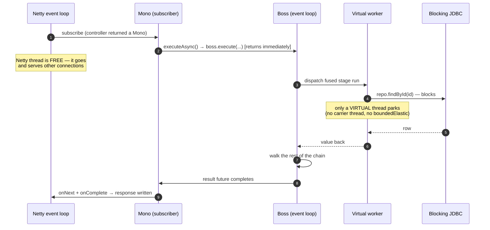
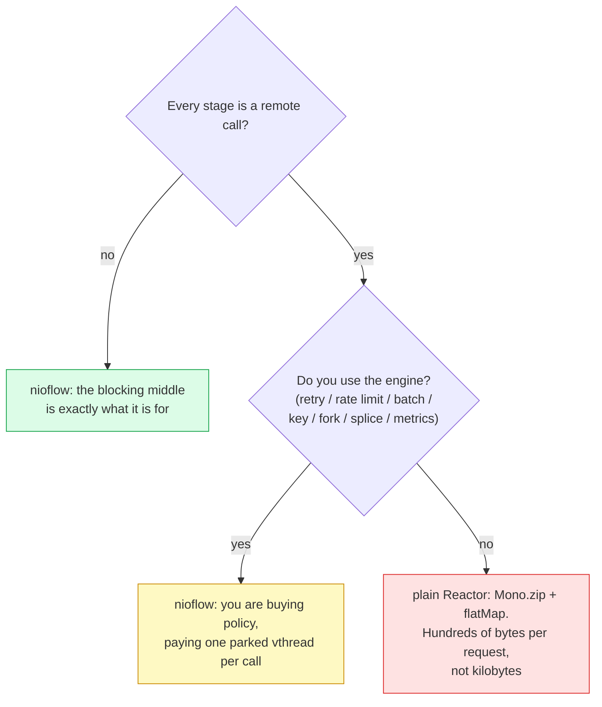
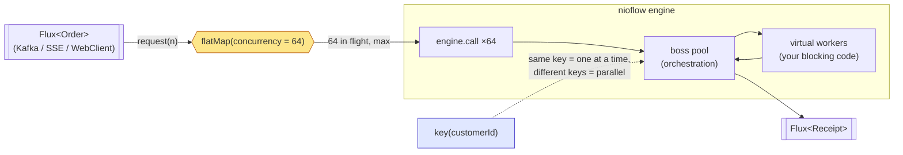

# RFC 0002 — WebFlux: `Mono` and `Flux` without a bridge

- **Status**: Implemented (see `infrastructure.reactive`, `NioStep.with`)
- **Target**: `core/` (`dev.nioflow.infrastructure`, plus one small addition to `NioStep`), `examples/springwebflux-with-nioflow`
- **Depends on**: `executeAsync()` (already returns a `CompletableFuture`), the virtual-thread workers, `FlowSignal.FILTERED`, `key()`

## Summary

**There is no bridge to build.** A `NioFlow` pipeline already ends in a `CompletableFuture`, which is a `CompletionStage`, which is what `Mono.fromFuture` consumes. The integration is a call, not a layer:

```java
@PostMapping("/orders/{id}/pay")
public Mono<Receipt> pay(@PathVariable String id) {
    return orders.just(id)
            .handle("load", repo::findById)                    // blocking JDBC — on a virtual worker
            .handleMono("fraud", fraud::score, ofMillis(200))  // a WebClient call — a stage like any other
            .adaptMono(psp::charge)                            // Mono<Receipt>: the chain continues at Receipt
            .executeMono();                                    // Netty's event loop was never touched
}
```

What this RFC proposes is **not** an adapter layer, a gateway, or a reactive `Link` type. It is:

1. **a subinterface of the existing contracts** — `ReactiveFlow extends NioFlow`, `ReactiveStep extends NioStep`, `ReactiveLane extends Lane` — so reactive stages are *stages*, chained like every other one, and `Mono`/`Flux` never leak into `core`. The mirror is delegation over the existing chain: the engine never learns what a `Mono` is;
2. one small addition to `NioStep` (seeding the per-execution `Context`), which tracing needs and which is useful on its own;
3. the recipes for the `Flux` side, where the honest answer is **use Reactor's operators, do not write a `Publisher`**.

## The thesis: why the fit is natural

Three properties of the engine, none of them added for this RFC, are what make the integration a call instead of a layer.

**1. `call()` never blocks the caller.** Admission control (`OverflowPolicy.BLOCK`, which parks the producer) lives in `inject()`, the fire-and-forget path — *not* in `call()`. So `executeAsync()` from a Netty event-loop thread does one thing: hand a `Runnable` to a boss and return. That is the single hardest requirement WebFlux places on anything it touches, and the engine already meets it. (This RFC pins it with a test, because it is now a load-bearing contract, not an accident.)

**2. The boss never runs user code, and workers are virtual threads.** So a stage may block — JDBC, JPA, a legacy SOAP client, `Thread.sleep`, whatever — and the only thread that parks is a virtual one. This is precisely the problem WebFlux users solve today with `publishOn(Schedulers.boundedElastic())`, and solve badly: `boundedElastic` is a capped pool of *platform* threads (default 10× cores), so a slow downstream saturates it and the whole application stalls behind it. nioflow's workers are virtual and effectively free, and the *real* admission control — `RateLimit`, `batch`, the Resilience4j bulkhead — sits where it belongs, on the stage that talks to the slow thing.

> The one-liner: **WebFlux gives you the non-blocking edge; nioflow gives you the blocking middle.** Neither has to pretend to be the other.

**3. A pipeline is a value, not a running thing.** `just(x).handle(...)` only *builds*; nothing runs until a terminal. That is what lets `executeMono()` be lazy per subscription — so `.retry()`, `.repeat()` and `.timeout()` on the returned `Mono` mean what a Reactor user expects them to mean.

### On the threads



The comparison that matters — the same blocking call, three ways:

| | Where the blocking call runs | What saturates first |
| --- | --- | --- |
| WebFlux, naive | the Netty event loop | everything (the server stops accepting) |
| WebFlux + `boundedElastic` | a capped platform-thread pool | the pool (default `10 × cores`), silently |
| WebFlux + nioflow | a virtual worker | the downstream — and only where you declared a `RateLimit` / bulkhead / `batch` |

## Non-goals

- **No custom `Publisher`.** Writing one that passes the Reactive Streams TCK is a project of its own, and Reactor's `flatMap`/`concatMap`/`flatMapSequential` already do the `request(n)` accounting correctly. We compose them; we do not reimplement them.
- **No reactive `Link` type** (an async stage returning a `CompletionStage` the engine chains on). Virtual workers make it unnecessary: a stage that parks on a `Mono` costs a parked virtual thread, which is exactly what an async link would have saved. Adding one would buy nothing and would put reactor semantics in the sealed model.
- **No cancellation propagation.** The engine has no cancellation (stages are not interruptible). A cancelled subscription detaches; see the semantics table.
- **No 1:N stages.** A nioflow execution is one value in, one value out. Emitting many is `adapt(... -> List<T>)` followed by `Flux.fromIterable` on the reactive side.
- **No Kotlin coroutines.** Same shape, different RFC.

## Where the code lives — and why reactive stays OPTIONAL

`dev.nioflow.infrastructure.Reactive`, with `reactor-core` as a **`compileOnly`** dependency: the exact slot `OpenTelemetryMetrics` and `Resilience4jStages` already occupy, under the same rule the architecture already states — *"optional adapters over `compileOnly` dependencies … only loads if the consumer brings the library"*.

```groovy
// core/build.gradle — beside the two that are already there
compileOnly 'io.projectreactor:reactor-core:3.7.0'
testImplementation 'io.projectreactor:reactor-core:3.7.0'
testImplementation 'io.projectreactor:reactor-test:3.7.0'   // StepVerifier
```

Three consequences, and they are the reason the API looks the way it does:

- **`core` keeps zero required runtime dependencies.** A consumer without Reactor on the classpath never loads `Reactive`; the JVM only resolves a class when it is first used, and nothing in `core.facade`, `core.model` or `application.facade` mentions it. Same as today: a consumer without Resilience4j never loads `Resilience4jStages`.
- **This is why `executeMono()` lives on a SUBinterface, not on `NioStep` itself.** Putting `Mono<T> executeMono()` on the core contract would drag `reactor-core` into the *public API* of a library that promises not to need it: every consumer would resolve `Mono` the moment they touched `NioStep`. Declaring it on `ReactiveStep extends NioStep` — which lives in `infrastructure` — gives the identical call-site ergonomics with none of that: a consumer who never names `ReactiveStep` never loads it, and the JVM never resolves `Mono`.
- **The dependency direction is unchanged.** `infrastructure` depends on `core`, never the reverse. `Reactive` consumes the public contracts (`NioStep`, `NioFlow`, `Context.Key`) exactly like a user would — it has no privileged access, which is also why it is easy to be sure it cannot regress the engine.

The one thing this RFC adds to `core` proper — `NioStep.with(Context.Key, value)` — has **no Reactor in its signature**. It is a plain context-seeding method that tracing needs; Reactor is merely its first caller.

**Pinned by a test** (`core/`): a classloader that hides `reactor.core.**` loads `DefaultNioFlow`, builds a chain, and executes it. If anything on the engine's path ever grows a static reference to Reactor, that test fails with `NoClassDefFoundError` instead of a user's application doing it in production.

## API: the reactive facade EXTENDS the original, it does not wrap it

The first draft of this RFC put static helpers inside the steps
(`handle("fraud", Reactive.awaitSame(fraud::score))`). That is wrong, and the
reason is not aesthetic: a helper at the *call site* means the reactive-ness of
a stage is a property of the lambda, invisible to the type system, to the
reader, and to any future validation. The right shape is a **subinterface of the
original contract**, so the reactive steps are steps like any other:

```java
// dev.nioflow.infrastructure.reactive — reactor lives ONLY here
public interface ReactiveFlow<I, O> extends NioFlow<I, O> {

    @Override ReactiveStep<I, O> just(I input);          // covariant: the pipeline stays reactive
    @Override ReactiveFlow<I, O> handle(String name, UnaryOperator<I> function);
    // ... every NioFlow method, re-declared covariantly ...

    /** A stage whose work IS a Mono: the virtual worker parks on it. */
    ReactiveFlow<I, O> handleMono(String name, Function<I, Mono<I>> call);

    /** Same, with the budget on the MONO — mono.timeout(d) CANCELS the HTTP
     *  call; handle(name, fn, timeout) cannot (it abandons the parked worker
     *  and the request stays alive on the connection pool). */
    ReactiveFlow<I, O> handleMono(String name, Function<I, Mono<I>> call, Duration budget);
}

public interface ReactiveStep<T, O> extends NioStep<T, O> {

    @Override ReactiveStep<T, O> handle(String name, UnaryOperator<T> function);
    @Override <R> ReactiveStep<R, O> adapt(Function<T, R> function);
    // ... every NioStep method, re-declared covariantly ...

    ReactiveStep<T, O> handleMono(String name, Function<T, Mono<T>> call);
    ReactiveStep<T, O> handleMono(String name, Function<T, Mono<T>> call, Duration budget);

    /** Re-types THROUGH a Mono: T -> Mono<R> -> the chain continues at R. */
    <R> ReactiveStep<R, O> adaptMono(Function<T, Mono<R>> call);

    /** Collects a Flux into the List the chain carries. Buffers it all:
     *  bounded results only (a 2 GB export is not a nioflow value). */
    <R> ReactiveStep<List<R>, O> adaptFlux(Function<T, Flux<R>> call);

    /** The terminal. Lazy: the pipeline runs on SUBSCRIPTION, once per
     *  subscription — so .retry()/.repeat() on the Mono re-run it, and an
     *  unsubscribed Mono runs nothing. */
    Mono<T> executeMono();
}

public interface ReactiveLane<T> extends Lane<T> { /* same treatment */ }
```

which reads exactly like the rest of the library:

```java
return orders.just(id)
        .handle("load", repo::findById)                      // blocking JDBC — a plain stage
        .handleMono("fraud", fraud::score, ofMillis(200))    // a WebClient call — a reactive stage
        .adaptMono(order -> psp.charge(order))               // Mono<Receipt>: the chain continues at Receipt
        .executeMono();                                      // Mono<Receipt> to the controller
```

### Why `handleMono` and not an overload of `handle`

Because `handle(String, UnaryOperator<T>)` + `handle(String, Function<T, Mono<T>>)` **does not compile at the call sites that already exist**. Verified, not assumed:

```
error: reference to handle is ambiguous
        s.handle("boom", v -> v.toUpperCase());
  both method handle(String,UnaryOperator<T>) and method handle(String,Function<T,Mono<T>>) match
```

An implicit lambda is applicable to both, so adding the overload is a **source-breaking change to every existing `handle`**. This is the same trap the codebase already documented for `handleContextual` ("deliberately NOT a `handle` overload: inexact method refs would turn ambiguous"). Distinct names are not a stylistic choice here; they are the only thing that compiles — and they put the reactive facade in the naming family the library already has (`handleSync`, `handleContextual`, `handleMono`).

### The one wall: lanes inside `when` / `match`

A `ReactiveCondition` that hands you a `ReactiveLane` **cannot exist** as a subtype of `Condition`. Also verified with javac:

```
error: name clash: then(UnaryOperator<ReactiveLane<T>>) in ReactiveCondition
       and then(UnaryOperator<Lane<T>>) in Condition
       have the same erasure, yet neither overrides the other
```

`Condition.then` hard-codes `UnaryOperator<Lane<I>>`. Erasure makes the reactive variant a clash, not an override, and the parameter is contravariant so a covariant trick is not available. Java simply will not let a `ReactiveCondition` both **be** a `Condition` and hand out a reactive lane.

So inside a branch lambda the parameter's static type is `Lane<T>`, and reactive steps need one unwrap — the object *is* a `ReactiveLane`, so this is a checked cast, not a conversion:

```java
orders.when(Order::highValue)
        .then(lane -> Reactive.lane(lane)                     // ← the one place a helper survives
                .handleMono("compliance", compliance::file, ofSeconds(5))
                .handle("mark", Order::flagged));
```

Three ways out, and the RFC picks the second:

| Option | What it buys | What it costs |
| --- | --- | --- |
| **A. Static helpers everywhere** (the first draft) | zero new types | reactive-ness invisible to the type system; a wrapper on every remote stage. **Rejected** — it is what prompted this revision. |
| **B. Mirror the main line (`ReactiveFlow`/`ReactiveStep`/`ReactiveLane`), unwrap inside branch lambdas** ✅ | natural everywhere on the main line, which is where the vast majority of stages live; one `Reactive.lane(l)` inside a fork lane | that one unwrap, plus the mirroring tax (below) |
| **C. Generify core's lane type** (`Condition<I, O, L extends Lane<I>>`, defaulted through subinterfaces) | uniform, no unwrap at all | a type parameter added to 9 public contracts whose *only* purpose is the reactive mirror. That is reactor-shaped pressure on core's design — the "forced" thing this RFC exists to avoid, just moved one level down. Kept as the escalation if lanes with reactive stages turn out to be common. |

### The mirroring tax, and how it gets paid

Every method on `NioFlow` / `NioStep` / `Lane` must be re-declared covariantly on its mirror, and a method added to core later will **silently** not appear on the reactive facade — the code still compiles, the user just falls back to the base return type mid-chain and loses reactive-ness.

That is a maintenance hazard, so it gets a test, not a promise: an architecture test reflects over `NioStep` and asserts `ReactiveStep` declares a covariant override for **every** one of its methods (and the same for `NioFlow` / `ReactiveFlow`, `Lane` / `ReactiveLane`). Add a step to core and forget the mirror, and the build goes red naming the method.

### What survives as a static helper

Exactly one thing, and only because the JLS forces it:

```java
public final class Reactive {

    /** Checked unwrap for a branch lane — the erasure clash above. The object
     *  IS a ReactiveLane; only its static type inside the lambda is not. */
    public static <T> ReactiveLane<T> lane(Lane<T> lane);
}
```

Everything else is a method on the facade: `handleMono` / `adaptMono` / `adaptFlux` / `fanOutMono` / `executeMono` on the steps, `pipe` / `pipeOrdered` on the flow.

### How the implementation stays thin

`ReactiveStep` is **not** a second engine. `handleMono(name, call, budget)` appends the same `Stage` link every other step appends — its function just happens to be `value -> call.apply(value).timeout(budget).block()`, which parks a virtual worker. So a reactive stage **fuses, retries, rate-limits, gets a timeout, lands in a lane, and reports its metrics exactly like every other stage**, because it *is* every other stage. The engine never learns what a `Mono` is; `core.model` stays sealed over the same eight links.

Concretely: `DefaultReactiveFlow<I, O> extends DefaultNioFlow<I, O> implements ReactiveFlow<I, O>` — the covariant overrides return `this`, and `handleMono` calls the inherited `stage(name, fn)`. The whole mirror is delegation over the existing `AbstractChain`; no new link, no engine change.

### The one core addition

Unrelated to Reactor, and needed by tracing — today `just()` always calls `engine.call(input, null, …)`, so there is **no way to seed the per-execution context** from the fluent API:

```java
// core/facade/NioStep.java — no Mono in the signature; Reactor is merely its first caller
<V> NioStep<T, O> with(Context.Key<V> key, V value);
```

## What it looks like

### A controller

The pipeline *is* the handler. No `subscribeOn`, no `publishOn`, no `boundedElastic`.

```java
@RestController
class OrderController {

    private final ReactiveFlow<String, Receipt> orders;   // the shared definition (a bean)

    @PostMapping("/orders/{id}/pay")
    Mono<Receipt> pay(@PathVariable String id) {
        return orders.just(id)
                .handle("load", repo::findById)                    // blocking JDBC
                .handle("charge", psp::charge, ofSeconds(2), Retry.of(3, ofMillis(50)))
                .fork("audit", sub -> sub                          // detached: the response does not wait
                        .adapt(AuditRecord::of)
                        .handle("persist", audit::save))
                .adapt(Receipt::of)
                .executeMono();
    }
}
```

Note what is *not* there: no `subscribeOn`, no `publishOn`, no `boundedElastic`, and no wrapper around the pipeline. `ReactiveStep` IS a `NioStep`, so every step you already know keeps working and returns a reactive step.

### `filter()` is `Mono.empty()`, which is your 404

A deliberate cut completes the execution with no value; a `Mono` cannot carry one either. The two notions of "nothing" line up exactly, so the idiomatic Reactor ending works as-is:

```java
@GetMapping("/orders/{id}")
Mono<Order> find(@PathVariable String id) {
    return orders.just(id)
            .handle("load", repo::findById)
            .filter(Objects::nonNull)                     // cut → empty
            .filter(order -> order.visibleTo(caller()))   // cut → empty
            .executeMono()
            .switchIfEmpty(Mono.error(new NotFound(id))); // → 404
}
```

### A reactive client inside a stage

`WebClient` returns a `Mono`, and `handleMono` is the step that takes one. It is a `Stage` link like any other, so the engine's resilience composes on top of it — timeout, retry, rate limit, `recover`, lanes, forks — with no new link type and nothing wrapping the lambda:

```java
orders.handleMono("fraud",
              order -> webClient.post().uri("/score").bodyValue(order)
                                .retrieve().bodyToMono(Order.class),
              ofMillis(200))                                  // the budget CANCELS the HTTP call
      .fanOutMono("enrich",
              List.of(stock::checkMono,                       // three reactive calls,
                      loyalty::pointsMono,                    // concurrent on three workers
                      order -> Mono.just(repo.localLookup(order))),
              Enriched::of);
```

The worker parks on the `Mono`; the Netty event loop that will complete it is a *different* thread, so there is no self-deadlock, and Reactor's `block()`-detection does not fire (a virtual worker is not a `NonBlocking` thread).

**`handleMono(name, call, budget)` is not `handle(name, fn, timeout)`.** The budget goes on the `Mono` (`mono.timeout(d)`), which cancels the subscription and lets reactor-netty release the connection. nioflow's stage timeout cannot do that: it abandons the parked worker, and the HTTP request stays alive on the client's connection pool. For a reactive call, the budget on the `Mono` is the one you want — which is why it is the one the signature offers.

## Trade-off: what if EVERY stage is a WebClient call?

It is not just possible, it is the case worth thinking through — an orchestration flow where nothing is JDBC and everything is a remote call. It works, but the economics change, and pretending otherwise is how a library gets used where it should not be.

### What it costs

```java
orders.handleMono("fraud",   fraud::score,   ofMillis(200))
      .handleMono("stock",   stock::reserve, ofMillis(200))
      .handleMono("pricing", pricing::quote, ofMillis(200))
      .handleMono("psp",     psp::charge,    ofSeconds(2));
```

**Threads.** Those four stages **fuse into one run** (consecutive, no stage timeout — the budget is on the `Mono`, which is exactly why the API pushes you there). So the whole chain travels boss→worker→boss **once**: two thread hops for the four calls, and the four awaits park *the same* virtual worker, one after another. The engine is not paying a hop per remote call.

Measured (`ReactiveBenchmark`, Monos that resolve immediately, so the score is pure engine overhead): four `handleMono` stages run at **57.1 ops/ms** against **56.0 ops/ms** for the same chain built from four plain `handle`s. A reactive stage costs what a stage costs — the fusion claim is not a hope.

**Heap.** This is the real cost, and it is the one number that separates nioflow from plain Reactor at scale. **Measured** (`ReactiveHeapProbeTest`, 10 000 requests each parked on a Mono that never completes — the shape of a request waiting on a slow downstream):

| | Retained heap per in-flight request |
| --- | --- |
| Pure Reactor chain | a few state-machine objects — **215 B** |
| nioflow + `handleMono` | an `Execution` + **a parked virtual thread**, whose stack is retained while it waits — **3 615 B** |

**16.8× more.** A parked virtual thread is cheap, not free: its stack chunk lives on the heap for as long as the remote call takes. At 1 000 concurrent requests that is 3.6 MB — noise. At 100 000 in flight against a slow downstream it is **~360 MB against ~21 MB**, which is the difference between a healthy heap and a GC death spiral — the exact scenario reactive programming was invented for.

(The JMH benchmarks cannot see this: their Monos resolve immediately, so nothing ever parks, and allocation *rate* is not *retention*. That is why the number comes from a heap probe and not from `-prof gc`.)

**Latency.** Two hops (~microseconds) per fused run against a remote call measured in *milliseconds*: unmeasurable. Latency is not the trade-off; heap is.

**Sequential by default.** Four `handle`s are four calls *in a row* — Reactor users would reach for `Mono.zip` to run them concurrently. In nioflow that is `fanOut`, and it is not a workaround, it is the same primitive:

```java
orders.fanOutMono("enrich",
        List.of(fraud::score,       // three calls,
                stock::reserve,     // three workers,
                pricing::quote),    // concurrent
        Enriched::of)
      .handleMono("psp", psp::charge, ofSeconds(2));
```

But note what this means for the heap line above: a fan-out of 3 parks **3** virtual threads per request instead of 1. Measured: 26.3 ops/ms and 3 496 B/op allocated, against 57.1 ops/ms and 1 112 B/op for the sequential version. Concurrency is not free — it is three workers.

### So when should you not do this?

Be honest about it, because the answer is sometimes "use plain Reactor":

- **Every stage is a remote call, concurrency is very high, and you need none of the engine.** If you are not using `Retry`/timeout/`RateLimit`/`batch`/`key`/`fork`/`recover`/runtime `splice`/the metrics SPI/chain validation — then the engine is charging you a virtual thread per in-flight call to give you a fluent API. Use `Mono.zip` and `flatMap`. This RFC is not a campaign to put nioflow in front of everything.
- **A stage streams something large.** `awaitAll` collects a `Flux` into a `List` — it *buffers the whole stream*, and a nioflow value is one object. A 2 GB export is not a nioflow value. Keep it in the `Flux`.

And when *should* you, even with an all-reactive chain? When the flow is where the **policy** lives: per-stage retry and rate limits shared across stages, a `batch` that coalesces 50 requests into one bulk call downstream, `key()` for per-customer ordering, a `fork` for the audit trail nobody should wait for, `splice` to swap a stage at runtime, and per-stage metrics that a Reactor chain would make you instrument by hand. That is a lot of machinery to hand-roll, and it is what the virtual thread is buying.



### A `Flux` through the flow

`pipe` is a method on `ReactiveFlow` (not a static helper), and it returns a plain Reactor `transform`. The honest recipe underneath: **let Reactor's operator do the backpressure**, and pick the operator by the ordering you need.

```java
// on ReactiveFlow<I, O> — the lambda gets the element AND the pipeline just() opened for it
<R> Function<Flux<I>, Flux<R>> pipe(int concurrency,
        BiFunction<I, ReactiveStep<I, O>, ReactiveStep<R, O>> pipeline);

<R> Function<Flux<I>, Flux<R>> pipeOrdered(int concurrency,
        BiFunction<I, ReactiveStep<I, O>, ReactiveStep<R, O>> pipeline);
```

```java
// Kafka/SSE ingestion: unordered, 64 in flight at once
Flux<Receipt> receipts = incoming.transform(
        orders.pipe(64, (order, step) -> step
                .handleMono("charge", psp::charge)
                .adapt(Receipt::of)));

// Same, but the output order must match the input order (flatMapSequential)
Flux<Receipt> ordered = incoming.transform(
        orders.pipeOrdered(64, (order, step) -> step.adapt(Receipt::of)));

// Per-key FIFO (Kafka-partition semantics) with full parallelism across keys:
// concurrency stays high, and the ENGINE serializes same-key executions.
Flux<Receipt> keyed = incoming.transform(
        orders.pipe(256, (order, step) -> step
                .key(order.customerId())          // ← the ordering lives in the engine, not in the Flux
                .adapt(Receipt::of)));
```



**Backpressure is `flatMap`'s `concurrency`**, and that is the whole story: it is the number of executions in flight, so it is the knob. Do **not** reach for `inject`/`await` + `OverflowPolicy` here — that is the non-reactive producer path, and its `BLOCK` policy parks the calling thread, which on an event loop is the one thing you must never do. `pipe` enforces this by construction: it only ever calls `call()`.

### Tracing: Reactor context → nioflow context

```java
static final Context.Key<String> TRACE = Context.Key.of("traceId");

Mono<Receipt> pay(String id) {
    return Mono.deferContextual(view -> orders.just(id)
            .with(TRACE, view.get("traceId"))          // ← the new NioStep.with
            .handleContextual("charge", (order, ctx) ->
                    psp.charge(order, ctx.get(TRACE)))
            .adapt(Receipt::of)
            .executeMono());
}
```

Reactor's context does not cross the thread hop into a worker by itself (nothing does — that is the point of a context). Copying the keys you need at the entry is explicit, cheap, and honest.

## Semantics

The table is the contract. Everything in it is a test.

| Reactor expects | nioflow gives | How |
| --- | --- | --- |
| **Nothing happens until you subscribe** | the pipeline runs on subscribe | `executeMono()` is `Mono.fromFuture(this::executeAsync)` — a *supplier*. A naive `Mono.fromFuture(step.executeAsync())` runs it eagerly, at assembly time, even if nobody subscribes. This is the #1 thing `executeMono()` exists to prevent. |
| **Re-subscription re-runs** (`retry`, `repeat`) | a `NioStep` is a builder, so `executeAsync()` can be called again | Each subscription is a fresh `Execution` over the same local chain and seed. So `.retry(2)` on the `Mono` retries the *whole pipeline* — which is the Reactor-level complement to `Retry` on a single stage. |
| **Empty for "no value"** | `filter()` → `Mono.empty()` | `executeAsync()` maps the `FILTERED` sentinel to `null`, and `Mono.fromFuture` maps a null completion to empty. A genuinely-null result is also empty — inherent to `Mono`, not a loss (use `executeResult()` if you must tell them apart). |
| **`onError` for failures** | terminal failures propagate | An uncaught stage failure completes the future exceptionally → `onError`. A failure a `recover()` caught is not a failure. A **fork's** failure never appears here (by design — it reaches `onError` *handlers*, not the caller). |
| **Cancellation stops work** | it does **not** | The engine has no cancellation. A cancelled subscription **detaches**: the execution runs to completion and its result is dropped, exactly like a `fork`. Stage timeouts are what bound it. This is a real limitation and it is documented, not hidden. |
| **Backpressure** | `flatMap(…, concurrency)` | The number of in-flight executions. See above. |
| **The event loop is never blocked** | it is not | `call()` does not admit, does not lock, does not wait; user code is on virtual workers. Pinned by a test that asserts the calling thread is never parked. |

## What could go wrong

| Risk | Mitigation |
| --- | --- |
| **An all-reactive chain at very high concurrency** eats heap: one parked virtual thread per in-flight remote call (KB) where a Reactor chain holds a state machine (bytes). | Named, measured and bounded: the benchmark below quantifies it, and the decision tree above says out loud when the answer is "use plain Reactor". This is the trade-off of the whole approach — it is not hidden in a footnote. |
| `adaptFlux` buffers a whole `Flux` into a `List`: a large stream becomes a large object. | Documented at the method. A nioflow value is one object; a big stream stays a `Flux` and is not a nioflow value. |
| `handle(name, fn, timeout)` around a reactive call looks right but **cannot cancel the HTTP call** — the stage timeout abandons the parked worker while the request stays alive on the connection pool. | `handleMono(name, call, budget)` exists precisely for this and applies `mono.timeout()`, which cancels the subscription (reactor-netty releases the connection). Both javadocs spell out the difference, and a test asserts the connection is released. |
| **A core method is added and the mirror does not get it**, so a chain silently falls back to the base type and loses reactive-ness mid-way. | The architecture test above: reflect over `NioStep`/`NioFlow`/`Lane` and require a covariant override on each mirror for every method. Forget it and the build goes red naming the method. |
| Someone writes `Mono.fromFuture(step.executeAsync())` (eager) instead of `executeMono()`. | `executeMono()` is the only documented terminal, and its javadoc says why. The gap is invisible in tests that always subscribe — so the suite has one that *does not* subscribe and asserts nothing ran. |
| Cancellation leaks work: a client disconnects and the pipeline keeps charging a card. | Documented loudly. The mitigation that exists today is the per-stage budget — the same one a non-reactive caller has. Real cancellation is *Future work* and needs engine support. |
| `flatMap` concurrency set far above what the downstream can take. | That is what `RateLimit` and the bulkhead are for, and they park a virtual worker rather than the producer. The `forksInFlight` / `queueDepth` gauges show the truth. |
| A reactive call ends up on the **boss** (`handleSync`, which is boss-inlined) and parks the event loop. | There is no `handleSyncMono` — the mirror simply does not offer one, so the mistake is not expressible. `handleSync` keeps taking a `UnaryOperator`, and a `Mono`-returning method reference does not fit it. |
| Reactor's `BlockHound` (if the app enables it) flags the worker's park. | Virtual workers are not `NonBlocking` threads, so Reactor's own check passes, and nothing needs allowlisting. The example ships BlockHound in its test scope anyway (RFC 0003), and goes one better: it marks the **bosses** non-blocking, so the engine's own event-loop rule is checked mechanically. |

## Testing and benchmarks

Per the project's feature workflow: unit tests in `core/`, JMH benchmarks in `tests/`, numbers reported before/after.

**Unit tests** (`core/`, new `ReactiveTest`, reactor as `testImplementation`, `StepVerifier`):

- nothing runs until subscription (the assembled `Mono` with no subscriber leaves the engine's execution counter at zero);
- re-subscription re-runs the pipeline; `.retry(2)` after a failing stage produces 3 executions;
- `filter()` → `StepVerifier.create(mono).verifyComplete()` (empty), and `switchIfEmpty` fires;
- an uncaught failure → `verifyError`; a recovered one → the value;
- **the calling thread never blocks**: subscribe from a thread that fails the test if it parks (a `NonBlocking` Reactor thread — if `call()` ever blocked, Reactor's own check would throw);
- cancellation detaches: the execution still completes (observed through `onComplete` handlers) and the `Mono` emits nothing;
- a `handleMono` stage **is a stage**: it fuses with its neighbours, honours `Retry`, lands inside a lane, is caught by `recover()`, and reports `stageCompleted` under its own name — asserted, because "it is just a `Stage` link" is the claim the whole design rests on;
- `handleMono(name, call, budget)` cancels the `Mono` on timeout (the stub server observes the cancellation), while `handle(name, fn, timeout)` does not;
- **the mirror is complete**: the architecture test over `NioStep`/`NioFlow`/`Lane` vs their reactive counterparts;
- **core does not load Reactor**: the hiding-classloader test;
- `pipe` / `pipeOrdered` over a `Flux`: ordering, concurrency ceiling, error propagation, and `key()` giving per-key FIFO with cross-key parallelism;
- `NioStep.with(key, value)` seeds the context a `handleContextual` reads.

**Benchmarks** (`tests/`, JMH) — the claim to defend is the thesis, so measure it:

1. `blockingCallUnderConcurrency` — one 50 ms blocking downstream, 1 → 512 concurrent requests, three implementations: WebFlux + `boundedElastic`, WebFlux + nioflow, and plain nioflow. Expect `boundedElastic` to cliff at its pool size while nioflow scales with the downstream; report throughput and p99.
2. **`allReactiveChain` — the trade-off, measured.** Four stages, each a `Mono` from a stubbed 20 ms server, three implementations: pure Reactor (`flatMap` chain), nioflow + `handleMono` (fused, sequential), and nioflow + `fanOutMono` (concurrent). Report throughput, p99 **and — the number this whole section turns on — retained heap per in-flight request** at 1 000 / 10 000 / 100 000 concurrent, via `-prof gc` plus a heap-occupancy probe. If the parked-virtual-thread cost is worse than the RFC claims, the decision tree moves, not the prose.
3. `monoOverhead` — `executeMono()` vs raw `executeAsync().join()` on a trivial chain: the `Mono` wrapper must cost a few hundred nanos and a couple of allocations, not a thread hop. And `handleMono` over an already-resolved `Mono` vs a plain `handle`: the mirror must not tax a stage that does not need it.
4. `fluxThroughput` — `pipe` vs `pipeOrdered` vs `concatMap` at concurrency 1/16/256, so the docs can quote the real cost of ordering.

Acceptance bar, in two parts:

- **Zero change to flows that do not use Reactor.** The helper is a separate class in `infrastructure`; core's hot path is untouched except for `NioStep.with`, which must not allocate when unused (the context map already lazy-inits). The existing `NioFlowBenchmark` before/after must be flat, and the classloader test above must pass.
- **The all-reactive numbers get published, not buried.** If benchmark 2 says a Reactor chain is 100× lighter per in-flight request, that goes in `docs/`, next to the recommendation to use it.

## Future work

- **Cancellation.** The honest fix is engine-level: a `CancellationToken` an execution checks between links, and an interruptible-stage opt-in. That is its own RFC, and it would also serve non-reactive callers.
- **A `Flux`-returning stage** (1:N), if a real streaming use case appears (chunked LLM responses, paginated fetches). Today: `adapt` to a `List` and `Flux.fromIterable`.
- **`Reactive.flow(Publisher)`** — treating a `Flux` as a nioflow *source* with the engine's `OverflowPolicy` as the backpressure strategy. Deliberately deferred: it is the design that most tempts you to write a custom `Publisher`, and `flatMap` already covers the use case.
- **Kotlin coroutines** (`suspend` stages, `Flow`): the same three properties make it work; different RFC.
- ~~**`examples/springwebflux-with-nioflow`**~~ — **done**. It is the executable version of this RFC: a controller returning `Mono`, a `Flux` ingestion endpoint, `WebClient` stages, a detached fork, and (since RFC 0003) BlockHound armed over the whole test suite.
- **The un-budgeted `handleMono` leaks a virtual worker forever** — a Mono that never completes parks it for the life of the JVM. Closed by RFC 0003 (`defaultBudget`); the permanent fix is cancellation, above.
