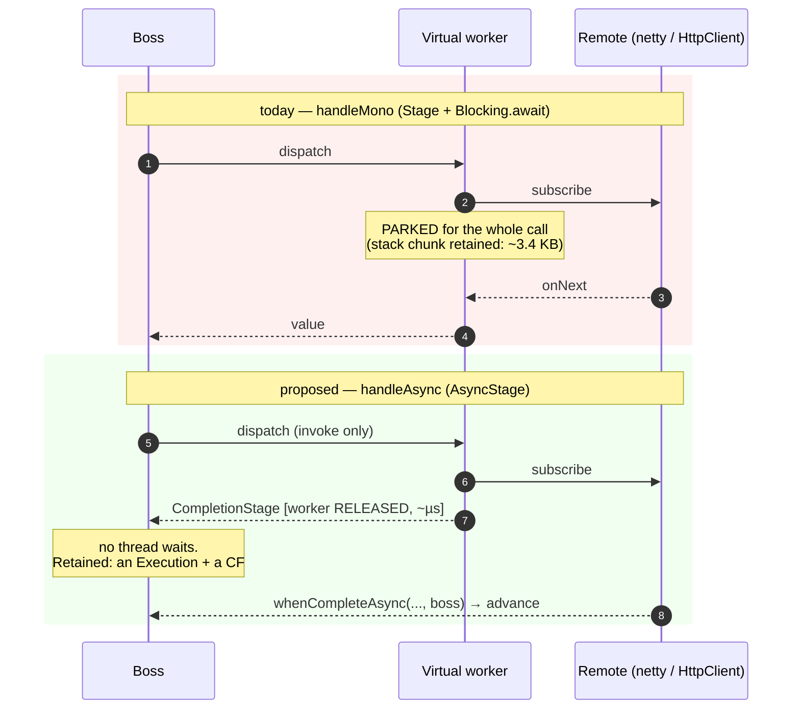
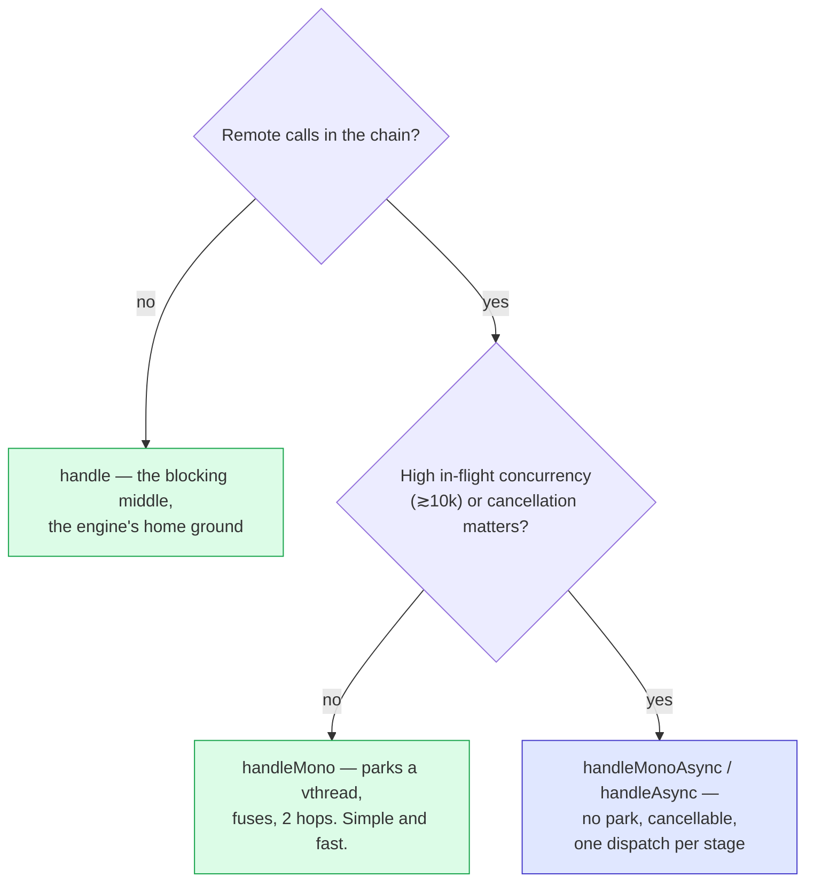

# RFC 0006 — `AsyncStage`: the stage that does not park

- **Status**: Implemented (`AsyncStage`, `DefaultNioEngine.Execution.attemptAsync`, `DefaultNioFlowAsyncStageTest`, `ReactiveAsyncStageTest`)
- **Target**: `core/` (`core.model`, `core.facade`, `application.facade`, `infrastructure.reactive`), `tests/`
- **Depends on**: the `TimerWheel`, the worker dispatch path, RFC 0002 (implemented)
- **Reverses**: one non-goal of RFC 0002 — *"No reactive `Link` type"*
- **Enables**: RFC 0007 (cancellation), which is nearly pointless without this one

## Summary

A ninth link: **`AsyncStage`**, whose function returns a `CompletionStage`. The virtual worker *invokes* the function and is released immediately; the boss resumes when the stage completes. Today's reactive stage parks a worker for the entire duration of a remote call — this one does not.

No Reactor in the signature. `CompletionStage` is `java.util.concurrent`, so the link lives in `core.model`, `CoreWithoutReactorTest` keeps passing unchanged, and `handleAsync` serves `HttpClient.sendAsync`, the AWS SDK v2 and the Cassandra driver exactly as well as it serves a `Mono`.

Two things it buys, one it costs:

| | Buys / costs |
| --- | --- |
| **Heap** | today's `handleMono` retains **3 615 B** per in-flight request against pure Reactor's **215 B** — 16.8×, measured by `ReactiveHeapProbeTest`. Almost all of it is one parked virtual thread's stack chunk. Remove the park and it should collapse to an `Execution` plus a `CompletableFuture`. |
| **Cancellation** | a `CompletionStage` is a *handle*. A parked thread is not. This is what makes RFC 0007 possible at all. |
| **Fusion** | an `AsyncStage` is a dispatch boundary: it ends a fused run. Four `handleMono`s fuse into 2 thread hops; four `handleAsync`es are 4 dispatches. This is the cost, and it is why both steps survive. |

## Why RFC 0002 said no, and why that answer expired

RFC 0002 stated the non-goal plainly (`0002:76`):

> **No reactive `Link` type** (an async stage returning a `CompletionStage` the engine chains on). Virtual workers make it unnecessary: a stage that parks on a `Mono` costs a parked virtual thread, **which is exactly what an async link would have saved**. Adding one would buy nothing and would put reactor semantics in the sealed model.

Two clauses, and time treated them differently.

- *"would put reactor semantics in the sealed model"* — **still true, and this RFC still refuses it.** `AsyncStage` carries a `Function<Object, CompletionStage<Object>>`. The engine learns nothing about Reactor.
- *"a parked virtual thread … would buy nothing"* — **an estimate, and 0002 is the document that disproved it.** It demanded a heap probe; the probe was written; it came back at **16.8×**. "Exactly what an async link would have saved" turns out to be ~3 400 B per in-flight request, plus every hope of cancellation. At 100 000 in flight that is the 360 MB vs 21 MB that 0002's own decision tree uses to send people *away* from the library.

The honest reading: 0002 rejected the async link on the strength of a number it did not have yet, then went and measured the number. This RFC is what the number says.

## Design

### The link

```java
// core/model/Link.java — the sealed interface grows from eight permits to nine
record AsyncStage(String name,
                  Function<Object, CompletionStage<Object>> call,
                  Duration timeout,          // nullable — armed on the TimerWheel, like Stage's
                  Retry retry,               // nullable
                  List<Guard> guards) implements Link { }
```

### The public steps — no Reactor anywhere

```java
// core/facade/NioFlow.java — type-preserving, like every other NioFlow step
NioFlow<I, O> handleAsync(String name, Function<I, CompletionStage<I>> call);
NioFlow<I, O> handleAsync(String name, Function<I, CompletionStage<I>> call, Duration timeout);
NioFlow<I, O> handleAsync(String name, Function<I, CompletionStage<I>> call, Duration timeout, Retry retry);

// core/facade/NioStep.java — plus the re-typing form
<R> NioStep<R, O> adaptAsync(Function<T, CompletionStage<R>> call);

// core/facade/Lane.java — the same, type-preserving over the lane's T
```

`handleAsync` is not a reactive feature that happens to be useful elsewhere; it is a **core** feature whose first caller happens to be reactive:

```java
orders.handleAsync("quote", order ->
        http.sendAsync(request(order), ofString())      // java.net.http — no worker parks
            .thenApply(response -> order.withQuote(response.body())));
```

And on the reactive mirror, the counterpart of `handleMono`:

```java
// infrastructure/reactive/ReactiveStep.java
ReactiveStep<T, O> handleMonoAsync(String name, Function<T, Mono<T>> call);
ReactiveStep<T, O> handleMonoAsync(String name, Function<T, Mono<T>> call, Duration budget);
<R> ReactiveStep<R, O> adaptMonoAsync(Function<T, Mono<R>> call);
// → delegate.handleAsync(name, v -> call.apply(v).toFuture())
```

### How it runs — the worker is a dispatcher, not a waiter

The rule "the boss never runs user code" is **not** relaxed. `call.apply(value)` is user code (it builds the request, it may subscribe), so it still goes to a worker. What changes is what happens next: the worker returns the `CompletionStage` immediately and goes back to the pool. It holds a virtual thread for microseconds, not for the 200 ms the remote call takes.



The resume is the handoff the engine already performs everywhere else — `whenCompleteAsync(…, boss)`, then `advance(resumeAt, value)`. There is no new orchestration concept; there is one fewer parked thread.

### The cancellation dividend (verified, not hoped)

From `reactor-core-3.8.6` sources, `MonoToCompletableFuture`:

```java
final class MonoToCompletableFuture<T> extends CompletableFuture<T> implements CoreSubscriber<T> {
    @Override
    public boolean cancel(boolean mayInterruptIfRunning) {
        boolean cancelled = super.cancel(mayInterruptIfRunning);
        if (cancelled) {
            Subscription s = ...;
            s.cancel();                     // ← the subscription dies with the future
        }
        return cancelled;
    }
}
```

So `mono.toFuture().cancel(false)` **cancels the HTTP call**, and reactor-netty releases the connection. That is the exact thing `0002:455` said a stage timeout *cannot* do, and which forced `handleMono(name, call, budget)` to push the budget onto the `Mono` as a workaround. With `AsyncStage`, the engine's own timeout — armed on the `TimerWheel` that already exists — cancels the call. The engine timeout and the Mono budget stop being two different things with two different reaches.

(This RFC only *enables* cancellation on the timeout path. Cancelling an execution from the outside — a disconnected client — is RFC 0007.)

### How it composes with what already exists

Each of these is a claim a test has to pin, because "it is just another link" is what the design rests on:

- **Timeout** — armed on the `TimerWheel` exactly as `Stage`'s per-attempt budget is (`DefaultNioEngine:1373-1400`), except that on expiry it *also* calls `cancel(false)` on the `CompletionStage`. Abandon becomes cancel.
- **Retry** — a failed attempt re-invokes the function on a worker. There is no inline `LockSupport.parkNanos` loop (there is no parked worker to loop on); backoff schedules on `delayedExecutor`, the cold path `Stage` already uses for timeout+retry.
- **Recovery** — the stage's future completing exceptionally enters `recover(index + 1, error)`, the same door a worker's throw enters by. `CompletionException` unwrapping is the existing logic.
- **Guards / lanes / forks** — `AsyncStage` carries `List<Guard>` like every link. Nothing to do.
- **`RateLimit`** — `acquire()` still parks a virtual worker; it *is* admission, and parking there is the point. It runs on the invoking worker before the function, so the worker is held for the wait and released with the `CompletionStage`. **Honest note**: a rate-limited async stage does park for the wait, so `RateLimit` + `AsyncStage` does not fully deliver the no-park property. The javadoc must say so.
- **Fusion** — breaks the run. Encoded in `CompiledChain`'s window computation exactly like `Background` and `Fork`.
- **No `handleSyncAsync`** — a `CompletionStage` on the boss is the mistake this design must keep inexpressible, same as there is no `handleSyncMono`.

### Both steps survive

This is a **choice, not an upgrade**:

| | Thread hops (4 remote stages) | Retained per in-flight request | Cancels the remote call |
| --- | --- | --- | --- |
| `handleMono` (fuses) | 2 | 3 173 B | only via `mono.timeout(budget)` |
| `handleMonoAsync` | 8 | 489 B (an `Execution` + a `CF`) | yes — engine timeout, and (RFC 0007) client disconnect |

Hops are microseconds against a remote call measured in milliseconds — **~8 µs per extra dispatch**, measured below; `0002:332` already established that latency is not the axis that moves. Heap is. So both stay, each javadoc points at the other, and the decision tree gains one branch:



Note what leaves the tree: the *"then use plain Reactor"* red box from `0002:366`. The only reason it was there was the 16.8×.

## Testing and benchmarks

**Unit tests (`core/`).**

- `AsyncStageTest` — the "it is just a link" battery, mirroring what `ReactiveMonoSemanticsTest` did for `handleMono`: an `AsyncStage` honours `Retry`, arms its timeout on the wheel, lands in a lane, is caught by `recover()`, reports `stageCompleted` under its own name, carries guards, and **breaks the fused run** (asserted by counting thread hops, not by reading the plan).
- **The worker is released** — an `AsyncStage` whose future never completes leaves the worker pool able to serve N more requests. Today's `handleMono` cannot pass this test. That assertion is the whole RFC in one line.
- `AsyncStageTimeoutTest` — the engine timeout **cancels** the `CompletionStage` (a stub observes the cancellation), where a `Stage` timeout only abandons the worker.
- `CoreWithoutReactorTest` and `ReactiveMirrorTest` pass **unchanged** — the mirror test goes red until every new step has its covariant override, which is exactly its job.

**Benchmarks (`tests/`).**

1. **`ReactiveHeapProbeTest`, extended — the arbiter.** Same 10 000 in-flight requests parked on a `Sinks.One` that never emits, now three-way: pure Reactor / `handleMono` / `handleMonoAsync`. The central claim is that the third column lands near the first.
2. **`asyncStageOverhead`** (new, JMH) — four `handleMono` (fused, 2 hops) against four `handleMonoAsync` (4 dispatches) over immediately-resolved Monos, so the score is pure engine overhead. This is the cost side of the table above, and it ships in `docs/webflux.md` at whatever number it comes back with.
3. **`NioFlowBenchmark` before/after** — a flow that declares no async stage must be flat. The ninth link adds a `switch` case, nothing else.

**Acceptance bar — and it is a gate, not a hope:**

- The heap probe shows `handleMonoAsync` retaining within ~2× of pure Reactor per in-flight request (against today's 16.8×). **If it does not, this RFC does not ship**: it would be a fusion loss bought with nothing.
- `NioFlowBenchmark` and the non-reactive suite are flat.

## What the implementation changed

Three things the RFC left open, decided in the code:

- **No `RateLimit` overload for `handleAsync`** — the RFC accepted an asterisk ("a rate-limited async stage does park for the admission wait"); the implementation removes the asterisk instead of documenting it. `acquire()` parks the worker, which is exactly what the link exists to avoid, so the overload does not exist: rate-limit an upstream `handle`, where the wait belongs, and the remote call still holds no thread. "Does not park" has no footnote.
- **`adaptAsync(call, timeout)` exists**, not just `adaptAsync(call)`. A re-typing remote call needs a budget as badly as a type-preserving one, and the budget is the whole cancellation story.
- **A null `CompletionStage` fails the value loudly** (`IllegalStateException`, recoverable) instead of hanging the execution on a stage that does not exist. It is the one new way an async call can be wrong that a blocking one cannot.

Cancellation is `toCompletableFuture().cancel(false)`, guarded: a minimal `CompletionStage` implementation may refuse to produce a future, and then the timeout still fires and `recover()` still runs — only the remote call keeps going. Honest, and asserted.

## Numbers

**The gate — retained heap per in-flight request** (`ReactiveHeapProbeTest`, 10 000 concurrent, all parked on a `Sinks.One` that never emits):

| | retained | vs pure Reactor |
| --- | --- | --- |
| `handleMono` (parks a virtual thread) | 3 173 B | 14.6× |
| **`handleMonoAsync`** (parks nothing) | **489 B** | **2.2×** |
| pure Reactor chain | 218 B | 1× |

The bar was "within ~2× of pure Reactor". It came back at 2.2× — 6.5× less than the parked thread it replaces, and the RFC ships. What is left is an `Execution` and a `CompletableFuture`, which is exactly what it predicted would be left.

**The cost — fusion**, and the flat-line check (`ReactiveBenchmark` / `NioFlowBenchmark`, JDK 25, 1 fork × (3 warmup + 5 measured), `-prof gc`):

| | throughput | allocation |
| --- | --- | --- |
| `fourReactiveStages` — four `handleMono`, FUSED (2 hops) | 56.2 ± 6.5 ops/ms | 1 057 B/op |
| `fourAsyncReactiveStages` — four `handleMonoAsync` (4 dispatches) | 20.6 ± 1.9 ops/ms | 3 537 B/op |
| `NioFlowBenchmark.engineCall` (8 stages) — no async stage anywhere, **before** | 57.9 ± 4.4 ops/ms | 679 B/op |
| `NioFlowBenchmark.engineCall` (8 stages) — no async stage anywhere, **after** | 55.6 ± 9.6 ops/ms | 677 B/op |

The flat line holds: a chain that declares no async stage is unchanged (within the error bars, and the allocation is identical to the byte). The ninth link costs a `switch` case to those who never use it, as predicted.

The cost side came back **worse than the RFC guessed**, and both numbers deserve to be read carefully:

- **Throughput: 2.7× down, not the rounding error the RFC implied.** But the benchmark resolves its Monos *immediately* — that is the point of it, it isolates engine overhead — so what it measures is 17.8 µs/op against 48.5 µs/op: **~8 µs per extra dispatch**. Against a remote call worth 200 ms, four of those are 0.015 % of the request. The decision tree does not move; the honest sentence is "microseconds per stage", and now it is a measured number instead of a claim.
- **Allocation: 3.3× up, which sounds like it contradicts the gate — it does not.** `gc.alloc.rate.norm` is *transient garbage per completed request*; the heap probe measures *retained bytes per in-flight request*. An async stage allocates more of the former (a `CompletableFuture` chain and four dispatches instead of one fused run) and holds 6.5× less of the latter (no parked thread's stack chunk). They are different axes and they genuinely point in opposite directions: `handleMonoAsync` trades **young-gen churn**, which the GC reclaims for free, for **live-set**, which it cannot. That trade is only worth making at concurrency — which is exactly the branch of the tree it sits on.

## Risks

| Risk | Mitigation |
| --- | --- |
| **A ninth link in the sealed model.** Every `switch` over `Link` grows a case, and the eight-link model was a selling point. | The link is `CompletionStage`-shaped, not Reactor-shaped: it is the JDK's async idiom, and `handleAsync` stands on its own for `HttpClient`/AWS/Cassandra users who have never heard of Reactor. If the ninth case cannot pay for itself in `core` alone, it does not belong in `core.model` — and then this RFC fails, cleanly. |
| **Two ways to do a remote call**, and users will pick wrong. | One question in the decision tree, each javadoc naming the other, and benchmark numbers in the docs. The alternative is the status quo: one step that silently parks a thread per in-flight call. |
| **Losing fusion is a real throughput regression** for chains of many small remote calls. | Measured and published, and it is bigger than this RFC guessed: 2.7× on immediately-resolved Monos (~8 µs per extra dispatch, invisible behind a real remote call, ruinous in front of a `Mono.just`). `handleMono` remains, and remains the default recommendation below ~10k in flight. |
| `RateLimit` + `AsyncStage` still parks for the admission wait, so "does not park" has an asterisk. | Stated in the javadoc and asserted by a test, rather than discovered in a heap dump. |

## Future work

- **RFC 0007 — cancellation.** The `CompletionStage` is the handle it needs.
- **`batchAsync`** — a bulk that returns a `CompletionStage`, so a coalescing point does not park a worker either.
- **Kotlin coroutines.** `AsyncStage` is a far better substrate for `suspend` than a parking stage ever was: `Deferred` is a `CompletionStage` away.
