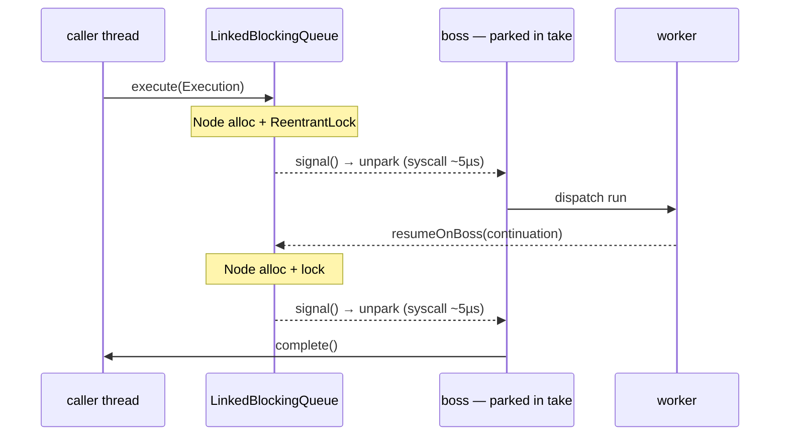
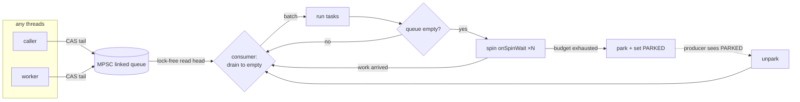

# RFC 0009 — The boss is a `ThreadPoolExecutor`, and that is the tax

- **Status**: Implemented (`BossLoop`, `DefaultNioEngine` counters, `BossLoopTest`, `DefaultNioEngineDedicatedPoolTest`)
- **Target**: `core/` (`application.facade`), `tests/`
- **Depends on**: nothing new
- **Part of**: the throughput series (0009–0017); this is the single largest win and stands alone

## Summary

Every boss is `Executors.newSingleThreadExecutor(...)` (`DefaultNioEngine:95`) — a `ThreadPoolExecutor` over a `LinkedBlockingQueue`. Each handoff to a boss allocates a queue `Node`, takes a `ReentrantLock`, and — the expensive part — `signal()`s a **parked platform thread** back to life through the kernel. A request crosses to the boss twice (submit, and worker→boss resume), so most of an execution's ~17.5 µs is `unpark` syscalls.

Replace the boss's executor with a purpose-built event loop that, **while busy, never parks and never syscalls**: an MPSC queue drained in batches, with spin-then-park so a producer only `unpark`s a boss that actually went to sleep. Same design as Netty's `SingleThreadEventExecutor`, for the same reason. No new dependency — the queue is ours (the zero-dependency rule stands).

This RFC also folds in the **shared counters on the same submission path** (§3): they are gated by the same benchmark (`engineCallContended`) and are the other half of "make `call()` contention-free under load".

## The cost, drawn

Two `unpark`s per request, each a kernel round trip. At trivial stage work that is the dominant term — chain length is free (1→32 stages costs 3%), so this is where the time actually goes.

## Results — measured

Before/after on identical params (`-f 2 -wi 3 -i 5 -r 1s -w 1s -prof gc`, JDK 25 / Darwin), the "before" run taken on the pre-change tree (git stash):

| Benchmark | stages | before ops/ms | after ops/ms | Δ | before B/op | after B/op |
| --- | --- | --- | --- | --- | --- | --- |
| `engineCall` | 8 | 58.0 | 71.9 | **+24%** | 685 | 616 |
| `engineCall` | 32 | 57.2 | 72.6 | **+27%** | 685 | 616 |
| `fluentExecute` | 1 | 58.0 | 92.8 | **+60%** | 756 | 688 |
| `fluentExecute` | 8 | 56.6 | 84.6 | **+49%** | 754 | 688 |
| `fluentExecute` | 32 | 56.7 | 73.9 | **+30%** | 744 | 688 |
| `perRequestBuilder` | 1 | 56.0 | 86.8 | **+55%** | 1066 | 1000 |
| `perRequestBuilder` | 32 | 51.1 | 72.0 | **+41%** | 2272 | 2208 |
| `engineCallContended` | 1 | 112.3 | 117.2 | +4% | 661 | 616 |
| `engineCallContended` | 8 | 109.7 | 116.6 | +6% | 661 | 616 |
| `engineCallContended` | 32 | 109.6 | 118.2 | +8% | 661 | 616 |

Two findings, one of which corrects this RFC's own prediction:

- **The design predicted `engineCallContended` would move most; the opposite happened.** The single-thread synchronous paths (`engineCall`/`fluentExecute`/`perRequestBuilder`, each `execute()` joins) park the boss between requests and pay an `unpark` on *every* one — exactly the cost `BossLoop` removes, so they gain +24–60%. The contended case runs several producer threads, keeping the boss warm and already-awake, so it had the least parking to eliminate (+4–8%). The mechanism is the same one the RFC named; the attribution was backwards.
- **Allocation fell, it did not merely hold.** −10% on `engineCall` (685→616 B/op) and similar across the board — removing the `bossCursor` atomic and the `LinkedBlockingQueue`/`ThreadPoolExecutor` machinery more than paid for the one `Node` per handoff `BossLoop` still allocates. The gate ("must not rise") is met with margin.

## Design

### 1. `BossLoop implements Executor` (~120 lines)

- **MPSC linked queue** (Vyukov): producers CAS the tail; the single consumer reads the head with no lock, no `Node` contention.
- **Batch drain**: the consumer polls until the queue is empty, so a burst of resumes costs one wake, not one per task.
- **Spin-then-park**: `Thread.onSpinWait()` for a bounded budget before parking, plus a `volatile int state` (`AWAKE`/`PARKED`) so a producer calls `unpark` **only** when the boss truly parked. Under load the boss stays `AWAKE` and a handoff is a CAS, not a syscall.

### 2. The one tunable

`-Dnioflow.boss.spin` (default modest — a few thousand `onSpinWait`s ≈ tens of µs). Idle CPU burn is the cost and is why the default is small: bosses are sized to the core count, so a server at 5% load must not spin at 100%.

### 3. The counters on the same path

Three shared cachelines touched on `call()` of a JVM-wide engine, gated by the same `engineCallContended`:

- **`bossCursor`** (`DefaultNioEngine:611`) — an `AtomicInteger.getAndIncrement()` per call just to round-robin. Replace with **caller-thread affinity**: `floorMod(Thread.currentThread().threadId(), bosses.length)`. Sequential thread ids spread at least as well, the atomic disappears, and a request thread keeps landing on the same boss (cache locality).
- **`activeExecutions`** (`DefaultNioEngine:121`) — one `AtomicInteger`, incremented/decremented for every execution and every fork, JVM-wide, purely for `shutdown(grace)` (a cold path). Stripe it (per-boss padded cell / `LongAdder`-shaped) and have `awaitDrain` poll `sum()` at ms granularity. Drain contract unchanged: 0 still means "everything reported".
- **`bossFor(key)`** (`DefaultNioEngine:617`) — uses `key.hashCode()` raw, so clustered low bits (a `Long` id, a sequential order number) serialize onto one boss. Spread it (`h ^ (h >>> 16)`), as `HashMap` does.

## Invariants that hold

- **Each execution pinned to one boss; only that boss touches its orchestration state.** Unchanged — this swaps *how* tasks reach the boss, not the affinity.
- **The boss never runs user code.** Unchanged.
- **`advance` stays iterative** — `DeepChainStressTest`.
- **Zero runtime dependencies** — the MPSC queue is ours.

## Testing

- **`BossLoopTest`**: FIFO from one producer (10k) and under 8 concurrent producers (160k, none lost); a task submitted while parked runs (the wake fires); reentrant submission from inside a task (the engine's hop-to-same-boss pattern); `execute` after `shutdown` is rejected; `shutdown` drains what is queued then terminates; a throwing task does not kill the loop.
- **`BossLoopIdleCpuTest`**: an idle boss consumes ≈ 0 CPU (it parks), and a lightly-loaded one stays near-parked — the mechanical proof the spin reaches the park, and a regression guard against a spins-forever edit.
- **Counters**: `DefaultNioEngineDedicatedPoolTest` — caller-thread affinity pins one producer to one boss, distinct keys spread deterministically across the pool, affinity holds across the worker hop; `awaitDrain` still returns 0 after a clean drain (`KeyedExecutionStressTest`, `ForkStormStressTest`).
- The full existing suite is the regression net; no assertion changed except the dedicated-pool test, which asserted round-robin spread (now caller-thread affinity).

## Gate — met

| Benchmark | Must | Result |
| --- | --- | --- |
| `engineCall` | improve (removes the unpark on submit/resume) | +24–27% ✓ |
| `engineCallContended` | improve | +4–8% ✓ |
| single-thread synchronous (`fluentExecute`, `perRequestBuilder`) | improve | +30–60% ✓ |
| `-prof gc` | must not rise | fell ~10% ✓ |
| idle CPU (`BossLoopIdleCpuTest`) | ≈ 0, must park | **0.0000 cores** ✓ |
| lightly-loaded CPU (5 ms drip) | ≈ real work only | **0.0112 cores** across 2 bosses ✓ |

**Low utilization is measured, not assumed.** `BossLoopIdleCpuTest` reads the dedicated engine's boss threads via `ThreadMXBean.getThreadCpuTime` (so GC/JIT/the shared pool never pollute it): a fully idle boss consumes **0.0000 cores** over a 2 s window — it parks after one ~µs spin burst and stays there — and a 5 ms drip of ~400 executions costs **0.0112 cores** across both bosses, which is the executions' own work, not spinning. The RFC's worry ("a workload that trickles just faster than the budget keeps a core hot") cannot happen: the spin budget is ~µs, so any inter-arrival slower than high-load parks between tasks. The bounded default (`nioflow.boss.spin=1000`) needs no change.

## Risks

- **Spin burns CPU on an idle server.** ~~Bounded, small default, tunable; the low-utilization benchmark is mandatory.~~ **Measured and closed**: idle bosses consume 0.0000 cores, a 5 ms drip 0.0112 cores (`BossLoopIdleCpuTest`). The spin reaches the park; the default needs no change.
- **A hand-written MPSC queue is subtle.** It is the one piece of genuinely concurrent code added; `BossLoopTest` hammers it with 8 producers × 20k tasks and asserts none is lost. A `jcstress`-style harness would strengthen this further and is worthwhile follow-up.
