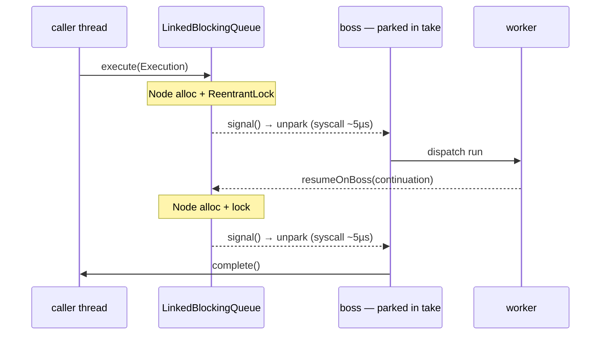
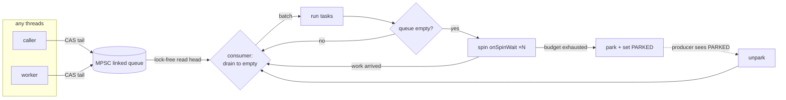

# RFC 0009 — The boss is a `ThreadPoolExecutor`, and that is the tax

- **Status**: Proposed
- **Target**: `core/` (`application.facade`), `tests/`
- **Depends on**: nothing new
- **Part of**: the throughput series (0009–0017); this is the single largest win and stands alone

## Summary

Every boss is `Executors.newSingleThreadExecutor(...)` (`DefaultNioEngine:95`) — a `ThreadPoolExecutor` over a `LinkedBlockingQueue`. Each handoff to a boss allocates a queue `Node`, takes a `ReentrantLock`, and — the expensive part — `signal()`s a **parked platform thread** back to life through the kernel. A request crosses to the boss twice (submit, and worker→boss resume), so most of an execution's ~17.5 µs is `unpark` syscalls.

Replace the boss's executor with a purpose-built event loop that, **while busy, never parks and never syscalls**: an MPSC queue drained in batches, with spin-then-park so a producer only `unpark`s a boss that actually went to sleep. Same design as Netty's `SingleThreadEventExecutor`, for the same reason. No new dependency — the queue is ours (the zero-dependency rule stands).

This RFC also folds in the **shared counters on the same submission path** (§3): they are gated by the same benchmark (`engineCallContended`) and are the other half of "make `call()` contention-free under load".

## The cost, drawn



Two `unpark`s per request, each a kernel round trip. At trivial stage work that is the dominant term — chain length is free (1→32 stages costs 3%), so this is where the time actually goes.

## Baseline

Smoke run (`-f 1 -wi 2 -i 3`, shape only):

```
NioFlowBenchmark.engineCall            1 stage    57.8 ops/ms   (~17.5 µs/op)
NioFlowBenchmark.engineCallContended   8 stages  105.3 ops/ms
ReactiveBenchmark.pureReactorChain              8788.7 ops/ms
```

`engineCallContended` (bosses warm, rarely parked) is already ~2× `engineCall` — evidence that the park/unpark is exactly the cost, since the contended case is the one that avoids it.

## Design

### 1. `BossLoop implements Executor` (~120 lines)



- **MPSC linked queue** (Vyukov): producers CAS the tail; the single consumer reads the head with no lock, no `Node` contention.
- **Batch drain**: the consumer polls until the queue is empty, so a burst of resumes costs one wake, not one per task.
- **Spin-then-park**: `Thread.onSpinWait()` for a bounded budget before parking, plus a `volatile int state` (`AWAKE`/`PARKED`) so a producer calls `unpark` **only** when the boss truly parked. Under load the boss stays `AWAKE` and a handoff is a CAS, not a syscall.

### 2. The one tunable

`-Dnioflow.boss.spin` (default modest — a few thousand `onSpinWait`s ≈ tens of µs). Idle CPU burn is the cost and is why the default is small: bosses are sized to the core count, so a server at 5% load must not spin at 100%.

### 3. The counters on the same path

Three shared cachelines touched on `call()` of a JVM-wide engine, gated by the same `engineCallContended`:

- **`bossCursor`** (`DefaultNioEngine:611`) — an `AtomicInteger.getAndIncrement()` per call just to round-robin. Replace with **caller-thread affinity**: `floorMod(Thread.currentThread().threadId(), bosses.length)`. Sequential thread ids spread at least as well, the atomic disappears, and a request thread keeps landing on the same boss (cache locality).
- **`activeExecutions`** (`DefaultNioEngine:121`) — one `AtomicInteger`, incremented/decremented for every execution and every fork, JVM-wide, purely for `shutdown(grace)` (a cold path). Stripe it (per-boss padded cell / `LongAdder`-shaped) and have `awaitDrain` poll `sum()` at ms granularity. Drain contract unchanged: 0 still means "everything reported".
- **`bossFor(key)`** (`DefaultNioEngine:617`) — uses `key.hashCode()` raw, so clustered low bits (a `Long` id, a sequential order number) serialize onto one boss. Spread it (`h ^ (h >>> 16)`), as `HashMap` does.

## Invariants that hold

- **Each execution pinned to one boss; only that boss touches its orchestration state.** Unchanged — this swaps *how* tasks reach the boss, not the affinity.
- **The boss never runs user code.** Unchanged.
- **`advance` stays iterative** — `DeepChainStressTest`.
- **Zero runtime dependencies** — the MPSC queue is ours.

## Testing

- **`BossLoop` unit tests**: FIFO under many concurrent producers; a task submitted while parked runs; a task submitted while spinning runs **without** an `unpark` (assert via a counter); `shutdown` rejects and drains.
- **Counters**: `bossFor` spread over clustered keys hits >1 boss; `awaitDrain` still returns 0 after a clean drain (`KeyedExecutionStressTest`, `ForkStormStressTest`).
- The full existing suite is the regression net; no assertion may change.

## Gate

| Benchmark | Must |
| --- | --- |
| `engineCallContended` | improve most (boss warm, contention removed) |
| `engineCall` | improve (removes the unpark on submit/resume) |
| `-prof gc` | 727 B/op sealed, 248 B/op inlined — must not rise |

Run at **low utilization too**: a throughput win that costs 8 idle cores spinning is not a win.

## Risks

- **Spin burns CPU on an idle server.** Bounded, small default, tunable; the low-utilization benchmark is mandatory.
- **A hand-written MPSC queue is subtle.** It is the one piece of genuinely concurrent code added; it gets its own tests and a `jcstress`-style hammer if we can afford one.
