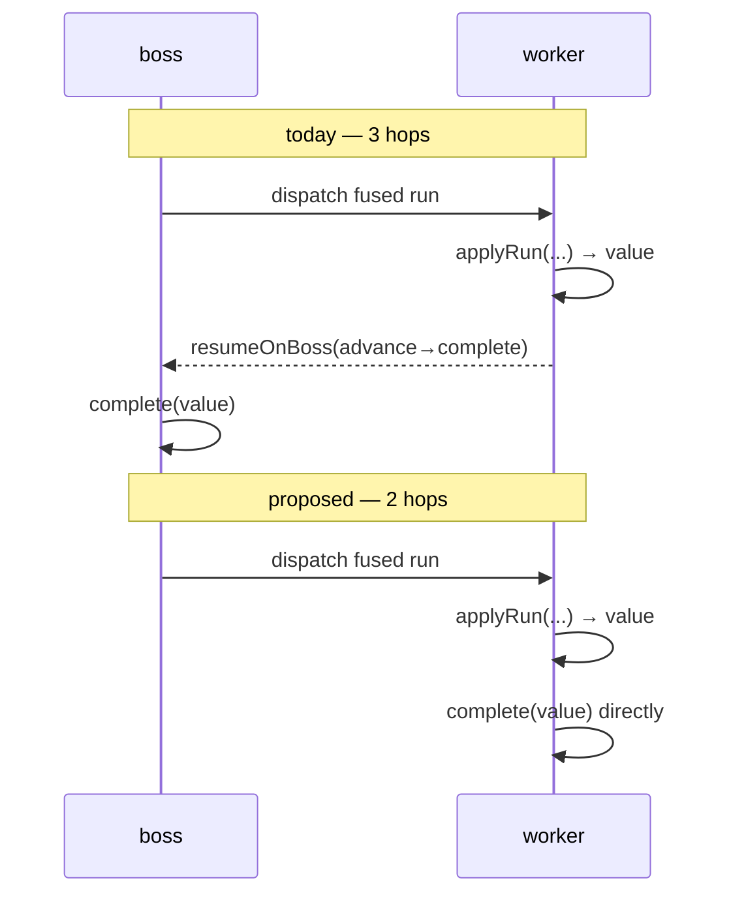
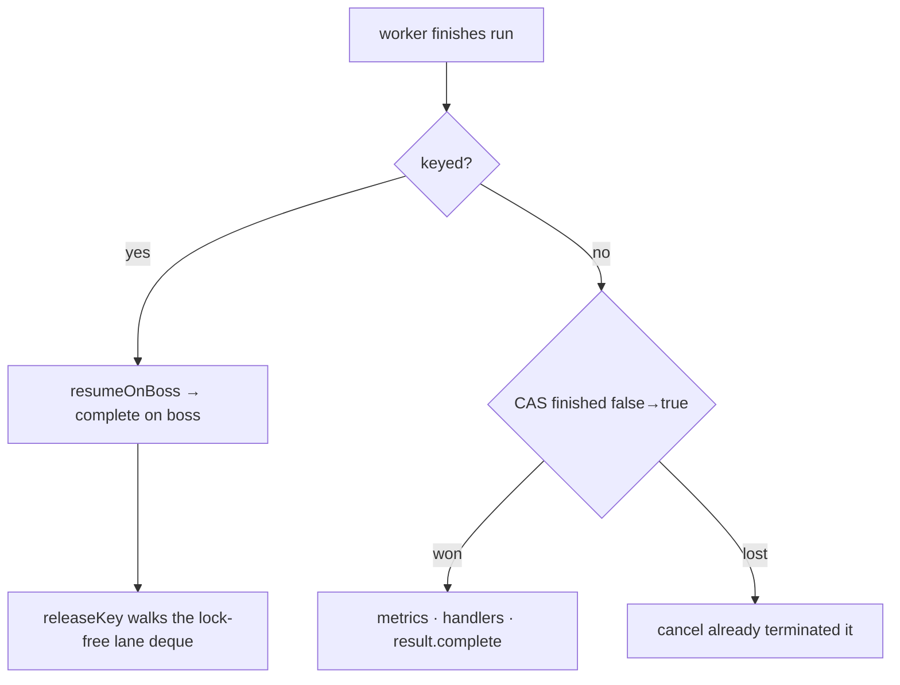

# RFC 0010 — The last hop: complete on the worker

- **Status**: Proposed
- **Target**: `core/` (`application.facade`), `tests/`
- **Depends on**: RFC 0007 (cancellation) — implemented; interacts with the `finished` guard
- **Part of**: the throughput series (0009–0017)

## Summary

The canonical chain fuses into one worker run and ends there — yet it still costs **three** thread hops, because the terminal (`complete()`) is posted back to the boss for no reason but habit. `complete()` touches no orchestration state (except a keyed execution's lane). Let the worker that finished the run complete the execution itself: **three hops become two.**

## The hop being removed

The trigger is exact: the fused run consumed the rest of the chain, i.e. `resumeAt == links.size()`. Then the worker holds the final value and there is nothing left to advance.

## What `complete()` actually touches

Reading `DefaultNioEngine:1016`: the `finished` flag, the metrics sink, the complete handlers, the result future — and, **only for keyed executions**, `releaseKey()`. None of the first four is orchestration state. Only the key lane is.

## Design

### 1. `finished` becomes a CAS

Today `if (finished) return; finished = true;` (`DefaultNioEngine:1017`) is a check-then-set that is safe *only because every writer is the same boss* — which is exactly why `cancel()` posts its terminal **to** the boss (`DefaultNioEngine:1065`). Completing on a worker makes it a real race against `cancel()`, so exactly-once must be enforced properly: one `VarHandle` CAS per execution. Nanoseconds against the microseconds of the hop it removes.

### 2. Keyed executions keep the hop

`releaseKey()` walks the `KeyLane` deque, which is lock-free **because** only its key's boss touches it. A keyed execution completes on the boss, as today. The optimization applies to unkeyed traffic — the common case.

### 3. The async path keeps its boss hop

An `AsyncStage` completes on **whatever thread the remote call completes on** — a Netty event loop, an `HttpClient` selector. Running complete handlers (user code) there would be strictly worse than the boss. So this RFC's shortcut is for the **blocking fused run only**, which finishes on a worker we own.

## A side effect, and it is an improvement

Complete handlers (`onComplete(...)`) are user code. Rule 2 says the boss never runs user code — yet today the terminal path runs them on the boss, quietly breaking its own rule. Moving them to the worker means a slow `onComplete` delays **one** request, not every execution pinned to that boss.

## Invariants

- **Only the boss touches orchestration state.** The terminal touches none (keyed: still on the boss).
- **Exactly-once completion.** Now enforced by CAS instead of by single-writer discipline — strictly stronger.
- **Cancellation reaches the terminal.** `cancel()` still posts to the boss; the CAS is the arbiter between it and a worker-side complete.

## Testing

- **Exactly-once race**: hammer `cancel()` and the terminal from two threads on the same execution; assert exactly one of `complete`/`cancelled` is observed and the drain returns 0.
- **Handler thread**: assert `onComplete` runs off the boss for an unkeyed execution and on the boss for a keyed one.
- Full existing suite unchanged (`DefaultNioFlowCancellationTest`, `KeyedExecutionStressTest`).

## Gate

| Benchmark | Must |
| --- | --- |
| `fluentExecute`, `engineCall` | improve (removes 1 of 3 hops) |
| `perRequestBuilder` keyed path | unchanged (keeps its hop) |
| `-prof gc` | not rise |

## Risks

- **Which thread runs `onComplete` changes** (boss → worker) for unkeyed executions. The docs promise "callbacks run on engine threads", still true; the specific thread changes. Release note, since anything relying on boss affinity in a callback relied on something never promised.
- **The CAS is now load-bearing for correctness, not just perf.** It is covered by the exactly-once race test above.
