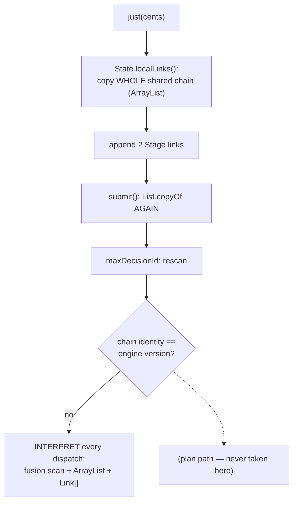
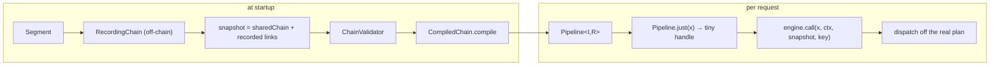
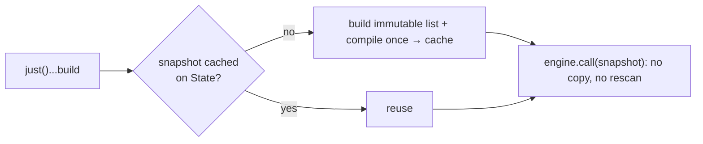

# RFC 0011 — A dispatch plan for per-request pipelines

- **Status**: Proposed
- **Target**: `core/` (`core.facade`, `application.facade`), `tests/`
- **Depends on**: nothing new; reuses `RecordingChain` and `CompiledChain`
- **Enables**: RFC 0014 (`pipe` over prebuilt pipelines)
- **Part of**: the throughput series (0009–0017)

## Summary

The documented main usage — `credits.just(cents).handle(...).adapt(...).execute()` — is the **only** path that interprets: it copies the shared chain twice, rescans it, and re-derives every fusion run on every dispatch, because a per-request chain has no identity match with the engine's compiled version. This RFC gives per-request pipelines a plan: a **prebuilt `Pipeline`** for the (common) case where the pipeline is structurally fixed, and a **cached snapshot** for the case where it genuinely varies. These are two mechanisms for one goal — *the `just()` path should dispatch off a plan* — so they ship as one RFC.

## What `just().…().execute()` pays today



References: `ExecutionNioFlow:460` (first copy), `DefaultNioEngine:323` (second copy + `maxDecisionId`), `DefaultNioEngine:1316-1339` (per-dispatch fusion scan and its two allocations). Everyone is on the interpreted path, and it is the one path that was never validated (`seal()` never saw it).

The smoke run shows the tail: `perRequestBuilder` degrades with chain length (46.7 ops/ms @32 vs `engineCall`'s 56.1, −17%) precisely because of the copies.

## Part A — the prebuilt `Pipeline` (the fixed case)

Most `just()` pipelines are identical every request; the lambdas do not close over the input. Let them be declared once.

```java
// startup — recorded, validated and compiled ONCE
Pipeline<Integer, String> charge = credits.pipeline(step -> step
        .handle("charge", item -> item * 2)
        .adapt(item -> "EUR " + item));

// per request — allocates an Execution, nothing else
charge.just(cents).execute();
charge.just(cents).key(customerId).executeAsync();
```



`pipeline(Segment<I, R>)` records the segment's links with `RecordingChain` (the machinery `fork` and `replaceRegion` already use), appends them to a shared-chain snapshot, **validates** it, and **compiles** it. `Pipeline.just(x)` returns a small handle carrying only what varies per request — input, key, seeded context, execution-scoped callbacks. Per request this removes both chain copies, the decision rescan, and the per-dispatch fusion scan with its two allocations, and moves validation from *never* to startup.

## Part B — the cached snapshot (the dynamic case)

Pipelines that genuinely differ per request keep the `just()` + build form, but stop paying the double copy:

```java
record ChainSnapshot(List<Link> links, CompiledChain plan) { }
```

`ExecutionNioFlow` produces the immutable snapshot itself, once, and caches it on its `State`. `NioEngine.call(input, context, snapshot, key)` takes it as-is: no defensive `List.copyOf`, no `maxDecisionId` rescan, precollected runs where the window is unguarded, plan-bounded windows where it is not. A re-subscribed `Mono` (which re-executes the same pipeline) then compiles nothing the second time — the snapshot is cached.



## Design notes

- **Same plan `seal()` builds.** The only new thing is that a per-request chain is *allowed* to carry one — `CompiledChain.compile` is unchanged.
- **`Pipeline` is additive public API** (`NioFlow.pipeline(Segment)` + the `Pipeline<I,R>` handle). `Segment` already exists.
- **Compiled and interpreted stay identical** (`DefaultNioEngineCompiledChainTest`) — this gives more chains a plan, never gives the plan a semantic.

## Testing

- **`PipelineTest`**: a prebuilt `Pipeline` and the equivalent `just()`-build produce identical results across guarded/branching/fork/batch chains.
- **Validation at build**: `pipeline(...)` with a broken chain (dangling guard, dead recovery) throws `ChainValidationException` at build, not at first request.
- **Snapshot caching**: a re-executed dynamic pipeline compiles once (assert via a compile counter/spy).
- Full suite unchanged.

## Gate

| Benchmark | Must |
| --- | --- |
| `perRequestBuilder` @32 | close the gap to `engineCall` (Part A) |
| `perRequestBuilder` @1, @8 | improve; allocation/op down (Part B) |
| new `PipelineBenchmark` | prebuilt beats `just()`-build on the same chain |
| `-prof gc` | allocation strictly down on the `just()` path |

## Risks

- **Two entry points for the same pipeline** (prebuilt vs dynamic). Documented: prebuilt for fixed structure, `just()` for per-request variation. The example's `NioFlowConfig` becomes the reference for the prebuilt form.
- **A `Pipeline` snapshots the shared chain at build time**; a later `splice` on the shared definition does not reach it. This is a feature (a prebuilt pipeline is stable) but must be stated — splice targets the live definition, not prebuilt pipelines.
