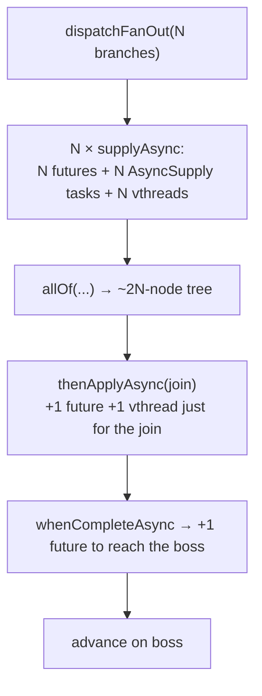
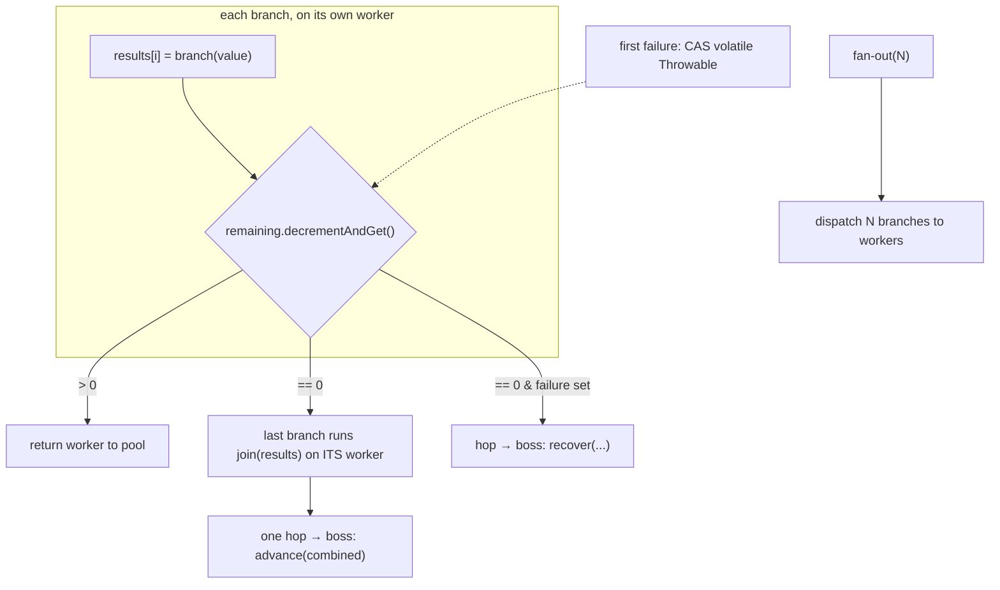
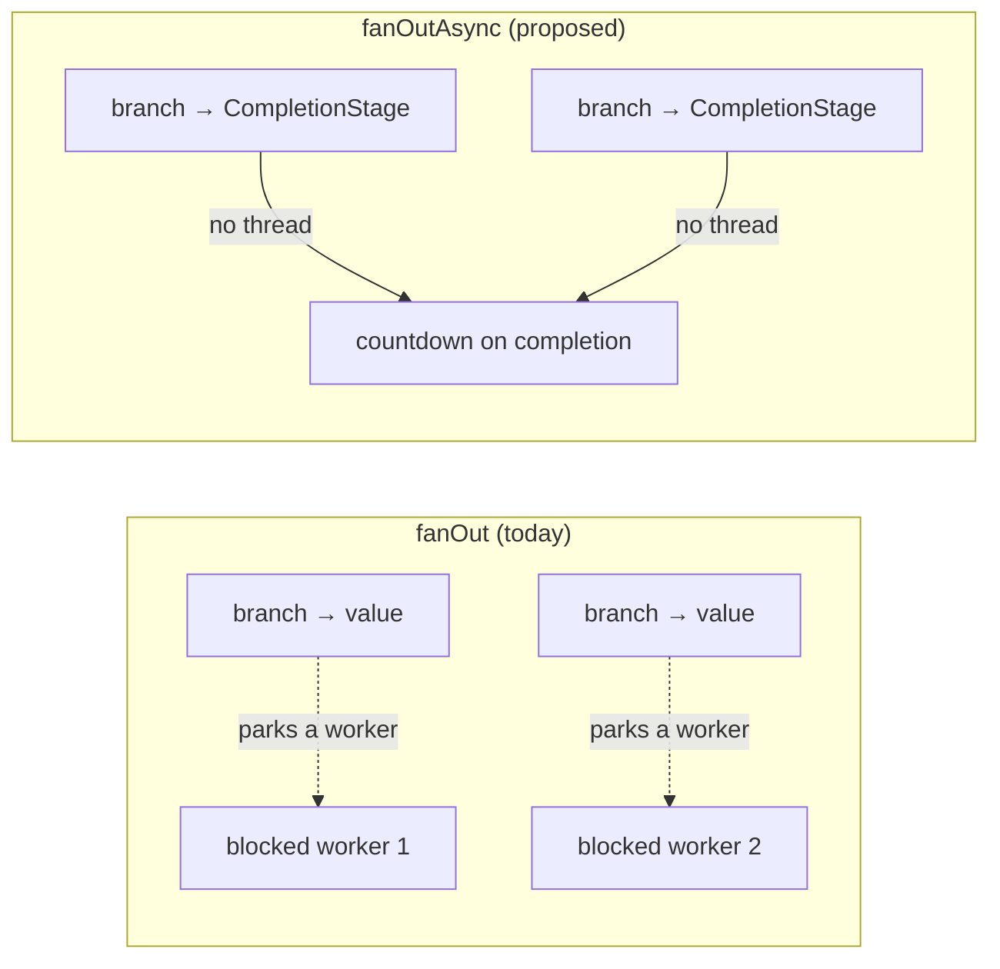

# RFC 0012 — Fan-out without the `CompletableFuture` ceremony (and `fanOutAsync`)

- **Status**: Proposed
- **Target**: `core/` (`core.model`, `core.facade`, `application.facade`), `tests/`
- **Depends on**: nothing new
- **Enables**: RFC 0016 (`fanOutMono` without parked workers)
- **Part of**: the throughput series (0009–0017)

## Summary

`dispatchFanOut` (`DefaultNioEngine:1462`) builds a tree of `CompletableFuture`s and spins up **one extra virtual thread just to run the join**. The engine already knows how to do a boss→worker→boss round trip by hand — `dispatch()` does it for stages — and fan-out is the last place still paying for the composition machinery. Replace it with four fields and a countdown. While the link is open, add **`fanOutAsync`**: a branch that returns a `CompletionStage` parks nothing, which is what RFC 0016 needs and what belongs in core (it names `CompletionStage`, never `Mono`).

## Today's allocation, per fan-out

`fanOutTrivial` measures the drag: 26.7 ops/ms against 58.6 for the sequential equivalent.

## Proposed: a countdown, no tree

Four fields replace the tree:

- **`results[]`** — one slot per branch, written only by that branch's worker: no sharing, no contention.
- **`AtomicInteger remaining`** — the branch that decrements it to zero runs `join(results)` **on its own worker** (it is already on a worker; user code belongs there), then hops to the boss once.
- **`volatile Throwable failure`** set by the first failing branch (CAS) — the last branch out takes the recovery path instead of the join.
- **no extra virtual thread for the join, no `allOf` tree, no dependent futures** — roughly 3N fewer allocations plus one fewer thread per fan-out.

## `fanOutAsync` — branches that hold no thread

Today a branch is `Function<Object, Object>`, so `fanOutMono` over four remote calls parks four virtual workers (`Blocking.branches`, `reactive/…/Blocking.java:101`) — the exact cost RFC 0006 removed from the main line and left standing here.

The countdown does not care whether a slot was filled by a worker **returning** or by a **future completing** — so `fanOutAsync(name, branches: Function<T, CompletionStage<R>>, join)` reuses the same machinery. `FanOut` grows a sibling link (or a flag) carrying async branches; the join and guard semantics are unchanged.

## Design notes

- **`FanOut` breaks fusion** (dispatch boundary) — unchanged.
- **Declaration order preserved** in `results[]` — the join sees branches in declared order, exactly as today.
- **A branch failure fails the whole fan-out, recoverable downstream** — unchanged; the `volatile Throwable` is the first-failure winner.
- **`CompletionStage`, never `Mono`** — `fanOutAsync` lives in core; the reactive `fanOutMono` decorates it (RFC 0016).

## Testing

- **`DefaultNioFlowFanOutTest`**: unchanged — same results, same order, same failure→recover behavior.
- **New**: `fanOutAsync` runs branches concurrently (total ≈ slowest, not sum), parks no worker (heap probe on a fan-out shape), and a failing async branch reaches `recover()` as itself.
- **Race**: two branches failing near-simultaneously — exactly one failure surfaces, deterministically the first to CAS.

## Gate

| Benchmark | Must |
| --- | --- |
| `fanOutTrivial` | improve (removes ~3N allocs + 1 thread) |
| `fanOutWork` | unchanged (real work dominates) |
| new `fanOutAsync` bench | no parked workers; concurrent |
| `-prof gc` | allocation/op down on fan-out |

## Risks

- **The join now runs on a branch's worker, not a dedicated one.** It is user code on a worker — correct by rule 2 — but a heavy join no longer has a thread to itself. In practice the join is a combine (cheap); a heavy join was already contending for the pool.
- **`fanOutAsync` adds public API** on `NioFlow`/`NioStep`/`Lane`. Additive, and it must appear on all three (`ReactiveMirrorTest` guards the reactive mirror separately).
