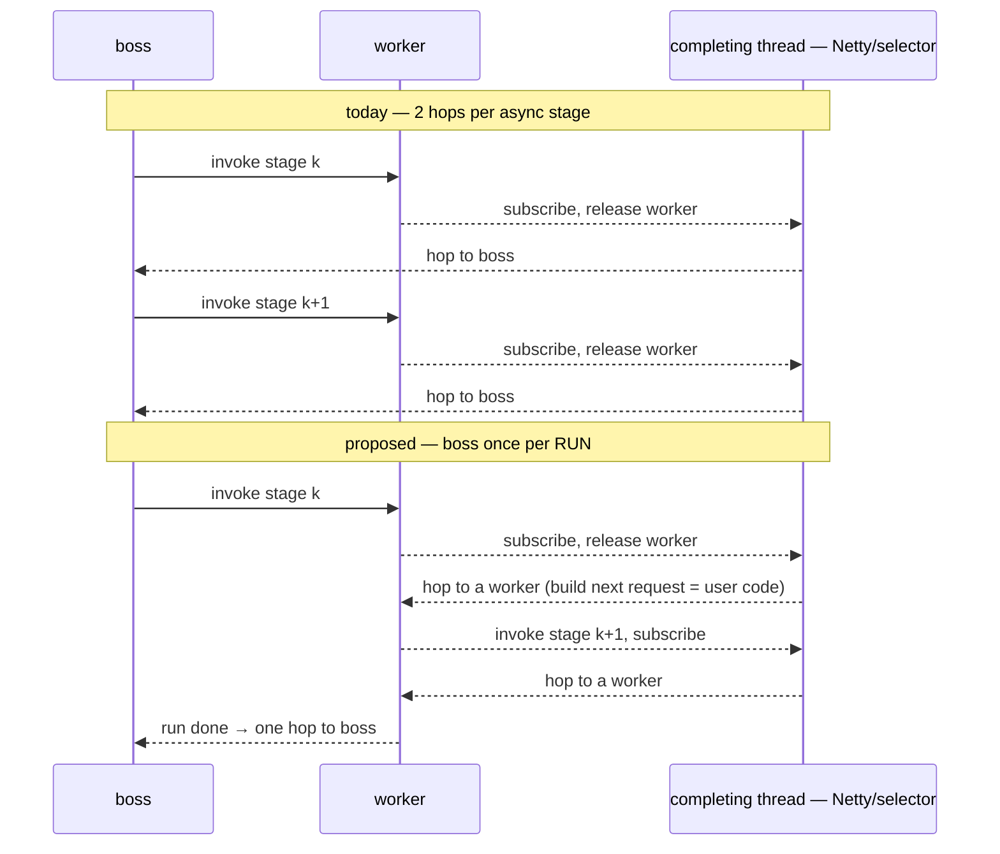
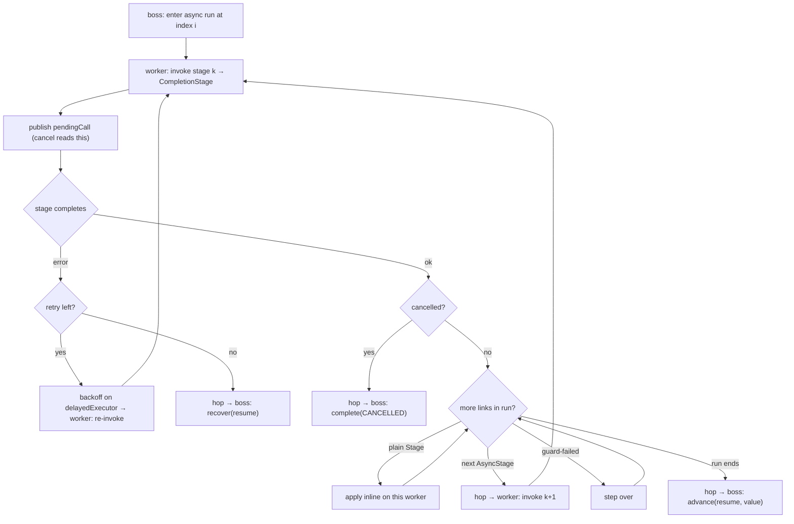

# RFC 0013 — Async-stage fusion: the 2.8× RFC 0006 accepted

- **Status**: Proposed
- **Target**: `core/` (`application.facade`), `tests/`
- **Depends on**: RFC 0006 (`AsyncStage`), RFC 0007 (cancellation) — both implemented
- **Enables**: RFC 0015 (async-routed `pipe`), the whole reactive heap win
- **Part of**: the throughput series (0009–0017). **This is the riskiest item and the highest-leverage one.**

## Summary

RFC 0006 measured that four `handleMonoAsync` stages cost 2.8× four `handleMono` stages (19.9 vs 54.9 ops/ms) and named the cause exactly:

> The cost is fusion: four async stages are four boss→worker round trips where four `handle`s are one.

It accepted this as the price of a dispatch boundary. It does not have to be the price. A run of consecutive `AsyncStage`s can be driven **from the worker side**, touching the boss once for the whole run instead of twice per stage.

## The hops today vs. proposed

The completing thread may be a Netty event loop, so stage *k+1*'s invocation (building the request, subscribing) — which is **user code** — must not run there and must not run on the boss. It runs on a worker. So the run costs **one worker hop per async stage** (not two boss hops) and reaches the boss **once**.

## Design — a worker-side driver over the run

The driver is a small state machine over the run's `Link[]`:

- **invoke stage *k*, publish `pendingCall`** (`DefaultNioEngine:935` — the field cancellation already reads), and on completion **hop to a worker** to build the next request, never continuing on the completing thread and never on the boss;
- **`cancelled` is read between stages**, exactly as `applyRun` reads it between fused blocking stages — RFC 0007's "the check the design forgot" applies here verbatim and for the same reason (a fused async run is several links with no boss boundary between them);
- **per-stage timeout, retry, `stageCompleted`** stay per stage, driven by the same machine: a `TimerWheel` budget per attempt, re-invoke on a worker after backoff;
- **a plain `Stage` inside the window is applied inline on the resuming worker** (it is already there, and it is a worker), so `adaptMonoAsync(...).handle(...).handleMonoAsync(...)` is one run, not three dispatches;
- **guards behave as in a blocking run**: guard-failed link stepped over, a passing `Decision` ends the run.

`CompiledChain.compile` grows one case: an `AsyncStage` window, under the same rules as a `Stage` window (`DefaultNioEngine:682`).

## Why this is the riskiest item

It is a **second execution driver**: it runs beside the boss rather than on it, and cancellation has to hold across it. Two drivers mean two places for a cancellation bug to hide. Mitigations:

- the driver **reuses `applyRun`'s structure and its checks** — same positional recovery, same cancellation read;
- the acceptance criterion is a **random-cut stress test**: a chain of async stages with cancellation fired at a uniformly random point, asserting **no stage runs after the cut**;
- it changes no public API and no semantic — it is purely how a run of existing links dispatches.

## Invariants

- **The boss never runs user code.** The driver runs user code on **workers**, never on the boss and never on the completing thread. Strictly upheld.
- **Cancellation reaches every loop.** This adds a third loop (after `advance` and `applyRun`); it gets the check.
- **Compiled == interpreted.** The async window is an optimization; an un-planned async chain still dispatches stage-by-stage, identically.

## Testing

- `ReactiveAsyncStageTest`, `DefaultNioFlowAsyncStageTest` — **pass unchanged**.
- **New stress**: random-cut cancellation across an async run (above); a mixed run (`asyncMono → handle → asyncMono`) fuses and cancels correctly; retry+timeout on a fused async stage still cuts and re-invokes.
- `ForkStormStressTest`, `ConcurrentSpliceStressTest` unchanged.

## Gate

| Benchmark | Must |
| --- | --- |
| `fourAsyncReactiveStages` | reach `fourReactiveStages` **±10%** |
| `fourReactiveStages` | unchanged |
| `-prof gc` | async run allocation down |

**This gate is load-bearing for the reactive series.** If async lands within 10% of blocking, RFC 0015 (async-routed `pipe`) is unblocked and the facade gets the 489 B/in-flight floor at fused throughput. If it does not, both reactive steps stay and the reactive heap win is deferred.

## Risks

- **Two execution drivers.** The single biggest risk in the whole series; the random-cut stress test is the gate, not a nice-to-have.
- **The completing thread must never run user code.** The design forbids continuing on it (always a worker hop); a bug that skips the hop would run a subscribe on a Netty loop. The test asserts stage invocations happen off the completing thread.
- **Backoff scheduling stays on `delayedExecutor`** (cold path) as RFC 0006 chose — a sub-tick backoff would degrade to wheel granularity. Unchanged.
