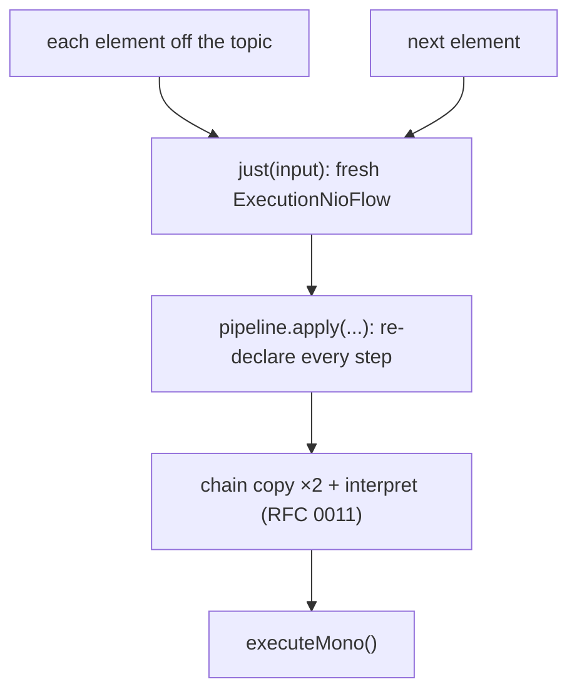
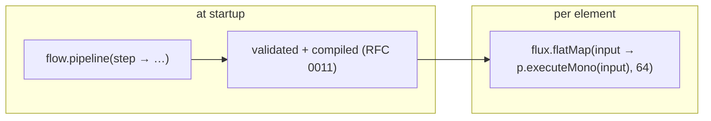

# RFC 0014 — `pipe` should not rebuild the pipeline per element

- **Status**: Proposed
- **Target**: `reactive/` (`infrastructure.reactive`)
- **Depends on**: RFC 0011 (per-request plan / `Pipeline`)
- **Part of**: the throughput series (0009–0017); the first reactive item and the one that stands alone soonest

## Summary

`pipe` is the facade's API for high-volume streams — its javadoc names Kafka, SSE and batch import — and it **re-assembles the entire pipeline on every element**. On the one path built for millions of messages, that is the worst place for per-element allocation. Build the pipeline once, execute it per element.

## The per-element cost

```java
// DefaultReactiveFlow.pipe (reactive/…/DefaultReactiveFlow.java:133)
return flux -> flux.flatMap(input -> pipeline.apply(input, just(input)).executeMono(), concurrency);
```



Every message pays: a new `ExecutionNioFlow`, every step's lambda re-wrapped, the double chain copy of RFC 0011, and the interpreted dispatch. None of it varies element to element on a typical ingestion loop.

## Proposed: build once, execute per element

```java
// once
Pipeline<Msg, Out> p = flow.pipeline(step ->
        step.handleMono("enrich", m -> enrich(m)).adaptMono(m -> persist(m)));

// the ingestion loop — only the input varies
Function<Flux<Msg>, Flux<Out>> ingest = flow.pipe(64, p);
```



`pipe(int, Pipeline)` becomes `flux -> flux.flatMap(input -> p.executeMono(input), concurrency)` — no per-element assembly, no chain copy, dispatch off the plan compiled once. The `Pipeline` overloads become the documented default for `pipe`/`pipeOrdered`/`pipeResilient`; the existing `BiFunction` overloads stay for the rare pipeline that varies per element.

## Design notes

- **`Pipeline.executeMono(input)`** is the reactive wrapper over `Pipeline.just(input).executeMono()` — the lazy `Mono.defer` and per-subscription execution semantics from `DefaultReactiveStep.executeMono` (`reactive/…/DefaultReactiveStep.java:173`) are preserved.
- **`pipeResilient(int, Pipeline, onElementError)`** keeps its mandatory error handler and its `onErrorResume → Mono.empty()` drop; only the assembly moves out of the per-element path.
- **The `BiFunction` form is not removed** — deprecating it would break call sites that legitimately vary per element. It simply stops being the default in the docs.

## Testing

- **Equivalence**: `pipe(n, prebuiltPipeline)` and `pipe(n, biFunctionForm)` produce the same output element-for-element on a fixed input Flux.
- **`pipeResilient`**: one poison element is dropped once, the engine's `onError` sees it once, the stream continues — on the prebuilt path.
- **Ordering**: `pipeOrdered(n, prebuilt)` preserves input order.
- `ReactiveMirrorTest` and the full `reactive/` suite unchanged.

## Gate

| Benchmark | Must |
| --- | --- |
| new `PipeBenchmark` (prebuilt vs `BiFunction` per element) | prebuilt faster; allocation/element down |
| `-prof gc` | allocation per element strictly down |

## Risks

- **Two `pipe` forms.** Documented split: `Pipeline` for a fixed ingestion loop, `BiFunction` for per-element variation.
- **Depends entirely on RFC 0011.** Until `Pipeline` exists, this is a no-op. Stated up front; it is the reason 0011 is core and this is reactive.
