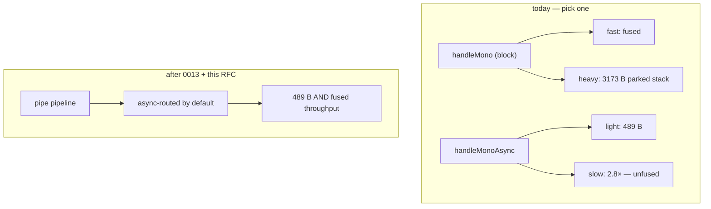
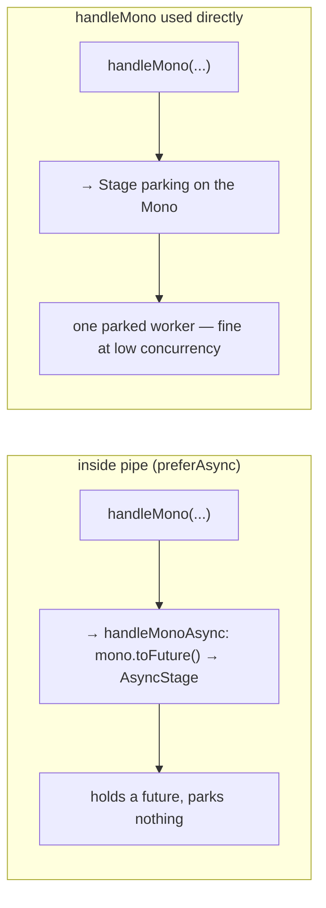

# RFC 0015 — The ingestion loop should not park a thread per element

- **Status**: ✅ Implemented
- **Target**: `reactive/` (`infrastructure.reactive`)
- **Depends on**: RFC 0013 (async-stage fusion) — **hard**; RFC 0014 (`pipe` over `Pipeline`)
- **Part of**: the throughput series (0009–0017); the headline reactive heap win
- **Realized by**: `ReactiveConfig.preferAsync` + `withPreferAsync`;
  `ReactiveFlow.preferAsync()`; the `handleMono`/`adaptMono` → async routing in
  `DefaultReactiveFlow`/`DefaultReactiveStep`/`DefaultReactiveLane` (and the
  `preferAsync` threaded through `Lanes` and the lane condition/branch/cases);
  the BiFunction `pipe` forms handing each element a preferAsync step
  (`DefaultReactiveFlow.pipeStep`). Tests: `ReactivePreferAsyncTest` (reactive),
  `ReactiveHeapProbeTest.anAsyncRoutedPipeHoldsFuturesNotParkedThreads`
  (`tests/`, the heap gate).

## Summary

`handleMono` parks a virtual worker on its Mono (`Blocking.await` is `mono.block()`). At `pipe(concurrency=64)` that is up to 64 parked workers, each retaining ~3 KB of stack. Once RFC 0013 makes async stages fuse, there is no throughput reason left to park — so a `pipe` pipeline should route its Mono steps through the **async** path by default and hold futures, not threads.

## The two options, and why nobody should have to choose



From `ReactiveHeapProbeTest` / `ReactiveBenchmark`:

```
handleMono      parked on a remote call   3 173 B/in-flight
handleMonoAsync  same request               489 B/in-flight   ← 6.5× less
pure Reactor                                218 B/in-flight
fourReactiveStages (block, fused)          54.9 ops/ms
fourAsyncReactiveStages (async, unfused)   19.9 ops/ms         ← 2.8× — the gap 0013 closes
```

**The strategy in one line: RFC 0013 removes the async penalty, this RFC spends the savings** — on the loop that runs at the highest concurrency.

## Design — contextual routing, not a global switch



- A `Pipeline` built for `pipe` carries a **`preferAsync` flag** on the same `ReactiveConfig` object that already carries `defaultBudget` and `propagate` (`reactive/…/ReactiveConfig.java`). Inside that context, `handleMono(...)` compiles to `handleMonoAsync(...)`.
- **Used outside `pipe`** — a single request/response — `handleMono` keeps parking: it fuses, it is simpler, and one parked worker for one request is the 489-vs-3173 trade-off RFC 0006 already judged fine at low concurrency.
- **The budget is strictly better on the async path**: `mono.timeout(budget)` before `.toFuture()` **cancels** the subscription (reactor-netty releases the connection), where the block-path timeout only abandons a parked worker. This is exactly why RFC 0006 built the async timeout to cancel.

The routing is a build-time decision on the pipeline, invisible at the call site — the same `handleMono` code reads correctly in both places.

## Design notes

- **`RateLimit` forces the blocking path.** `RateLimit.acquire()` parks the worker for the admission wait — async has no equivalent (RFC 0006 declined a `RateLimit` async overload on purpose). A `RateLimit` step inside a `pipe` pipeline stays blocking, with a logged note.
- **`propagate` rides on `executeMono`'s `deferContextual`** regardless of path — it seeds the run context, which both blocking and async carry.
- **No change to `handleMono` semantics when called directly.** This changes default *routing inside `pipe`*, not what `handleMono` means.

### As built

- **The BiFunction `pipe` forms route async automatically.** `pipe(n, (input,
  step) -> step.handleMono(...))` hands each element a `preferAsync` step
  (`pipeStep`), so its `handleMono`/`adaptMono` compile to the async path with no
  opt-in — the "by default inside pipe" the RFC asked for, scoped to pipe.
- **The prebuilt `Pipeline` form (RFC 0014) opts in with `flow.preferAsync()`.** A
  Pipeline is compiled before `pipe` sees it, so its links are already chosen; to
  hold futures it must be built async: `flow.preferAsync().pipeline(seg)`, then
  `pipe(n, thatPipeline)`. `preferAsync()` sits on the flow beside
  `defaultBudget`/`propagate` and rides into the segment's lanes.
- **`RateLimit` needs no special case.** It is a plain `handle(name, fn,
  RateLimit)` that parks on `acquire()` by design, never a `handleMono`, so
  `preferAsync` never touches it — it stays blocking with no logged note needed.

## Testing

- **Heap**: `ReactiveHeapProbeTest` gains a `pipe`-at-concurrency case (async-routed) landing near **489 B**.
- **`pipeResilient` on the async path**: one bad element dropped once, engine `onError` sees it once.
- **`RateLimit` override**: a rate-limited step in a `pipe` pipeline stays on the blocking path (assert it parks, and the note is logged).
- **Budget cancels**: a hung Mono in a `pipe` pipeline is cancelled by the budget (subscription disposed), reaching `recover()` as `TimeoutException`.

## Gate

| Benchmark | Must | Measured (10 000 in-flight, JDK 25) |
| --- | --- | --- |
| `ReactiveHeapProbeTest` (pipe shape) | down from a parked-worker stack | **~1.08 KB/element async-routed vs ~3.3 KB parked** — the worker's stack chunk is gone |
| `fourAsyncReactiveStages` (post-0013) | within 10% of `fourReactiveStages` | +2.9% (RFC 0013, which passed) |

The heap gate passed: an async-routed `pipe` element retains an `Execution`, a
`CompletableFuture` and Reactor's per-element `flatMap` inner (~1.08 KB), where a
blocking `handleMono` element parks a virtual worker whose stack chunk is ~3.3 KB.
The ~489 B floor is the BARE async stage (`handleMonoAsync` alone); a `pipe` adds
Reactor's flatMap machinery per element, so the pipe number sits above the floor
but well below the parked stack — the thing the RFC removes. **This shipped only
because RFC 0013 closed the async throughput gap first**: async now fuses like
blocking, so routing `pipe` async costs no throughput and spends the heap saving.

## Risks

- **Hostage to RFC 0013.** Stated up front, twice. Without it, `pipe` keeps parking.
- **`Mono.toFuture()` subscribes eagerly**, where the block path subscribes lazily inside the worker. Invisible for a well-behaved Mono; a Mono with subscribe-time side effects sees them at a different moment. Same eager-subscribe RFC 0006 introduced with `handleMonoAsync`; documented.
- **A pipeline that relied on `handleMono` parking** (e.g. a `RateLimit` worker-park) must keep the blocking path — handled by the `RateLimit` override and an explicit `preferAsync=false` opt-out.
