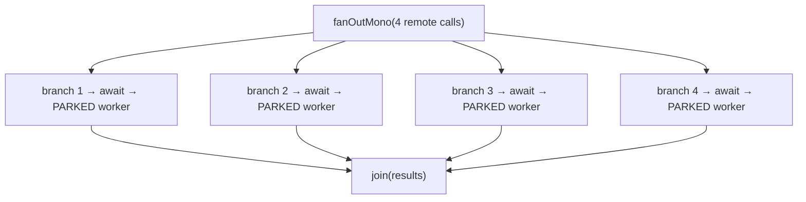
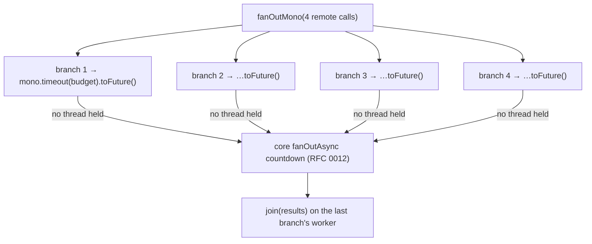

# RFC 0016 — `fanOutMono` without parked workers

- **Status**: ✅ Implemented
- **Target**: `reactive/` (`infrastructure.reactive`)
- **Depends on**: RFC 0012 (`fanOutAsync` in core) — **hard**
- **Part of**: the throughput series (0009–0017)
- **Realized by**: `Blocking.asyncBranches` (each Mono →
  `mono.timeout(budget).toFuture()`), and the three `fanOutMono` impls
  (`DefaultReactiveFlow`/`DefaultReactiveStep`/`DefaultReactiveLane`) now calling
  `delegate.fanOutAsync(...)`. Tests: `ReactiveFanOutMonoAsyncTest` (reactive),
  `ReactiveHeapProbeTest.anAsyncFanOutMonoHoldsFuturesNotNParkedWorkers`
  (`tests/`, the heap gate).

## Summary

`fanOutMono` over N remote calls parks **N** virtual workers for the duration of the slowest branch — the exact cost RFC 0006 removed from the main line and RFC 0012 removes from `FanOut` itself. Once core ships `fanOutAsync`, `fanOutMono` decorates it instead of blocking N branches: N concurrent calls, zero parked workers.

## Today: one parked worker per branch

```java
// Blocking.branches (reactive/…/Blocking.java:101)
blocking.add(value -> await(budgeted(branch.apply(value), budget)));
```



Four threads' worth of stack retained for one fan-out, for the whole duration of the slowest call.

## Proposed: decorate `fanOutAsync`



Each branch becomes `value -> call.apply(value).toFuture()` — a `CompletionStage`, parking nothing. Core's `fanOutAsync` countdown (RFC 0012) fires the join once all branches complete. Four concurrent remote calls, one execution's worth of heap instead of four threads' worth.

## Design notes

- **The per-branch budget still applies**: `mono.timeout(budget)` before `.toFuture()`, so a hung branch is cancelled (subscription disposed) exactly as on the async main line — strictly better than the block-path abandon.
- **The join is unchanged** — same `Function<List<R>, C>`, same declaration-order results.
- **`Blocking.branches` is replaced by `Blocking.asyncBranches`, not kept.** The RFC planned to leave the blocking helper for a caller who explicitly wants blocking fan-out branches — but there is no API to opt into that (fan-out branches take a `Mono`, and every path now routes async), so keeping it would be dead code. It was renamed and re-typed to the async form instead; a future blocking-fanout opt-in would re-introduce it.
- **Mirror parity**: `fanOutMono` must keep its override on `ReactiveStep` **and** `ReactiveLane` (fan-out inside a branch/fork). `ReactiveMirrorTest` guards this — the drift it caught once (`adaptMono(call, budget)` missing on the lane) is exactly this failure mode.

## Testing

- **Concurrency**: branches with a controllable latch run concurrently — total ≈ slowest, not sum.
- **No parked workers**: heap probe on a `fanOutMono` shape lands near one execution's floor, not N threads.
- **Budget cancels a hung branch**: reaches `recover()` as `TimeoutException`; a failing branch fails the fan-out, recoverable downstream.
- **In a lane**: `fanOutMono` inside a `when`/`match` branch and inside a `fork` still parks nothing (the lane mirror uses the same async path).
- `ReactiveMirrorTest`, full `reactive/` suite unchanged.

## Gate

| Benchmark | Must | Measured (JDK 25) |
| --- | --- | --- |
| `fanOutMono` behaviour | concurrent; no parked workers | branches proven concurrent by a barrier; the budget cancels a hung branch |
| heap probe (fan-out shape) | ~1 execution floor, down from N×3 KB | **1.6 KB/execution for a 4-branch fanOutMono** vs ~3.5 KB for ONE parked worker (a blocking fan-out would park four) |

A 4-branch `fanOutMono` now retains ~1.6 KB per in-flight execution — less than a
single parked worker's stack, where the blocking form parked four (~14 KB). Core's
`fanOutAsync` countdown (RFC 0012) runs the branches concurrently while a worker
only invokes each and is released; the per-branch budget rides on the Mono, so a
hung branch is cancelled and reaches `recover()` as a `TimeoutException`.

## Risks

- **Hard dependency on RFC 0012's `fanOutAsync`.** Until it lands, `fanOutMono` stays as-is.
- **Eager subscription** via `.toFuture()` (same as RFC 0015) — a branch Mono with subscribe-time side effects sees them earlier. Documented.
