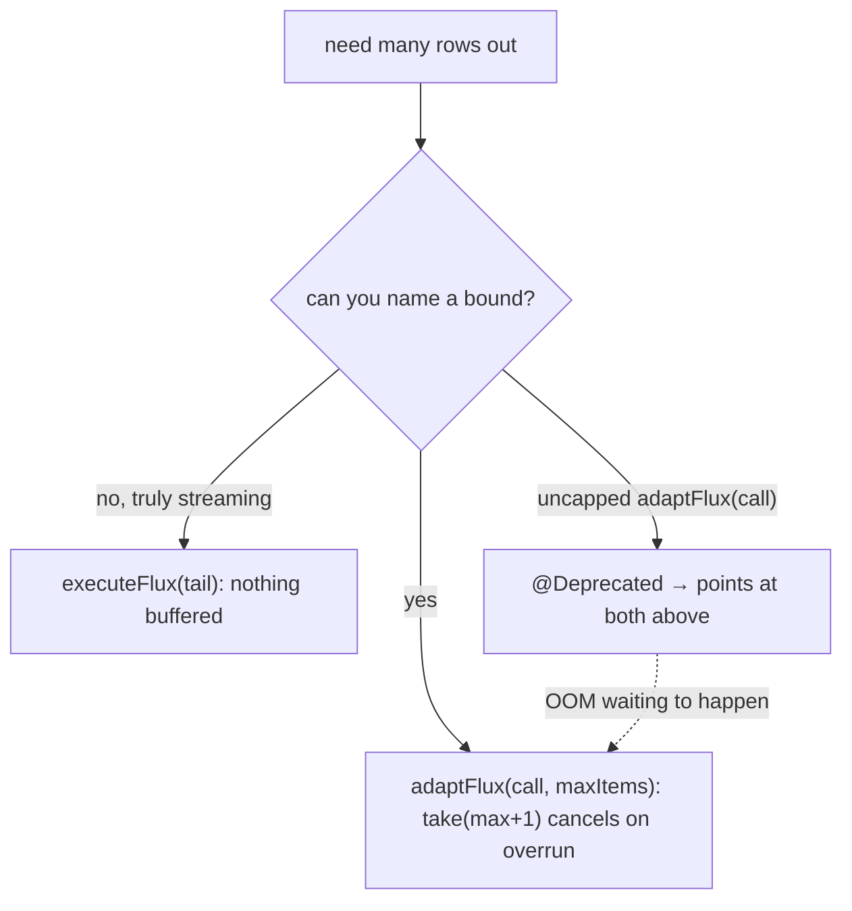
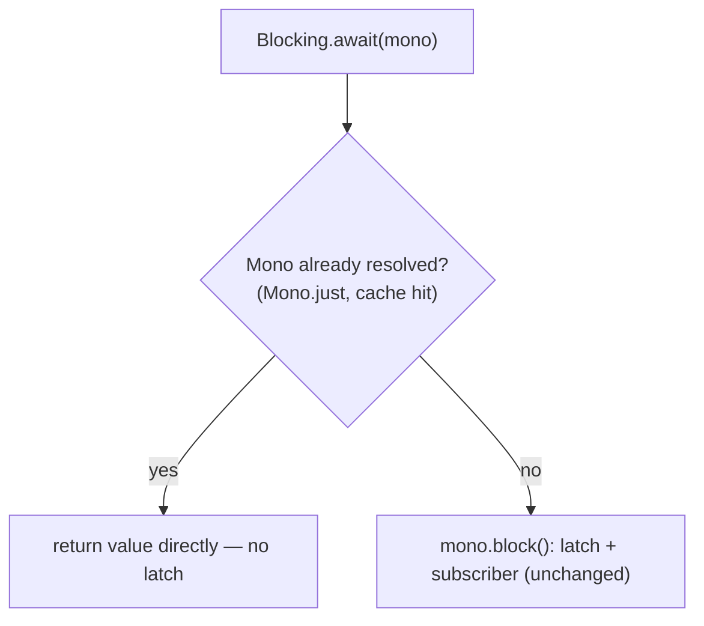

# RFC 0017 — Reactive streaming & blocking hygiene

- **Status**: ◐ Partially implemented — **Part 1 shipped**, **Part 2 measured neutral and not shipped**
- **Target**: `reactive/` (`infrastructure.reactive`)
- **Depends on**: nothing new
- **Part of**: the throughput series (0009–0017); the two independent low-risk touch-ups, kept together because neither is big enough to stand alone and both are "reactive efficiency without new machinery"
- **Realized by**: `@Deprecated(forRemoval = false)` on the uncapped `adaptFlux(call)`
  (`ReactiveStep`, `ReactiveLane`, and their impls). Test:
  `ReactiveBlockingHygieneTest` (the `Blocking.await` contract, kept from Part 2's
  investigation).

## Summary

Two small, independent improvements that need no core change:

1. **Streaming discipline** — make the bounded Flux path the easy one and the unbounded one loud, closing RFC 0004's own loose end. **Shipped.**
2. **Blocking fast-path** — do not install a `CountDownLatch` when the Mono is already resolved (a cache hit, a `Mono.just`). **Investigated, measured neutral, NOT shipped** (see Part 2).

## Part 1 — streaming out: bound it or stream it

RFC 0004 already got the shape right: `adaptFlux(call, maxItems)` uses `take(maxItems+1)` to cancel on overrun (`reactive/…/Blocking.java:80`), and `executeFlux(tail)` streams the engine's one value into Reactor's many with **no buffer** (`reactive/…/DefaultReactiveStep.java:211`). The loose end is the **uncapped** `adaptFlux(call)`, which RFC 0004 kept "because removing it breaks every call site" — against its own rule, *"if you cannot name a bound, do not collect it."*

**Proposal**: `@Deprecated` on `adaptFlux(call)` with a message naming the capped overload and `executeFlux`. No call site breaks; the next OOM stops being written. That is the entire content — no new machinery, just steering.

## Part 2 — `Blocking.await` on an already-resolved Mono

`handleMono` used directly (outside `pipe`) keeps parking, and that path is already lean: `Exceptions.unwrap` is only on the catch, and `budgeted(mono, null)` returns the Mono untouched (`reactive/…/Blocking.java:40`). The remaining cost is `mono.block()` itself — it installs a `CountDownLatch` and a blocking subscriber **per call, even when the Mono is already complete**.

**Proposal**: a fast-path check — `Mono.blockOptional`-style immediate resolution, or a `Callable`/scalar check — that returns the value without a latch when the Mono is synchronous. A real remote call still hits `block()` exactly as today.

Honest about its ceiling: it helps synchronous Monos (cache hits, `Mono.just`) — which are exactly the Monos that never needed the facade's heap trade-off. It does **nothing** for a real remote call; that is what RFC 0015 is for.

### Outcome: measured neutral, not shipped

The fast-path was built (a `mono instanceof Callable` check calling `call()`
instead of `block()`) and benchmarked against the same `handleMono`-over-`Mono.just`
stage, before and after:

| | throughput | allocation |
| --- | --- | --- |
| `block()` (before) | 74.85 ops/ms | 1199.0 B/op |
| Callable fast-path (after) | 74.98 ops/ms | 1199.5 B/op |

**Identical.** The JIT's escape analysis already eliminates `block()`'s
`CountDownLatch` — it never escapes the call, so it is not heap-allocated in the
first place. The fast-path removed a latch the runtime had already removed. By
this series' own rule (a change ships only if its gate moves — the rule that got
RFC 0010 rejected), Part 2 does not ship. Its investigation is kept as
`ReactiveBlockingHygieneTest`, which pins `Blocking.await`'s error contract
(value, checked cause via `CompletionException`, unchecked cause rethrown) —
worth having regardless. A future megamorphic-call-site case where escape
analysis fails could revisit it, with a benchmark that shows the gate move.

## Testing

- **Part 1**: the deprecation compiles with a warning; `adaptFlux(cap)` overrun still costs one element and surfaces `FlowOverflowException` through `recover()`; `executeFlux` still emits lazily, one execution per subscription, empty-Flux filter cut intact.
- **Part 2**: a synchronous `Mono.just` through `handleMono` returns **without** installing a latch (probe or timing assertion); an async Mono blocks exactly as before; a failing sync Mono still surfaces its cause through `recover()` (the `Exceptions.unwrap` path is unchanged).
- `ReactiveMirrorTest`, full `reactive/` suite unchanged.

## Gate

| Benchmark | Must | Measured |
| --- | --- | --- |
| `syncMono` bench through `handleMono` | faster (no latch) | **neutral** — the JIT already elides the latch, so Part 2 is not shipped |
| `monoOverhead` | not regress | unchanged (Part 1 is a deprecation only; no runtime change) |

## Risks

- **Deprecation is a visible API signal.** It removes nothing; a `@Deprecated(forRemoval = false)` communicates "prefer the bounded path" without breaking builds. If a future RFC wants removal, that is its own argument.
- **The fast-path must exactly match `block()`'s error semantics** for a synchronous failing Mono — same exception, same unwrap. Covered by the test above; if it cannot be matched cheaply, the fast-path is limited to the success case only.
