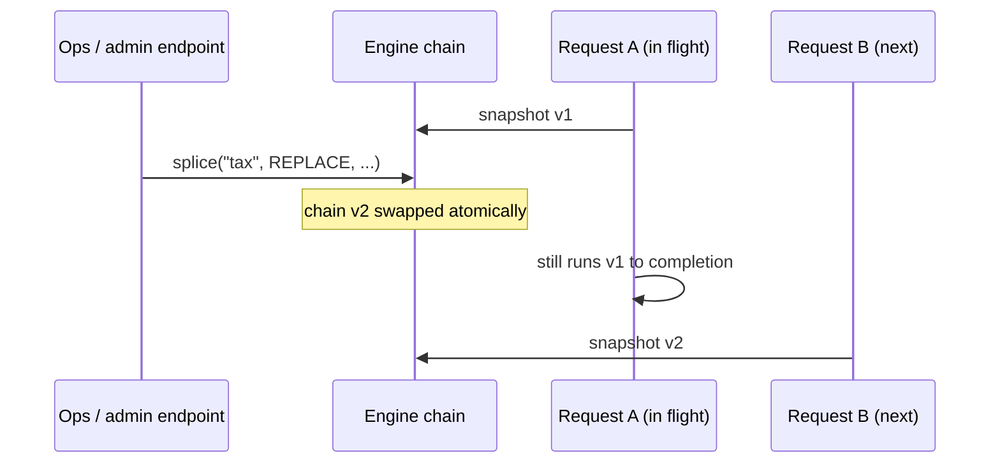

# Runtime editing

This is the feature nio-flow is built around: **the chain is data, and you can edit it while traffic flows through it.**

The chain is an immutable list swapped atomically. Every execution snapshots it at submission, so an edit **never** affects in-flight requests — the next request sees the new chain. No locks, no draining, no redeploy.



## Appending live

The chain stays open by default. New links appended to the shared definition apply from the next execution on:

```java
NioFlow<Order, Order> flow = DefaultNioFlow.from(Order.class)
        .handle("price", pricing::apply);

flow.just(order).execute();               // runs: price

flow.background("audit", audit::record);  // appended live

flow.just(order).execute();               // runs: price, audit
```

## Splicing single links

`splice` edits the chain **relative to a named link** — that's why stages, backgrounds, recoveries, fan-outs and batches take names:

```java
import dev.nioflow.core.model.Splice;
import dev.nioflow.core.model.Stage;

// Replace the tax stage with a new rate, while requests keep flowing:
engine.splice("tax", Splice.REPLACE, List.of(
        new Stage("tax", value -> ((Order) value).withTax(0.21), false, null, null, List.of())));

// Or insert around an anchor:
engine.splice("price", Splice.BEFORE, List.of(couponStage));
engine.splice("price", Splice.AFTER,  List.of(surchargeStage));
```

Typical uses:

- **Swap a provider** behind a stable stage name ("payments" points to a different gateway).
- **Tighten a gate during an incident** (replace the fraud threshold stage).
- **Insert a temporary diagnostic** (`AFTER` a suspect stage), remove it later.

## Regions: swapping whole sections atomically

Single-link splices get tedious when the thing that changes is a *section* — a pricing strategy of four stages, a whole notification block. Name the section when you embed it:

```java
Segment<Order, Order> pricingV1 = lane -> lane
        .handle("base-price", pricing::base)
        .handle("discount", pricing::seasonal);

flow.handle("validate", validator::check)
    .use("pricing", pricingV1)            // <- named region
    .handle("tax", pricing::withTax);
```

Then swap the whole region in one atomic edit — one chain swap, one validation, one recompile:

```java
flow.replaceRegion("pricing", lane -> lane
        .handle("flat-price", pricing::flatCampaign));
```

Region boundaries are tracked by **link identity**, not index, so edits elsewhere in the chain never break them. After a swap the region points at its new links — it stays swappable forever. An empty replacement retires the region.

> Replacement segments may contain forks: nio-flow records them off-chain while drawing routing ids from the live engine, so guards never collide with the running chain.

## Guardrails for live edits

Live edits are powerful, so the engine validates them. Sealing is **optional** — an open chain accepts any edit — but once you call `seal()`, every splice and region swap is validated first, and a rejected edit leaves the previous chain untouched:

```java
engine.seal();   // optional hardening: freeze appends, validate every edit

engine.splice("price", Splice.AFTER, brokenLinks);
// -> ChainValidationException: dangling guards, duplicate anchors, dead
//    recoveries... the running chain is exactly as it was.
```

The validator rejects: guards on undeclared decisions, contradictory guards, duplicate anchor names (splices would turn ambiguous), recoveries with nothing fallible upstream, and boss-inlined stages carrying a timeout or retry.

## What edits cost

Nothing on the request path. An edit builds a new immutable list and swaps a reference; per-request snapshots are how the engine works anyway. On sealed chains each edit recompiles the dispatch plan **once per edit, never per request**.

## Rules of thumb

- Give a **name** to anything you might edit later. Anonymous links can't be anchors.
- Prefer **regions** when a business capability spans several links — swapping them piecemeal creates intermediate chains that never should have existed.
- Keep edits on the **shared definition**. Per-request additions (`just(x).handle(...)`) are for request-specific steps, not for operating the system.
