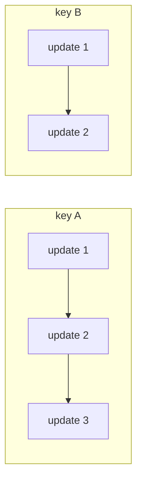

# Scaling & ordering

## Batching: N callers, one downstream call

When many concurrent executions hit the same downstream — a database, a bulk API — coalesce them:

```java
flow.batch("bulk-insert", 16, Duration.ofMillis(10), orders ->
        repository.insertAll(orders));
```

Executions park at the link until **16 accumulated or 10ms passed**, one bulk call maps all values positionally, and each execution continues with its own element. The batch is invisible to callers: every future gets its individual result.

- The win is **fewer downstream round trips**, not parallelism (independent stages already run in parallel on workers). Measured against a serialized downstream: 16 round trips → 1 is ~5x.
- A bulk failure — or a result list of the wrong size — fails every batched execution, recoverable per execution.
- Inside a branch lane, only values routed through that lane pool together.
- Declare batches on the shared definition: only executions of the same flow pool together.

## Keyed execution: order per business entity

Two concurrent updates to the same order must not race each other. Key the executions:

```java
flow.just(update).key(update.orderId()).executeAsync();
```

Executions sharing a key are pinned to one event-loop thread and processed **strictly one at a time, in submission order** — Kafka-partition semantics per key. Distinct keys (and unkeyed traffic) keep full parallelism.



- A slow execution delays only **its own key's** successors (head-of-line by design; a stage timeout bounds it).
- A failed execution releases its lane to the next — it never stalls the queue.
- Only callers using a key pay for it; the unkeyed path is untouched.

## Backpressure for fire-and-forget

`inject`/`justAll` are unbounded by default. Bound them:

```java
NioEngine engine = new DefaultNioEngine(1_000, OverflowPolicy.BLOCK);
```

| Policy | When the bound is hit |
|---|---|
| `BLOCK` | The producer parks until a slot frees |
| `DROP` | The value is discarded — reported to error handlers and the `valueDropped` metric |
| `FAIL` | `inject` throws `RejectedExecutionException` |

Admission happens **before** the execution runs — rejecting already-processed work is not backpressure. Slots free when `await()` collects a result.

## Dedicated event loops

By default every engine shares one JVM-wide pool of boss threads (size: CPU cores, tunable with `-Dnioflow.bosses=N`). For latency-critical flows, give the engine its own:

```java
NioEngine critical = DefaultNioEngine.dedicated(2);
NioFlow<Tick, Quote> quotes = DefaultNioFlow.from(Tick.class, critical);
```

No other engine can queue orchestration behind its bosses. Beside a noisy neighbor, this cuts the victim flow's p99.9 latency roughly in half; `shutdown()` terminates dedicated pools without touching the shared ones.

## Graceful shutdown

```java
int pending = engine.shutdown(Duration.ofSeconds(10));
```

Rejects new work immediately, waits up to the grace period for in-flight executions (batched values still parked count — make the grace cover your largest batch window), then terminates engine-owned executors. Returns how many executions were still running: `0` means a clean drain.
